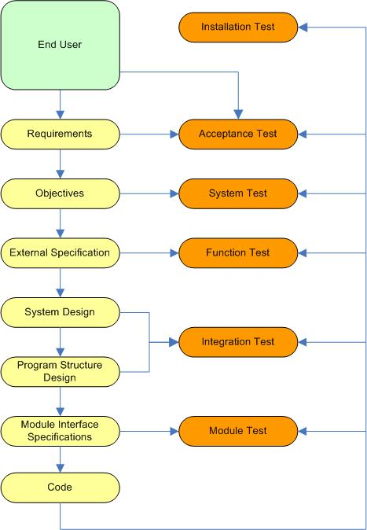
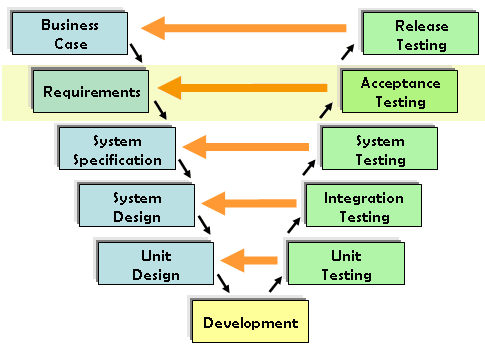
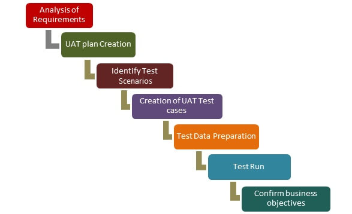

# Higher-level Testing

The following key diagram presents illustrates a software development cycle and the associated testing processes. Note how distinct testing processes are associated with distinct development processes:

The [flow](http://diranieh.com/Testing/HigherOrderTesting.htm#Overview) of the process can be summarized in seven steps:

1. Requirements is a written translation of user's needs. These are the goals of the product. In other words, why the program is needed.

2. Objectives specify what the programs should do, and how well the program should do it.

3. Objectives are translated into precise product specification, viewing the product as a black box and considering only its interfaces and interactions with the end user.

4. System design partitions the system into sub-systems, components, individual programs, and defines their interface.

5. The structure of the program is designed by specifying the function of each module, the hierarchical structure of modules, and the interfaces between modules.

6. A precise specification is developed that defines the interface and the function of each module.

7. Through one or more sub-steps, the module interface specification is translated into source-code.

With respect to testing, each testing process is focused on a particular development step. For example:

* The purpose of *module* testing is to find discrepancies between the program's modules and their interface specification.

* The purpose of *function* testing is to show that a program does not match its external specifications.

* The purpose of *system* testing is to show that a program is inconsistent with its original objectives.

## Unit Tests

A unit test is written by a programmer to verify that a component (class, module, method, or object) is fulfilling its what it is intended to do. 

They are narrow in scope, they should be easy to write and execute, and their effectiveness depends on what the programmer expects.

Unit tests shouldn't have dependencies on outside systems - they test internal consistency.

## Integration Tests

An integration test is done to demonstrate that different pieces of the system work together.

Different software modules are combined and tested as a group to make sure that integrated system is ready for system testing.

Integration testing focuses on checking data communication amongst the collaborative modules.

These forms of tests usually require resources like database instances and hardware to be allocated to them.

Although each software module is unit tested, defects still exist for these reasons:

* A Module, in general, is designed by an individual software developer whose understanding and programming logic may differ from other programmers. Integration Testing becomes necessary to verify the software modules work in unity

* At the time of module development, there are wide chances of change in requirements by the clients. These new requirements may not be unit tested and hence system integration testing becomes necessary.

* Interfaces of the software modules with the database could be erroneous.

* External Hardware interfaces, if any, could be erroneous.

* Inadequate exception handling could cause issues.

### How to perform Integration Testing?

1. Prepare the Integration Tests Plan

2. Design the Test Scenarios, Cases, and Scripts

3. Executing the test cases followed by reporting the defects

4. Tracking & re-testing the defects

5. Steps 3 and 4 are repeated until the completion of integration is successful

### Brief Description of Integration Test Plans:

It includes the following attributes:

* Methods/Approaches to testing

* Scopes and Out-of-scope items of integration testing

* Roles and Responsibilities

* Pre-requisites for Integration testing

* Testing environment

* Risk and Mitigation Plans

### Entry and Exit Criteria of Integration Testing

Entry and Exit Criteria to Integration testing phase in any software development model

#### Entry Criteria:

* Unit Tested Components/Modules

* All highly prioritized bugs fixed and closed

* All Modules to be code completed and integrated successfully

* Integration tests Plan, test case, scenarios to be signed off and documented

* Required Test Environment to be set up for Integration testing

#### Exit Criteria:

* Successful Testing of Integrated Application

* Executed Test Cases are documented

* All High prioritized bugs fixed and closed

* Technical documents to be submitted followed by release Notes

### Best Practices / Guidelines for Integration Testing

* First, determine the Integration Test Strategy that could be adopted and later prepare the test cases and test data accordingly.

* Study the Architecture design of the Application and identify the Critical Modules. These need to be tested on priority.

* Obtain the interface designs from the Architectural team and create test cases to verify all of the interfaces in detail. Interface to database/external hardware/software application must be tested in detail.

* After the test cases, it’s the test data which plays the critical role.

* Always have the mock data prepared, prior to executing. Do not select test data while executing the test cases.

## System Tests

System testing is performed on a complete, integrated system. 

It allows checking system's compliance as per the requirements. 

It tests the overall interaction of components. 

It involves load, performance, reliability and security testing.

System testing is most often the final test to verify that the system meets the specification. 

It evaluates both functional and non-functional need for the testing.

System Testing involves testing the software code for the following:

* Testing the fully integrated applications including external peripherals in order to check how components interact with one another and with the system as a whole. This is also called End to End testing scenario.

* Verify thorough testing of every input in the application to check for desired outputs.

* Testing of the user’s experience with the application. 

## Acceptance Tests

Acceptance tests make sure a feature or use case is correctly implemented. 

They act as the final verification of the required business functionality and proper functioning of the system, emulating real-world usage condition.

The main purpose of User Acceptance Testing is to validate end to end business flow.

User Acceptance Testing is carried out in a separate testing environment w/ production-like data setup.

It is a kind of `black box` testing where two or more end-user and the client will be involved.

### Acceptance Testing and V-Model

In VModel, User acceptance testing corresponds to the requirement phase of the Software Development life cycle.

### Prerequisites of User Acceptance Testing

Following are the criteria for User Acceptance Testing:

* Business Requirements must be available.

* Application Code should be fully developed

* Unit Testing, Integration Testing & System Testing should be completed

* No Showstoppers, High, Medium defects in System Integration Test Phase

* Only Cosmetic error is acceptable before UAT

* Regression Testing should be completed with no major defects

* All the reported defects should be fixed and tested before UAT

* Traceability matrix for all testing should be completed

* UAT Environment must be ready

* Sign off mail or communication from System Testing Team that the system is ready for UAT execution

### How to do UAT Testing

UAT is done by the intended users of the system or software. This type of Software Testing usually happens at the client location which is known as Beta Testing. 

Once entry criteria for UAT is satisfied, the following tasks are performed by the testers:

### Exit criteria for UAT

Before moving into production, following needs to be considered:

* No critical defects open

* Business process works satisfactorily

* UAT Sign off meeting with all stakeholders

### Best Practices

Following points need to be considered to make UAT successful:

* Prepare UAT plan early in the project life cycle

* Prepare Checklist before the UAT starts

* Conduct Pre-UAT session during System Testing phase itself

* Set the expectation and define the scope of UAT clearly

* Test End to End business flow and avoid system tests

* Test the system or application with real-world scenarios and data

* Think as an Unknown user to the system

* Perform Usability Testing

* Conduct Feedback session and meeting before moving to production
