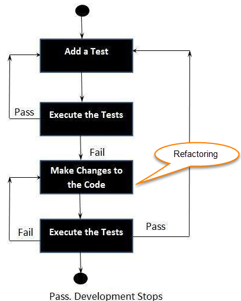

# Creating a Tic-Tac-Toe application using the Test-Driven Development approach

## Application Quick-start Steps

* To install gems, run `bundle install`

* To run specs, enter these commands:

    * `bundle exec rspec spec/01_tic_tac_toe_node_spec.rb`

    * `bundle exec rspec spec/02_super_computer_player_spec.rb`

## Test-Driven Development (TDD)

*Test-driven development* is a software development approach which dictates that tests, not application code, should be written first, and then application code should only be written to pass already written specs.

The process starts w/ designing and developing tests for every small functionality of an application. TDD framework instructs developers to write new code only if an automated test has failed.

**Define functionality and write the specs first, then implement.**


### Motivations for TDD

* Code written is guaranteed to be testable because you are writing the code specifically to pass a test

* Developers avoid writing lots of extra functionality that is not included in the specs b/c they engage in the spec-writing process first

* Ensure you have excellent test coverage b/c no application code is written w/o already written tests

* Tight development workflow (red, green, refactor) makes for happy, productive developers

* Encourages a focus on modularity b/c the developer is forced to think about the application in small, testable chunks

* Encourages a focus on a module's/class's public interface (i.e. on how the module will be used rather than on how it's implemented)

### The Three Rules of TDD 

Robert C. Martin (“Uncle Bob”) three rules of Test-Driven Development are as outlined:

1. Write production code only to pass a failing unit test.

2. Write no more of a unit test than sufficient to fail (compilation failures are failures).

3. Write no more production code than necessary to pass the one failing unit test.

Rule number one says to write tests *first*-understand and specify, in the form of a unit test example, behavior you must build into the system.

Rule number two says to proceed as incrementally as possible-after each line written, get feedback (via compilation or test run) if you can before moving on.

Rule number three says to write no more code than your tests specify. That's why rule number one says "to pass a *failing* unit test." If you write more code than needed-if you implement behavior for which no test exists-you'll be unable to follow rule #1, because you'll soon be writing tests that immediately pass.

### Red, Green, Refactor

**Red**, **Green**, **Refactor** describes the proper TDD workflow.

1. **Red**: Write the tests and watch them fail (go red). It's important to ensure the tests initially fail so that you don't have false positives.

2. **Green**: Write the (minimum amount of) code to make the tests pass (go green).

3. **Refactor**: Refactor the code you just wrote. Your job is not over when the tests pass; you got it working, now make it clean.

Generally, TDD developers keep their Red, Green, Refactor loop pretty tight. They'll write a few related tests, then implement the functionality, then refactor, then repeat. You keep the units small.

### How to perform TDD Test

1. Add a test

2. Run all tests and see if any new test fails

3. Write some code.

4. Run tests and refactor code

5. Repeat



## TDD in practice

The following details the process of creating a Tic-Tac-Toe application with Ruby while adhering to the TDD development cycle.

### Board

Let's first define a class `Board`. For this class, we will try to satisfy the following conditions.

A condition for the grid layout of the `Board`:

* The grid should be of a `3 x 3` layout.

In this TDD walk-through, we begin writing the test suite for the code that fulfills all the above requirements.

```rb
# spec/board_spec.rb

describe Board do
    let(:empty_board) do
        Board.new
    end

    describe '#initialize' do
        it 'sets up the instance variable grid' do
            expect(empty_board.grid.length).to eq(3)
            empty_board.grid.each { |row| expect(row.length).to eq(3)}
            expect(empty_board.grid.flatten.length).to eq(9)
        end

        it 'should start out empty' do
            for row in empty_board.grid do
                for col in row do                    
                    expect(col).to be_nil;
                end
            end
        end
    end
end
```

We begin by instantiating a new board using the class `Board` that we will create to fulfill this test.

The test first checks that the length of the board adds up to 3 rows, then that each row is of length 3, and that there are a total of 9 squares within the board's grid. Finally, our test will need to ensure that the board's grid starts off as `[[nil, nil, nil], [nil, nil, nil], [nil, nil, nil]]`.

When we run the test, the test fails as expected since there is no code written yet. The specs fail as follows:

```zsh
Failures:

  1) Board#initialize sets up the instance variables
     Failure/Error: expect(empty_board.grid.length).to eq(3)
     NoMethodError:
       undefined method `length' for nil:NilClass
     # ./spec/board_spec.rb:11:in `block (3 levels) in <top (required)>'

Finished in 0.00036 seconds (files took 0.088 seconds to load)
1 example, 1 failure

Failed examples:

rspec ./spec/board_spec.rb:10 # Board#initialize sets up the instance variables
```

To run the test, we create class `Board`:

```rb
# lib/board.rb

class Board
    attr_reader :grid

    def self.blank_grid
        Array.new(3) { Array.new(3) }
    end

    def initialize(grid = self.class.blank_grid)
        @grid = grid
    end
end
```

As a result adding some functionality to the `Board` class, the test case now succeeds, as seen in the following output:

```zsh
Finished in 0.0009 seconds (files took 0.088 seconds to load)
1 example, 0 failures
```

Adding

## Summary

* TDD stands for Test-driven development

* TDD meaning: It is a process of modifying the code in order to pass a test designed previously

* Its emphasis is on production code rather than test case design

* Test-driven development is a process of modifying the code in order to pass a test designed previously

* TDD testing includes refactoring a code, i.e., changing/adding some amount of code to the existing code w/o affecting the behavior of the code.

* TDD programming when used makes for clearer and more simple-to-understand code
