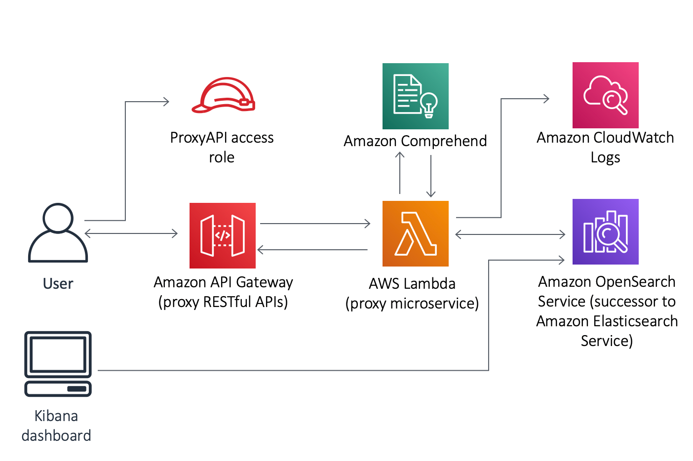

# Amazon Comprehend

1. A company is looking for a way to analyze the calls between customers and service agents. Each conversation is transcribed, JSON-formatted, and saved to an Amazon S3 bucket. The company’s solutions architect is tasked to design a solution for extracting and visualizing sentiments from the transcribed files.

Which solution meets the requirements while minimizing the amount of operational overhead?

[ ] Analyze the JSON files w/ Amazon Textract. Index the sentiment along w/ the transcript to an Amazon OpenSearch cluster. Visualize the results using Amazon Managed Grafana.

[ ] Create an Amazon Comprehend analysis job. Index the sentiment along w/ the transcript to an Amazon OpenSearch cluster. Visualize the results using Amazon Managed Grafana.

[ ] Create an Amazon Comprehend analysis job. Index the sentiment along w/ the transcript to an Amazon OpenSearch cluster. Visualize the results using the OpenSearch Dashboard.

[ ] Train a custom Natural Language Processing (NLP) model using Amazon SageMaker. Index the sentiment along w/ the transcript to an Amazon OpenSearch cluster. Visualize the results using the OpenSearch Dashboard.

**Explanation**: **Amazon Comprehend** uses machine learning to help you uncover the insights and relationships in your unstructured data. The service identifies the language of the text; extracts key phrases, places, people, brands, or events; understands how positive or negative the text is; analyzes text using tokenization and parts of speech, and automatically organizes a collection of text files by topic. You can also use AutoML capabilities in Amazon Comprehend to build a custom set of entities or text classification models that are tailored uniquely to your organization’s needs.

In this scenario, you can build the application with the help of Amazon Comprehend. You could expose the application through a RESTful endpoint, have it invoke a Lambda function that will call Amazon Comprehend for sentiment analysis, and index data into an Amazon OpenSearch cluster.

Hence, the correct answer is: **Create an Amazon Comprehend analysis job. Index the sentiment along with the transcript to an Amazon OpenSearch cluster. Visualize the results using the OpenSearch Dashboard.**

> The option that says: **Analyze the JSON files with Amazon Textract. Index the sentiment along with the transcript to an Amazon OpenSearch cluster. Visualize the results using Amazon Managed Grafana** is incorrect. Amazon Textract is just an AI service used to extract text data from scanned documents in PNG, JPEG, TIFF, PDF formats and is not capable of running sentiment analysis. Furthermore, Grafana is more suited for the visualization of time-series data such as system metrics (CPU load, disk storage, memory utilization, temperature, etc). While there are hacks you can use to visualize non-time series like the one in the scenario, they come with additional overhead on your part. The built-in OpenSearch dashboard is enough to do the job.

> The option that says: **Create an Amazon Comprehend analysis job. Index the sentiment along with the transcript to an Amazon OpenSearch cluster. Visualize the results using Amazon Managed Grafana** is incorrect. The Amazon OpenSearch dashboard is a more suitable service to use than Grafana since the sentiment data is already processed by an Amazon OpenSearch cluster. This solution needs a separate AWS data source configuration in the Grafana workspace console to integrate and read the sentiment data, which entails an additional operational overhead.

> The option that says: **Train a custom Natural Language Processing (NLP) model using Amazon SageMaker. Index the sentiment along with the transcript to an Amazon OpenSearch cluster. Visualize the results using the Amazon QuickSight Dashboard** is incorrect. Although this may be a viable option, training your own ML model rather than using the readily available Amazon Comprehend service requires more time and effort. The same is true in using the Amazon QuickSight dashboard instead of the OpenSearch Dashboard. It takes a lot of steps to properly integrate Amazon QuickSight and an OpenSearch cluster which might cause delays in the project implementation.

 
