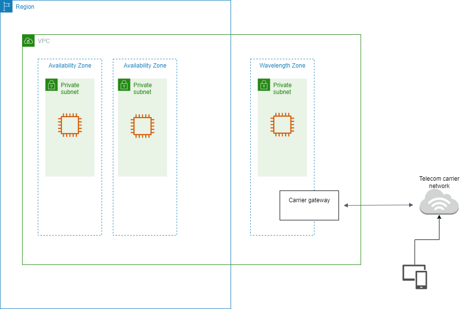

# Elastic Kubernetes Service

1. A company needs to accelerate the performance of its AI-powered medical diagnostic application by running its machine learning workloads on the edge of telecommunication carriers' 5G networks. The application must be deployed to a Kubernetes cluster and have role-based access control (RBAC) access to IAM users and roles for cluster authentication.

Which of the following should the Solutions Architect implement to ensure single-digit millisecond latency for the application?

[x] Launch the application to an Amazon Elastic Kubernetes Service (Amazon EKS) cluster. Create node groups in Wavelength Zones for the Amazon EKS cluster via the AWS Wavelength service. Apply the AWS authenticator configuration map (`aws-auth ConfigMap`) to your cluster.

[ ] Host the application to an Amazon EKS cluster and run the Kubernetes pods on AWS Fargate. Create node groups in AWS Wavelength Zones for the EKS cluster. Add the EKS pod execution IAM role (`AmazonEKSFargatePodExecutionRole`) to your cluster and ensure that the Fargate profile has the same IAM role as your Amazon EC2 node groups.

[ ] Launch the application to an Amazon Elastic Kubernetes Service (Amazon EKS) cluster. Create VPC endpoints for the AWS Wavelength Zones and apply them to the Amazon EKS cluster. Install the AWS IAM Authenticator for Kubernetes (`aw-iam-authenticator`) to your cluster.

[ ] Host the application to an Amazon Elastic Kubernetes Service (Amazon EKS) cluster. Set up node groups in AWS Wavelength Zones for the Amazon EKS cluster. Attach the Amazon EKS connector agent role (`AmazonECSConnectorAgentRole`) to your cluster and use AWS Control Tower for RBAC access.

**Explanation**: AWS Wavelength combines the high bandwidth and ultralow latency of 5G networks with AWS compute and storage services so that developers can innovate and build a new class of applications.

Wavelength Zones are AWS infrastructure deployments that embed AWS compute and storage services within telecommunications providers’ data centers at the edge of the 5G network, so application traffic can reach application servers running in Wavelength Zones without leaving the mobile providers’ network. This prevents the latency that would result from multiple hops to the internet and enables customers to take full advantage of 5G networks. Wavelength Zones extend AWS to the 5G edge, delivering a consistent developer experience across multiple 5G networks around the world. Wavelength Zones also allow developers to build the next generation of ultra-low latency applications using the same familiar AWS services, APIs, tools, and functionality they already use today.

Amazon EKS uses IAM to provide authentication to your Kubernetes cluster, but it still relies on native Kubernetes Role-Based Access Control (RBAC) for authorization. This means that IAM is only used for the authentication of valid IAM entities. All permissions for interacting with your Amazon EKS cluster’s Kubernetes API are managed through the native Kubernetes RBAC system.

Access to your cluster using AWS Identity and Access Management (IAM) entities is enabled by the AWS IAM Authenticator for Kubernetes, which runs on the Amazon EKS control plane. The authenticator gets its configuration information from the `aws-auth` `ConfigMap` (AWS authenticator configuration map).

The `aws-auth` `ConfigMap` is automatically created and applied to your cluster when you create a managed node group or when you create a node group using `eksctl`. It is initially created to allow nodes to join your cluster, but you also use this `ConfigMap` to add role-based access control (RBAC) access to IAM users and roles.

Hence, the correct answer is: **Launch the application to an Amazon Elastic Kubernetes Service (Amazon EKS) cluster. Create node groups in Wavelength Zones for the Amazon EKS cluster via the AWS Wavelength service. Apply the AWS authenticator configuration map (`aws-auth` `ConfigMap`) to your cluster.**

> The option that says: **Host the application to an Amazon Elastic Kubernetes Service (Amazon EKS) cluster. Set up node groups in AWS Wavelength Zones for the Amazon EKS cluster. Attach the Amazon EKS connector agent role (`AmazonECSConnectorAgentRole`) to your cluster and use AWS Control Tower for RBAC access** is incorrect. An Amazon EKS connector agent is only used to connect your externally hosted Kubernetes clusters and to allow them to be viewed in your AWS Management Console. The AWS Control Tower doesn't provide RBAC access too to your EKS cluster. This service is commonly used for setting up a secure multi-account AWS environment and not for providing cluster authentication using IAM users and roles.

> The option that says: **Launch the application to an Amazon Elastic Kubernetes Service (Amazon EKS) cluster. Create VPC endpoints for the AWS Wavelength Zones and apply them to the Amazon EKS cluster. Install the AWS IAM Authenticator for Kubernetes (`aws-iam-authenticator`) to your cluster** is incorrect because you cannot create VPC Endpoints in AWS Wavelength Zones. In addition, it is more appropriate to apply the AWS authenticator configuration map (`aws-auth` `ConfigMap`) to your Amazon EKS cluster to enable RBAC access.

> The option that says: **Host the application to an Amazon EKS cluster and run the Kubernetes pods on AWS Fargate. Create node groups in AWS Wavelength Zones for the Amazon EKS cluster. Add the EKS pod execution IAM role (`AmazonEKSFargatePodExecutionRole`) to your cluster and ensure that the Fargate profile has the same IAM role as your Amazon EC2 node groups** is incorrect. Although this solution is possible, the security configuration of the Amazon EKS control plane is wrong. You have to ensure that the Fargate profile has a different IAM role as your Amazon EC2 node groups and not the other way around.

 
