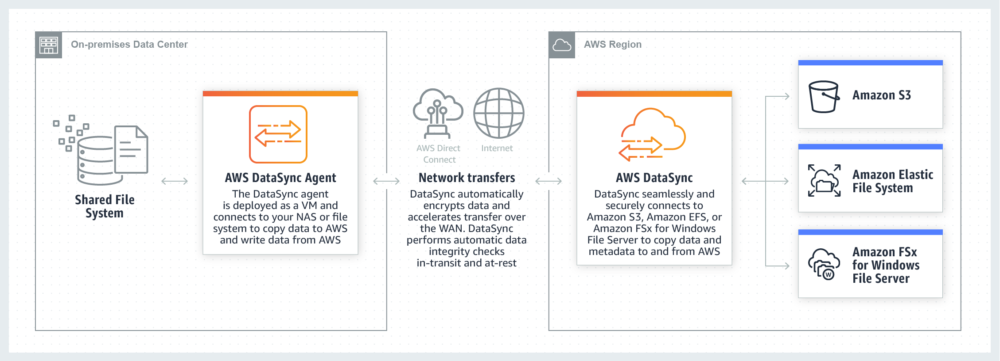

# AWS DataSync

1. An organization plans to use an AWS Direct Connect connection to establish a dedicated connection between its on-premises network and AWS. The organization needs to launch a fully managed solution that will automate and accelerate the replication of data to and from various AWS storage services.

Which of the following solutions would you recommend?

[ ] Use an AWS Storage Gateway file gateway to store and retrieve files directly using the SMB file system protocol.

[ ] Use an AWS Storage Gateway tape gateway to store data on virtual tape cartridges and asynchronously copy your backups to AWS.

[ ] Use an AWS DataSync agent to rapidly move the data over the Internet.

[x] Use an AWS DataSync agent too rapidly move the data over a service endpoint.

**Explanation**: **AWS DataSync** allows you to copy large datasets with millions of files, without having to build custom solutions with open source tools or license and manage expensive commercial network acceleration software. You can use DataSync to migrate active data to AWS, transfer data to the cloud for analysis and processing, archive data to free up on-premises storage capacity, or replicate data to AWS for business continuity.

AWS DataSync simplifies, automates, and accelerates copying large amounts of data to and from AWS storage services over the internet or AWS Direct Connect. DataSync can copy data between Network File System (NFS), Server Message Block (SMB) file servers, self-managed object storage, or AWS Snowcone, and Amazon Simple Storage Service (Amazon S3) buckets, Amazon EFS file systems, and Amazon FSx for Windows File Server file systems.

You deploy an AWS DataSync agent to your on-premises hypervisor or in Amazon EC2. To copy data to or from an on-premises file server, you download the agent virtual machine image from the AWS Console and deploy to your on-premises VMware ESXi, Linux Kernel-based Virtual Machine (KVM), or Microsoft Hyper-V hypervisor. To copy data to or from an in-cloud file server, you create an Amazon EC2 instance using a DataSync agent AMI. In both cases the agent must be deployed so that it can access your file server using the NFS, SMB protocol, or the Amazon S3 API. To set up transfers between your AWS Snowcone device and AWS storage, use the DataSync agent AMI that comes pre-installed on your device.

Since the scenario plans to use AWS Direct Connect for private connectivity between on-premises and AWS, you can use DataSync to automate and accelerate online data transfers to AWS storage services. The AWS DataSync agent will be deployed in your on-premises network to accelerate data transfer to AWS. To connect programmatically to an AWS service, you will need to use an AWS Direct Connect service endpoint.

Hence, the correct answer is: **Use an AWS DataSync agent to rapidly move the data over a service endpoint.**

> The option that says: **Use AWS DataSync agent to rapidly move the data over the Internet** is incorrect because the organization will be using an AWS Direct Connect connection for private connectivity. This means that the connection will not pass through the public Internet.

> The options that say: **Use AWS Storage Gateway tape gateway to store data on virtual tape cartridges and asynchronously copy your backups to AWS** and **Use AWS Storage Gateway file gateway to store and retrieve files directly using the SMB file system protocol** are both incorrect because, in the scenario, you need to accelerate the replication of data, and not establish a hybrid cloud storage architecture. AWS Storage Gateway only supports a few AWS storage services as a target based on the type of gateway that you launched. AWS DataSync is more suitable in automating and accelerating online data transfers to a variety of AWS storage services.

 
