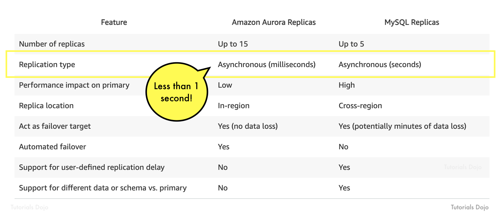

# Aurora High Availability using Read Replicas

1. A tech startup is launching an on-demand food delivery platform using Amazon ECS cluster with an AWS Fargate serverless compute engine and Amazon Aurora. It is expected that the database read queries will significantly increase in the coming weeks ahead. A Solutions Architect recently launched two Read Replicas to the database cluster to improve the platform's scalability.

Which of the following is the MOST suitable configuration that the Architect should implement to load balance all of the incoming read requests equally to the two Read Replicas?

[ ] Enable Amazon Parallel Query.

[x] Use the built-in Reader endpoint of the Amazon Aurora database.

[ ] Create a new Network Load Balancer to evenly distribute the read queries to the Read Replicas of the Amazon Aurora database.

[ ] Use the built-in Cluster endpoint of the Amazon Aurora database.

**Explanation**: **Amazon Aurora** typically involves a cluster of DB instances instead of a single instance. Each connection is handled by a specific DB instance. When you connect to an Aurora cluster, the hostname and port that you specify point to an intermediate handler called an *endpoint*. Aurora uses the endpoint mechanism to abstract these connections. Thus, you don't have to hardcode all the hostnames or write your own logic for load-balancing and rerouting connections when some DB instances aren't available.

For certain Aurora tasks, different instances or groups of instances perform different roles. For example, the primary instance handles all data definition language (DDL) and data manipulation language (DML) statements. Up to 15 Aurora Replicas handle read-only query traffic.

Using endpoints, you can map each connection to the appropriate instance or group of instances based on your use case. For example, to perform DDL statements, you can connect to whichever instance is the primary instance. To perform queries, you can connect to the reader endpoint, with Aurora automatically performing load-balancing among all the Aurora Replicas. For clusters with DB instances of different capacities or configurations, you can connect to custom endpoints associated with different subsets of DB instances. For diagnosis or tuning, you can connect to a specific instance endpoint to examine details about a specific DB instance.

A reader endpoint for an Aurora DB cluster provides load-balancing support for read-only connections to the DB cluster. Use the reader endpoint for read operations, such as queries. By processing those statements on the read-only Aurora Replicas, this endpoint reduces the overhead on the primary instance. It also helps the cluster to scale the capacity to handle simultaneous `SELECT` queries, proportional to the number of Aurora Replicas in the cluster. Each Aurora DB cluster has one reader endpoint.

If the cluster contains one or more Aurora Replicas, the reader endpoint load balances each connection request among the Aurora Replicas. In that case, you can only perform read-only statements such as `SELECT` in that session. If the cluster only contains a primary instance and no Aurora Replicas, the reader endpoint connects to the primary instance. In that case, you can perform write operations through the endpoint.

Hence, the correct answer is to **use the built-in Reader endpoint of the Amazon Aurora database.**

> The option that says: **Use the built-in Cluster endpoint of the Amazon Aurora database** is incorrect because a cluster endpoint (also known as a writer endpoint) simply connects to the current primary DB instance for that DB cluster. This endpoint can perform write operations in the database such as DDL statements, which is perfect for handling production traffic but not suitable for handling queries for reporting since there will be no write database operations that will be sent.

> The option that says: **Enable Amazon Aurora Parallel Query** is incorrect because this feature simply enables Amazon Aurora to push down and distribute the computational load of a single query across thousands of CPUs in Aurora's storage layer. Take note that it does not load balance all of the incoming read requests equally to the two Read Replicas. With Parallel Query, query processing is pushed down to the Aurora storage layer. The query gains a large amount of computing power, and it needs to transfer far less data over the network. In the meantime, the Aurora database instance can continue serving transactions with much less interruption. This way, you can run transactional and analytical workloads alongside each other in the same Aurora database, while maintaining high performance.

> The option that says: **Create a new Network Load Balancer to evenly distribute the read queries to the Read Replicas of the Amazon Aurora database** is incorrect because a Network Load Balancer is not the suitable service/component to use for this requirement since an NLB is primarily used to distribute traffic to servers, not Read Replicas. You have to use the built-in Reader endpoint of the Amazon Aurora database instead.

 

2. A company is using an Amazon RDS for MySQL 5.6 with Multi-AZ deployment enabled and several web servers across two AWS Regions. The database is currently experiencing highly dynamic reads due to the growth of the company’s website. The Solutions Architect tried to test the read performance from the secondary AWS Region and noticed a notable slowdown on the SQL queries.

Which of the following options would provide a read replication latency of less than 1 second?

[ ] Upgrade the MySQL database engine.

[ ] Migrate the existing database to Amazon Aurora and create a cross-region read replica.

[ ] Create an Amazon RDS for MySQL read replica in the secondary AWS Region.

[ ] Use Amazon ElastiCache to improve database performance.

**Explanation**: **Amazon Aurora** is a MySQL and PostgreSQL-compatible relational database built for the cloud, that combines the performance and availability of traditional enterprise databases with the simplicity and cost-effectiveness of open source databases. Amazon Aurora is up to five times faster than standard MySQL databases and three times faster than standard PostgreSQL databases.

It provides the security, availability, and reliability of commercial databases at 1/10th the cost. Amazon Aurora is fully managed by Amazon RDS, which automates time-consuming administration tasks like hardware provisioning, database setup, patching, and backups.

Based on the given scenario, there is a significant slowdown after testing the read performance from the secondary AWS Region. Since the existing setup is an Amazon RDS for MySQL, you should migrate the database to Amazon Aurora and create a cross-region read replica.

The read replication latency of less than 1 second is only possible if you would use Amazon Aurora replicas. Aurora replicas are independent endpoints in an Aurora DB cluster, best used for scaling read operations and increasing availability. You can create up to 15 replicas within an AWS Region.

Hence, the correct answer is: **Migrate the existing database to Amazon Aurora and create a cross-region read replica.**

> The option that says: **Upgrade the MySQL database engine** is incorrect because upgrading the database engine wouldn't improve the read replication latency to milliseconds. To achieve the read replication latency of less than 1-second requirement, you need to use Amazon Aurora replicas.

> The option that says: **Use Amazon ElastiCache to improve database performance** is incorrect. Amazon ElastiCache won't be able to improve the database performance because it is experiencing highly dynamic reads. This option would be helpful if the database frequently receives the same queries.

> The option that says: **Create an Amazon RDS for MySQL read replica in the secondary AWS Region** is incorrect because MySQL replicas won't provide you a read replication latency of less than 1 second. RDS Read Replicas can only provide asynchronous replication in seconds and not in milliseconds. You have to use Amazon Aurora replicas in this scenario.

 
