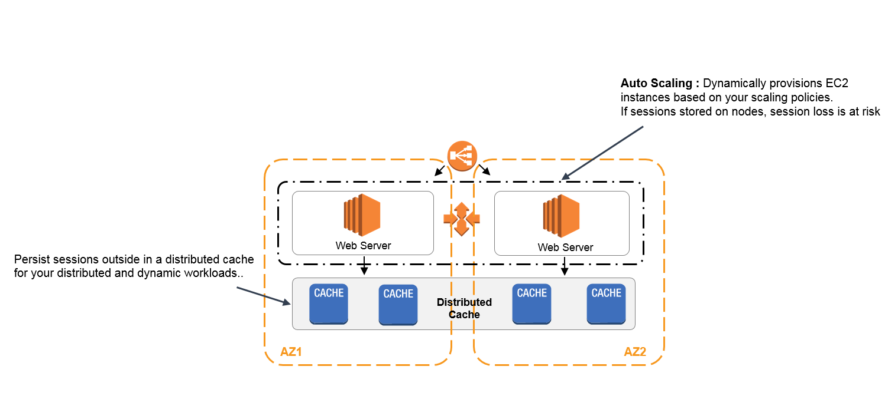

# ElastiCache

1. A company is designing a banking portal that uses Amazon ElastiCache for Redis as its distributed session management component. Since the other Cloud Engineers in your department have access to your ElastiCache cluster, you have to secure the session data in the portal by requiring them to enter a password before they are granted permission to execute Redis commands.

As the Solutions Architect, which of the following should you do to meet the above requirement?

[ ] Authenticate the users using Redis AUTH by creating a new Redis Cluster with both the `--transit-encryption-enabled` and `--auth-token` parameters enabled.

[ ] Set up a Redis replication group and enable the `AtRestEncryptionEnabled` parameter.

[ ] Set up an IAM Policy and MFA which requires the Cloud Engineers to enter their IAM credentials and token before they can access the ElastiCache cluster.

[ ] Enable the in-transit encryption for Redis replication groups.

**Explanation**: Using **Redis** `AUTH` command can improve data security by requiring the user to enter a password before they are granted permission to execute Redis commands on a password-protected Redis server. Hence, the correct answer is: **Authenticate the users using Redis AUTH by creating a new Redis Cluster with both the `--transit-encryption-enabled` and `--auth-token` parameters enabled**.

To require that users enter a password on a password-protected Redis server, include the parameter `--auth-token` with the correct password when you create your replication group or cluster and on all subsequent commands to the replication group or cluster.

> **Setting up an IAM Policy and MFA which requires the Cloud Engineers to enter their IAM credentials and token before they can access the ElastiCache cluster** is incorrect because this is not possible in IAM. You have to use the Redis AUTH option instead.

> **Setting up a Redis replication group and enabling the `AtRestEncryptionEnabled` parameter** is incorrect because the Redis At-Rest Encryption feature only secures the data inside the in-memory data store. You have to use Redis AUTH option instead.

> **Enabling the in-transit encryption for Redis replication groups** is incorrect. Although in-transit encryption is part of the solution, it is missing the most important thing which is the Redis AUTH option.

 

2. An online stock trading system is hosted in AWS and uses an Auto Scaling group of EC2 instances, an RDS database, and an Amazon ElastiCache for Redis. You need to improve the data security of your in-memory data store by requiring the user to enter a password before they are granted permission to execute Redis commands.   

Which of the following should you do to meet the above requirement?

[ ] Authenticate the users using Redis AUTH by creating a new Redis Cluster w/ both the `--transit-encryption-enabled` and `--auth-token` parameters enabled.

[ ] Create a new Redis replication group and set the `AtRestEncryptionEnabled` parameter to `true`.

[ ] Do nothing. This feature is already enabled by default.

[ ] Enable the in-transit encryption for Redis replication groups.

[ ] None of the above.

**Explanation**: Using Redis `AUTH` command can improve data security by requiring the user to enter a password before they are granted permission to execute Redis commands on a password-protected Redis server.

Hence, the correct answer is to **authenticate the users using Redis AUTH by creating a new Redis Cluster with both the `--transit-encryption-enabled` and `--auth-token` parameters enabled.**

To require that users enter a password on a password-protected Redis server, include the parameter `--auth-token` with the correct password when you create your replication group or cluster and on all subsequent commands to the replication group or cluster.

> **Enabling the in-transit encryption for Redis replication groups** is incorrect because although in-transit encryption is part of the solution, it is missing the most important thing which is the Redis AUTH option.

> **Creating a new Redis replication group and setting the `AtRestEncryptionEnabled` parameter to true** is incorrect because the Redis At-Rest Encryption feature only secures the data inside the in-memory data store. You have to use Redis AUTH option instead.

> The option that says: **Do nothing. This feature is already enabled by default** is incorrect because the Redis AUTH option is disabled by default.

 

3. A company has a fleet of running Spot EC2 instances behind an Application Load Balancer. The incoming traffic comes from various users across multiple AWS regions and you would like to have the user's session shared among the fleet of instances. You are required to set up a distributed session management layer that will provide a scalable and shared data storage for the user sessions.

Which of the following would be the best choice to meet the requirement while still providing sub-millisecond latency for the users?

[ ] Multi-master DynamoDB

[ ] ElastiCache in-memory caching

[ ] Multi-AZ RDS

[ ] ELB sticky sessions

**Explanation**: For sub-millisecond latency caching, **ElastiCache** is the best choice. In order to address scalability and to provide a shared data storage for sessions that can be accessed from any individual web server, you can abstract the HTTP sessions from the web servers themselves. A common solution for this is to leverage an In-Memory Key/Value store such as Redis and Memcached.

> **ELB sticky sessions** is incorrect because the scenario does not require you to route a user to the particular web server that is managing that individual user’s session. Since the session state is shared among the instances, the use of the ELB sticky sessions feature is not recommended in this scenario.

> **Multi-master DynamoDB** and **Multi-AZ RDS** are incorrect. Although you can use DynamoDB and RDS for storing session state, these two are not the best choices in terms of cost-effectiveness and performance when compared to ElastiCache. There is a significant difference in terms of latency if you used DynamoDB and RDS when you store the session data.

 
