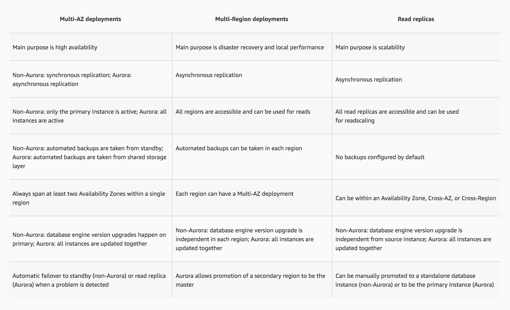

# High Availability using RDS Read Replicas

1. Due to the large volume of query requests, the database performance of an online reporting application significantly slowed down. The Solutions Architect is trying to convince her client to use Amazon RDS Read Replica for their application instead of setting up a Multi-AZ Deployments configuration.

What are two benefits of using Read Replicas over Multi-AZ that the Architect should point out? (Select TWO.)

[ ] Provides synchronous replications and automatic failover in the case of Availability Zone service failures.

[x] Provides asynchronous replication and improves the performance of the primary database by taking read-heavy database workloads from it.

[ ] Allows both read and write operations on the read replica to complement the primary database.

[x] It elastically scales out beyond the capacity constraints of a single DB instance for read-heavy database workloads.

**Explanation**: Amazon RDS Read Replicas provide enhanced performance and durability for database (DB) instances. This feature makes it easy to elastically scale out beyond the capacity constraints of a single DB instance for read-heavy database workloads.

You can create one or more replicas of a given source DB Instance and serve high-volume application read traffic from multiple copies of your data, thereby increasing aggregate read throughput. Read replicas can also be promoted when needed to become standalone DB instances.

For the MySQL, MariaDB, PostgreSQL, and Oracle database engines, Amazon RDS creates a second DB instance using a snapshot of the source DB instance. It then uses the engines' native asynchronous replication to update the read replica whenever there is a change to the source DB instance. The read replica operates as a DB instance that allows only read-only connections; applications can connect to a read replica just as they would to any DB instance. Amazon RDS replicates all databases in the source DB instance.

When you create a read replica for Amazon RDS for MySQL, MariaDB, PostgreSQL, and Oracle, Amazon RDS sets up a secure communications channel using public-key encryption between the source DB instance and the read replica, even when replicating across regions. Amazon RDS establishes any AWS security configurations, such as adding security group entries needed to enable the secure channel.

You can also create read replicas within a Region or between Regions for your Amazon RDS for MySQL, MariaDB, PostgreSQL, and Oracle database instances encrypted at rest with AWS Key Management Service (KMS).

Hence, the correct answers are:

* It elastically scales out beyond the capacity constraints of a single DB instance for read-heavy database workloads.

* Provides asynchronous replication and improves the performance of the primary database by taking read-heavy database workloads from it.

> The option that says: **Allows both read and write operations on the read replica to complement the primary database** is incorrect as Read Replicas are primarily used to offload read-only operations from the primary database instance. By default, you can't do a write operation to your Read Replica.

> The option that says: **Provides synchronous replication and automatic failover in the case of Availability Zone service failures** is incorrect as this is a benefit of Multi-AZ and not of a Read Replica. Moreover, Read Replicas provide an asynchronous type of replication and not synchronous replication.

 
