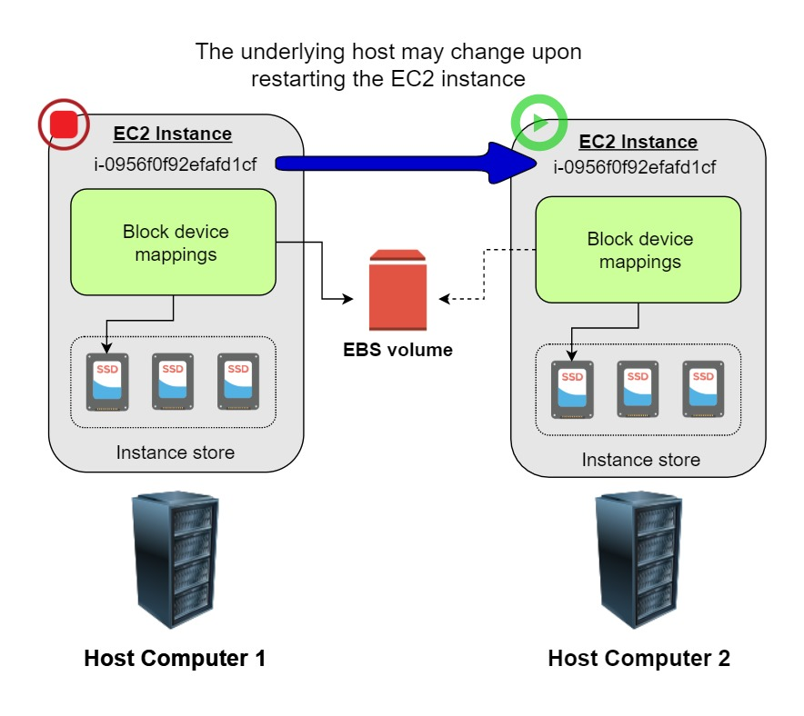

# EC2

1. A company has many applications on Amazon EC2 instances running in Auto Scaling groups. Company policy requires that the data on the attached Amazon Elastic Block Store (Amazon EBS) volumes will be retained.

Which action will meet these requirements w/o impacting performance?

**Disable `DeleteOnTermination` attribute for the Amazon EBS volumes**

**Explanation**: Health check will not affect whether the EBS volume will be retained.

 

2. A solutions architect wants to design a solution to save costs for Amazon EC2 instances that do not need to run during a 2-week company shutdown. The applications running on the instances store data in instance memory (RAM) that must be present when the instances resume operation.

Which approach should the solutions architect recommend to shut down and resume the instances?

[ ] Modify the application to store the data on instance store volumes. Reattach the volumes while restarting
them.

[ ] Snapshot the instances before stopping them. Restore the snapshot after restarting the instances.

[x] Run the applications on instances enabled for hibernation. Hibernate the instances before the shutdown.

[ ] Note the Availability Zone for each instance before stopping it. Restart the instances in the same
Availability Zones after the shutdown.

**Explanation**: Hibernating an instance saves the contents of RAM to the Amazon EBS root volume. When the instance restarts, the RAM contents are reloaded.

 

3. A FinTech startup deployed an application on an Amazon EC2 instance with attached Instance Store volumes and an Elastic IP address. The server is only accessed from 8 AM to 6 PM and can be stopped from 6 PM to 8 AM for cost efficiency using Lambda with the script that automates this based on tags.

Which of the following will occur when the EC2 instance is stopped and started? (Select TWO.)

[x] All data on the attached instance-store devices will be lost.

[x] The underlying host for the instance is possibly changed.

[ ] There will be no changes.

[ ] The ENI (Elastic Network Interface) is detached.

[ ] The Elastic IP address is disassociated w/ the instance.

**Explanation**: This question did not mention the specific type of EC2 instance, however, it says that it will be stopped and started. Since only EBS-backed instances can be stopped and restarted, it is implied that the instance is EBS-backed. Remember that an instance store-backed instance can only be rebooted or terminated, and its data will be erased if the EC2 instance is either stopped or terminated.

If you stopped an EBS-backed EC2 instance, the volume is preserved, but the data in any attached instance store volume will be erased. Keep in mind that an EC2 instance has an underlying physical host computer. If the instance is stopped, AWS usually moves the instance to a new host computer. Your instance may stay on the same host computer if there are no problems with the host computer. In addition, its Elastic IP address is disassociated from the instance if it is an EC2-Classic instance. Otherwise, if it is an EC2-VPC instance, the Elastic IP address remains associated.

Take note that an EBS-backed EC2 instance can have attached Instance Store volumes. This is the reason why there is an option that mentions the Instance Store volume, which is placed to test your understanding of this specific storage type. You can launch an EBS-backed EC2 instance and attach several Instance Store volumes but remember that there are some EC2 Instance types that don't support this kind of setup.

Hence, the correct answers are:

* The underlying host for the instance is possibly changed.

* All data on the attached instance-store devices will be lost.

> The option that says: **The ENI (Elastic Network Interface) is detached is incorrect because the ENI will stay attached even if you stopped your EC2 instance**.

> The option that says: **The Elastic IP address is disassociated with the instance** is incorrect because the EIP will actually remain associated with your instance even after stopping it.

> The option that says: **There will be no changes** is incorrect because there will be a lot of possible changes in your EC2 instance once you stop and start it again. AWS may move the virtualized EC2 instance to another host computer; the instance may get a new public IP address, and the data in your attached instance store volumes will be deleted.

 
