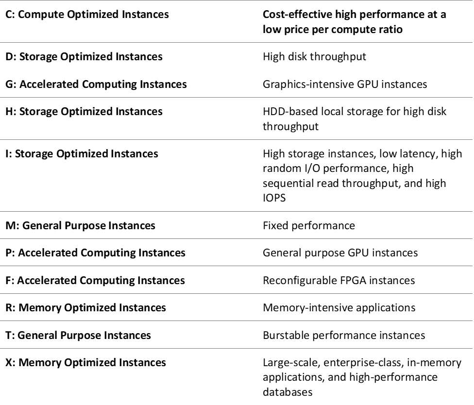

# EC2 Instance Types

1. A company plans to migrate a NoSQL database to an EC2 instance. The database is configured to replicate the data automatically to keep multiple copies of data for redundancy. The Solutions Architect needs to launch an instance that has a high IOPS and sequential read/write access.

Which of the following options fulfills the requirement if I/O throughput is the highest priority?

[ ] Use Memory optimized instances w/ EBS volume.

[ ] Use Storage optimized instances w/ instance store volume.

[ ] Use General purpose instances w/ EBS volume.

[ ] Use Compute optimized instance w/ instance store volume.

**Explanation**: **Amazon EC2** provides a wide selection of instance types optimized to fit different use cases. Instance types comprise varying combinations of CPU, memory, storage, and networking capacity and give you the flexibility to choose the appropriate mix of resources for your applications. Each instance type includes one or more instance sizes, allowing you to scale your resources to the requirements of your target workload.

A storage optimized instance is designed for workloads that require high, sequential read and write access to very large data sets on local storage. They are optimized to deliver tens of thousands of low-latency, random I/O operations per second (IOPS) to applications. Some instance types can drive more I/O throughput than what you can provision for a single EBS volume. You can join multiple volumes together in a RAID 0 configuration to use the available bandwidth for these instances.

Based on the given scenario, the NoSQL database will be migrated to an EC2 instance. The suitable instance type for NoSQL database is I3 and I3en instances. Also, the primary data storage for I3 and I3en instances is non-volatile memory express (NVMe) SSD instance store volumes. Since the data is replicated automatically, there will be no problem using an instance store volume.

Hence, the correct answer is: **Use Storage optimized instances with instance store volume.**

> The option that says: **Use Compute optimized instances with instance store volume** is incorrect because this type of instance is ideal for compute-bound applications that benefit from high-performance processors. It is not suitable for a NoSQL database.

> The option that says: **Use General purpose instances with EBS volume** is incorrect because this instance only provides a balance of computing, memory, and networking resources. Take note that the requirement in the scenario is high sequential read and write access. Therefore, you must use a storage optimized instance.

> The option that says: **Use Memory optimized instances with EBS volume** is incorrect. Although this type of instance is suitable for a NoSQL database, it is not designed for workloads that require high, sequential read and write access to very large data sets on local storage.

 

2. A Solutions Architect needs to set up the required compute resources for the application which have workloads that require high, sequential read and write access to very large data sets on local storage.

Which of the following instance type is the most suitable one to use in this scenario?

[ ] Compute Optimized Instances

[ ] Memory Optimized Instances

[ ] General Purpose Instances

[ ] Storage Optimized Instances

**Explanation**: **Storage optimized instances** are designed for workloads that require high, sequential read and write access to very large data sets on local storage. They are optimized to deliver tens of thousands of low-latency, random I/O operations per second (IOPS) to applications.

Hence, the correct answer is: **Storage Optimized Instances.**

> **Memory Optimized Instances** is incorrect because these are designed to deliver fast performance for workloads that process large data sets in memory, which is quite different from handling high read and write capacity on local storage.

> **Compute Optimized Instances** is incorrect because these are ideal for compute-bound applications that benefit from high-performance processors, such as batch processing workloads and media transcoding.

> **General Purpose Instances** is incorrect because these are the most basic type of instances. They provide a balance of compute, memory, and networking resources, and can be used for a variety of workloads. Since you are requiring higher read and write capacity, storage optimized instances should be selected instead.

 

3. A company is transitioning its Amazon EC2 based MariaDB database to Amazon RDS. The company has already identified a database instance type that will meet the company's CPU and memory requirements. The database must provide at least 40 GiB of storage capacity and 1,000 IOPS.

Which storage configuration for the Amazon RDS for MariaDB instance is MOST cost-effective?

[ ] Provision 350 GiB of magnetic storage for the RDS instance. → `Incorrect. Magnetic storage does not support IOPS as a configurable parameter.`

[ ] Provision 50 GiB of General Purpose SSD storage for the RDS instance. → `Incorrect. Baseline I/O performance for General Purpose SSD storage is 3 IOPS for each GiB, with a minimum of 100 IOPS. For 50 GiB of storage, the baseline performance would be 150 IOPS.`

[ ] Provision 334 GiB of General Purpose SSD storage for the RDS instance → `Correct. Baseline I/O performance for General Purpose SSD storage is 3 IOPS for each GiB. For 334 GiB of storage, the baseline performance would be 1,002 IOPS. Additionally, General Purpose SSD storage is more cost-effective than Provisioned IOPS storage.`

[ ] Provision 50 GiB of Provisioned IOPS storage w/ 1,000 IOPS for the RDS instance. → `Incorrect. 50 GiB of Provisioned IOPS storage with 1,000 IOPS would be more expensive than 334 GiB of General Purpose SSD storage.`

 

4. A media company is designing a new solution for graphic rendering. The application requires up to 400 GB of storage for temporary data that is discarded after the frames are rendered. The application requires approximately 40,000 random IOPS to perform the rendering.

What is the MOST cost-effective storage option for this rendering application?

[ ] A storage optimized Amazon EC2 instance w/ instance store storage. → `Correct. SSD-Backed Storage Optimized (i2) instances provide more than 365,000 random IOPS. The instance store has no additional cost, compared with the regular hourly cost of the instance.`

[ ] A storage optimized Amazon EC2 instance w/ a Provisioned IOPS SSD (io1 or io2) Amazon Elastic Block Store (Amazon EBS) volume → `Incorrect. Provisioned IOPS SSD (io1 or io2) EBS volumes can deliver more than the 40,000 IOPS that are required in the scenario. However, this solution is not as cost-effective as an instance store because Amazon EBS adds cost to the hourly instance rate. This solution provides persistence of data beyond the lifecycle of the instance, but persistence is not required in this use case.`

[ ] A burstable Amazon EC2 instance w/ a Throughput Optimized HDD (st1) Amazon Elastic Block Store (Amazon EBS) volume → `Incorrect. Throughput Optimized HDD (st1) EBS volumes are engineered to maximize the throughput of data that can be sent to and from a volume, not the random IOPS. Consequently, this solution does not meet the IOPS requirement. In addition, Amazon EBS adds cost to the hourly instance rate. This solution provides persistence of data beyond the lifecycle of the instance, but persistence is not required in this use case.`

[ ] A burstable Amazon EC2 instance w/ Amazon S3 storage over a VPC endpoint → `Incorrect. The rapidly changing data that is required for the scratch volume space makes Amazon S3 (object storage) the wrong storage. Block storage is appropriate for the read/write functionality to work smoothly.`

 
