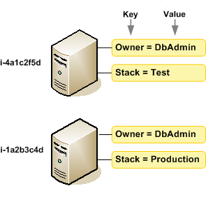

# EC2 Tags

1. A company has a UAT and production EC2 instances running on AWS. They want to ensure that employees who are responsible for the UAT instances don’t have the access to work on the production instances to minimize security risks.

Which of the following would be the best way to achieve this?

[ ] Launch the UAT and production instances in different Availability Zones and use Multi Factor Authentication.

[ ] Launch the UAT and production EC2 instances in separate VPC's connected by VPC peering.

[ ] Provide permissions to the users via the AWS Resource Access Manager (RAM) service to only access EC2 instances that are used for production or development.

[x] Define the tags on the UAT and production servers and add a condition to the IAM policy which allows access to specific tags.

**Explanation**: For this scenario, the best way to achieve the required solution is to use a combination of Tags and IAM policies. You can define the tags on the UAT and production EC2 instances and add a condition to the IAM policy which allows access to specific tags.

Tags enable you to categorize your AWS resources in different ways, for example, by purpose, owner, or environment. This is useful when you have many resources of the same type — you can quickly identify a specific resource based on the tags you've assigned to it.

By default, IAM users don't have permission to create or modify Amazon EC2 resources, or perform tasks using the Amazon EC2 API. (This means that they also can't do so using the Amazon EC2 console or CLI.) To allow IAM users to create or modify resources and perform tasks, you must create IAM policies that grant IAM users permission to use the specific resources and API actions they'll need, and then attach those policies to the IAM users or groups that require those permissions.

Hence, the correct answer is: **Define the tags on the UAT and production servers and add a condition to the IAM policy which allows access to specific tags.**

> The option that says: **Launch the UAT and production EC2 instances in separate VPC's connected by VPC peering** is incorrect because these are just network changes to your cloud architecture and don't have any effect on the security permissions of your users to access your EC2 instances.

> The option that says: **Provide permissions to the users via the AWS Resource Access Manager (RAM) service to only access EC2 instances that are used for production or development** is incorrect because the AWS Resource Access Manager (RAM) is primarily used to securely share your resources across AWS accounts or within your Organization and not on a single AWS account. You also have to set up a custom IAM Policy in order for this to work.

> The option that says: **Launch the UAT and production instances in different Availability Zones and use Multi Factor Authentication** is incorrect because placing the EC2 instances to different AZs will only improve the availability of the systems but won't have any significance in terms of security. You have to set up an IAM Policy that allows access to EC2 instances based on their tags. In addition, a Multi-Factor Authentication is not a suitable security feature to be implemented for this scenario.

 
