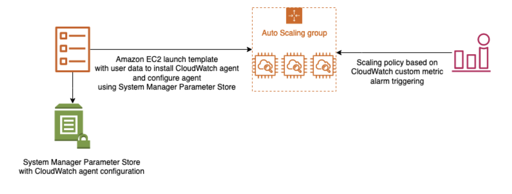

# Monitoring an Auto Scaling Group through CloudWatch

1. A company is running a custom application in an Auto Scaling group of Amazon EC2 instances. Several instances are failing due to insufficient swap space. The Solutions Architect has been instructed to troubleshoot the issue and effectively monitor the available swap space of each EC2 instance.

Which of the following options fulfills this requirement?

[ ] Install the CloudWatch agent on each instance and monitor the `SwapUtilization` metric.

[ ] Create a CloudWatch dashboard and monitor the `SwapUsed` metric.

[ ] Create a new trail in AWS CloudTrail and configure Amazon CloudWatch Logs to monitor your trail logs.

[ ] Enable detailed monitoring on each instance and monitor the `SwapUtilization` metric.

**Explanation**: **Amazon CloudWatch** is a monitoring service for AWS cloud resources and the applications you run on AWS. You can use Amazon CloudWatch to collect and track metrics, collect and monitor log files, and set alarms. Amazon CloudWatch can monitor AWS resources such as Amazon EC2 instances, Amazon DynamoDB tables, and Amazon RDS DB instances, as well as custom metrics generated by your applications and services and any log files your applications generate. You can use Amazon CloudWatch to gain system-wide visibility into resource utilization, application performance, and operational health.

The main requirement in the scenario is to monitor the `SwapUtilization` metric. Take note that you can't use the default metrics of CloudWatch to monitor the `SwapUtilization` metric. To monitor custom metrics, you must install the CloudWatch agent on the EC2 instance. After installing the CloudWatch agent, you can now collect system metrics and log files of an EC2 instance.

Hence, the correct answer is: **Install the CloudWatch agent on each instance and monitor the `SwapUtilization` metric.**

The option that says: **Enable detailed monitoring on each instance and monitor the `SwapUtilization` metric** is incorrect because you can't monitor the `SwapUtilization` metric by just enabling the detailed monitoring option. You must install the CloudWatch agent on the instance.

The option that says: **Create a CloudWatch dashboard and monitor the `SwapUsed` metric** is incorrect because you must install the CloudWatch agent first to add the custom metric in the dashboard.

The option that says: **Create a new trail in AWS CloudTrail and configure Amazon CloudWatch Logs to monitor your trail logs** is incorrect because CloudTrail won't help you monitor custom metrics. CloudTrail is specifically used for monitoring API activities in an AWS account.

 

2. An Auto Scaling group (ASG) of Linux EC2 instances has an Amazon FSx for OpenZFS file system with basic monitoring enabled in CloudWatch. The Solutions Architect noticed that the legacy web application hosted in the ASG takes a long time to load. After checking the instances, the Architect noticed that the ASG is not launching more instances as it should be, even though the servers already have high memory usage.

Which of the following options should the Architect implement to solve this issue?

[ ] Implement an AI solution that leverages Amazon Comprehend to track the near-real-time memory usage of each and every EC2 instance. Use Amazon SageMaker to automatically trigger the Auto Scaling event if there is high memory usage.

[ ] Enable detailed monitoring on the Amazon EC2 instances of the Auto Scaling group. Use Amazon Forecast to automatically scale out the Auto Scaling group based on the aggregated memory usage of Amazon EC2 instances.

[ ] Set up Amazon Rekognition to automatically identify and recognize the cause of the high memory usage. Use the AWS Well-Architected Tool to automatically trigger the scale-out event in the ASG based on the overall memory usage.

[ ] Install the CloudWatch unified agent to the EC2 instances. Set up a custom parameter in AWS Systems Manager Parameter Store w/ the CloudWatch agent configuration to create an aggregated metric on memory usage percentage. Scale the Auto Scaling group based on the aggregated metric.

**Explanation**: Amazon CloudWatch agent enables you to collect both system metrics and log files from Amazon EC2 instances and on-premises servers. The agent supports both Windows Server and Linux and allows you to select the metrics to be collected, including sub-resource metrics such as per-CPU core.

The premise of the scenario is that the EC2 servers have **high memory** usage, but since this specific metric is not tracked by the Auto Scaling group by default, the scaling out activity is not being triggered. Remember that by default, CloudWatch doesn't monitor memory usage but only the CPU utilization, Network utilization, Disk performance, and Disk Reads/Writes.

This is the reason why you have to install a CloudWatch agent in your EC2 instances to collect and monitor the custom metric (memory usage), which will be used by your Auto Scaling Group as a trigger for scaling activities.

The AWS Systems Manager Parameter Store is one of the capabilities of AWS Systems Manager. It provides secure, hierarchical storage for configuration data management and secrets management. You can store data such as passwords, database strings, Amazon Machine Image (AMI) IDs, and license codes as parameter values. You can store values as plain text or encrypted data. You can reference Systems Manager parameters in your scripts, commands, SSM documents, and configuration and automation workflows by using the unique name that you specified when you created the parameter.

Hence, the correct answer is: **Install the CloudWatch unified agent to the EC2 instances. Set up a custom parameter in AWS Systems Manager Parameter Store with the CloudWatch agent configuration to create an aggregated metric on memory usage percentage. Scale the Auto Scaling group based on the aggregated metric**

> The option that says: **Implement an AI solution that leverages Amazon Comprehend to track the near-real-time memory usage of each and every EC2 instance? Use Amazon SageMaker to automatically trigger the Auto Scaling event if there is high memory usage** is incorrect because Amazon Comprehend cannot track near-real-time memory usage in Amazon EC2. This is just a natural-language processing (NLP) service that uses machine learning to uncover valuable insights and connections in text. Also, the use of an Amazon SageMaker in this scenario is not warranted since there is no machine learning requirement involved.

> The option that says: **Enable detailed monitoring on the Amazon EC2 instances of the Auto Scaling group. Use Amazon Forecast to automatically scale out the Auto Scaling group based on the aggregated memory usage of Amazon EC2 instances** is incorrect because detailed monitoring does not provide metrics for memory usage. CloudWatch does not monitor memory usage in its default set of EC2 metrics and detailed monitoring just provides a higher frequency of metrics (1-minute frequency). Amazon Forecast is a time-series forecasting service based on machine learning (ML) and built for business metrics analysis — not for scaling out an Auto Scaling group based on an aggregated metfic.

> The option that says: **Set up Amazon Rekognition to automatically identify and recognize the cause of the high memory usage. Use the AWS Well-Architected Tool to automatically trigger the scale-out event in the ASG based on the overall memory usage** is incorrect because Amazon Rekognition is simply an image recognition service that detects objects, scenes, and faces; extracts text; recognizes celebrities; and identifies inappropriate content in images. It can't be used to track the high memory usage of your Amazon EC2 instances. The AWS Well-Architected Tool, on the other hand, is designed to help you review the state of your applications and workloads. It merely provides a central place for architectural best practices in AWS and nothing more.

 

3. A website hosted on Amazon ECS container instances loads slowly during peak traffic, affecting its availability. Currently, the container instances are run behind an Application Load Balancer, and CloudWatch alarms are configured to send notifications to the operations team if there is a problem in availability so they can scale out if needed. A solutions architect needs to create an automatic scaling solution when such problems occur.

Which solution could satisfy the requirement? (Select TWO.)

[ ] Create an AWS Auto Scaling policy that scales out an ECS service when the ALB endpoint becomes unreachable.

[x] Create an AWS Auto Scaling policy that scales out the ECS service when the service's memory utilization is too high.

[x] Create an AWS Auto Scaling policy that scales out the ECS cluster when the cluster's CPU utilization is too high.

[ ] Create an AWS Auto Scaling policy that scales out the ECS service when the ALB hits a high CPU utilization.

[ ] Create an AWS Auto Scaling policy that scales out the ECS cluster when the ALB target group's CPU utilization is too high.

**Explanation**: **AWS Auto Scaling** monitors your applications and automatically adjusts capacity to maintain steady, predictable performance at the lowest possible cost. Using AWS Auto Scaling, it’s easy to set up application scaling for multiple resources across multiple services in minutes. The service provides a simple, powerful user interface that lets you build scaling plans for resources including Amazon EC2 instances and Spot Fleets, Amazon ECS tasks, Amazon DynamoDB tables and indexes, and Amazon Aurora Replicas.

In this scenario, you can set up a scaling policy that triggers a scale-out activity to an ECS service or ECS container instance based on the metric that you prefer.

The following metrics are available for instances:

* CPU Utilization

* Disk Reads

* Disk Read Operations

* Disk Writes

* Disk Write Operations

* Network In

* Network Out

* Status Check Failed (Any)

* Status Check Failed (Instance)

* Status Check Failed (System)

The following metrics are available for ECS Service:

* `ECSServiceAverageCPUUtilization` ▶︎ Average CPU utilization of the service.

* `ECSServiceAverageMemoryUtilization` ▶︎ Average memory utilization of the service.

* `ALBRequestCountPerTarget` ▶︎ Number of requests completed per target in an Application Load Balancer target group.

Hence, the correct answers are:

* Create an AWS Auto scaling policy that scales out the ECS service when the service’s memory utilization is too high.

* Create an AWS Auto scaling policy that scales out the ECS cluster when the cluster’s CPU utilization is too high.

> The option that says: **Create an AWS Auto scaling policy that scales out an ECS service when the ALB endpoint becomes unreachable** is incorrect. This would be a different problem that needs to be addressed differently if this is the case. An unreachable ALB endpoint could mean other things like a misconfigured security group or network access control lists.

> The option that says: **Create an AWS Auto scaling policy that scales out the ECS service when the ALB hits a high CPU utilization** is incorrect. ALB is a managed resource. You cannot track nor view its resource utilization.

> The option that says: **Create an AWS Auto scaling policy that scales out the ECS cluster when the ALB target group’s CPU utilization is too high** is incorrect. AWS Auto Scaling does not support this metric for ALB.

 
