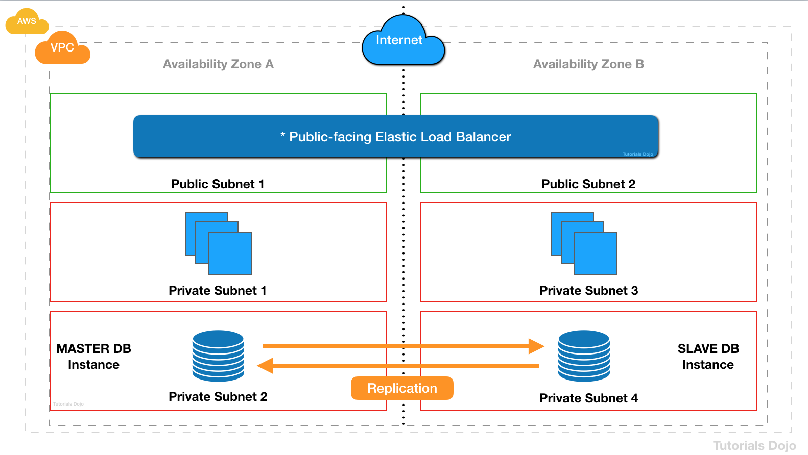

# Subnets

1. A company has a two-tier environment in its on-premises data center which is composed of an application tier and database tier. You are instructed to migrate their environment to the AWS cloud, and to design the subnets in their VPC with the following requirements:

  1. There is an application load balancer that would distribute the incoming traffic among the servers in the application tier.

  2. The application tier and the database tier must not be accessible from the public Internet. The application tier should only accept traffic coming from the load balancer.

  3. The database tier contains very sensitive data. It must not share the same subnet with other AWS resources and its custom route table with other instances in the environment.

  4. The environment must be highly available and scalable to handle a surge of incoming traffic over the Internet.

How many subnets should you create to meet the above requirements?

[ ] 3

[ ] 6

[ ] 2

[ ] 4

**Explanation**: The given scenario indicated 4 requirements that should be met in order to successfully migrate their two-tier environment from their on-premises data center to AWS Cloud. The first requirement means that you have to use an application load balancer (ALB) to distribute the incoming traffic to your application servers.

The second requirement specifies that both your application and database tier should not be accessible from the public Internet. This means that you could create a single private subnet for both of your application and database tier. However, the third requirement mentioned that the database tier should not share the same subnet with other AWS resources to protect its sensitive data. This means that you should provision one private subnet for your application tier and another private subnet for your database tier.

The last requirement alludes to the need for using at least two Availability Zones to achieve high availability. This means that you have to distribute your application servers to two AZs as well as your database which can be set up with a master-slave configuration to properly replicate the data between two zones.

If you have more than one private subnet in the same Availability Zone that contains instances that need to be registered with the load balancer, you only need to create one public subnet. You need only one public subnet per Availability Zone; you can add the private instances in all the private subnets that reside in that particular Availability Zone.

Since you have a public internet-facing load balancer that has a group of backend Amazon EC2 instances that are deployed in a private subnet, you must create the corresponding public subnets in the same Availability Zones. This new public subnet is on top of the private subnet that is used by your private EC2 instances. Lastly, you should associate these public subnets to the Internet-facing load balancer to complete the setup.

To summarize, we need to have one private subnet for the application tier and another one for the database tier. We then need to create another public subnet in the same Availability Zone where the private EC2 instances are hosted, in order to properly connect the public Internet-facing load balancer to your instances. This means that we have to use a total of 3 subnets consisting of 2 private subnets and 1 public subnet.

To meet the requirement of high availability, we have to deploy the stack to two Availability Zones. This means that you have to double the number of subnets you are using. Take note as well that you must create the corresponding public subnet in the same Availability Zone of your private EC2 servers in order for it to properly communicate with the load balancer.

Hence, the correct answer is **6** subnets.

 
