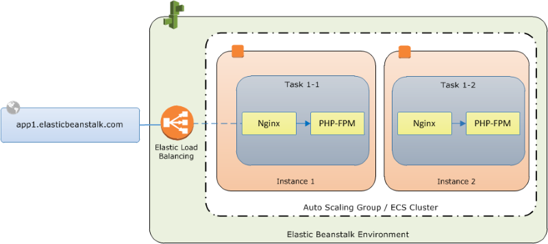

# Elastic Beanstalk

1. The company you are working for has a set of AWS resources hosted in `ap-northeast-1` region. You have been asked by your IT Manager to create an AWS CLI shell script that will call an AWS service which could create duplicate resources in another region in the event that `ap-northeast-1` region fails. The duplicated resources should also contain the VPC Peering configuration and other networking components from the primary stack.

Which of the following AWS services could help fulfill this task?

[ ] AWS Elastic Beanstalk

[x] AWS CloudFormation

**Explanation**: **AWS CloudFormation** is a service that helps you model and set up your Amazon Web Services resources so that you can spend less time managing those resources and more time focusing on your applications that run in AWS.

You can create a template that describes all the AWS resources that you want (like Amazon EC2 instances or Amazon RDS DB instances), and AWS CloudFormation takes care of provisioning and configuring those resources for you. With this, you can deploy an exact copy of your AWS architecture, along with all of the AWS resources which are hosted in one region to another.

Hence, the correct answer is **AWS CloudFormation**.

> **AWS Elastic Beanstalk** is incorrect. Elastic Beanstalk is a high-level service that simplifies the creation of application resources such as an EC2 instance with preconfigured proxy servers (Nginx or Apache), a load balancer, an auto-scaling group, and so on. Elastic Beanstalk environments have limited resources; for example, Elastic Beanstalk does not create a VPC for you. CloudFormation on the other hand is more of a low-level service that you can use to model the entirety of your AWS environment. In fact, Elastic Beanstalk uses CloudFormation under the hood to create resources.

 

2. A company developed a financial analytics web application hosted in a Docker container using MEAN (MongoDB, Express.js, AngularJS, and Node.js) stack. You want to easily port that web application to AWS Cloud which can automatically handle all the tasks such as balancing load, auto-scaling, monitoring, and placing your containers across your cluster.

Which of the following services can be used to fulfill this requirement?

[ ] AWS CloudFormation

[ ] AWS Elastic Beanstalk

[ ] Amazon Elastic Container Service (Amazon ECS)

[ ] AWS Compute Optimizer

**Explanation**: **AWS Elastic Beanstalk** supports the deployment of web applications from Docker containers. With Docker containers, you can define your own runtime environment. You can choose your own platform, programming language, and any application dependencies (such as package managers or tools), that aren't supported by other platforms. Docker containers are self-contained and include all the configuration information and software your web application requires to run.

By using Docker with Elastic Beanstalk, you have an infrastructure that automatically handles the details of capacity provisioning, load balancing, scaling, and application health monitoring. You can manage your web application in an environment that supports the range of services that are integrated with Elastic Beanstalk, including but not limited to VPC, RDS, and IAM.

Hence, the correct answer is: **AWS Elastic Beanstalk.**

> **Amazon Elastic Container Service (Amazon ECS)** is incorrect. Although it also provides Service Auto Scaling, Service Load Balancing, and Monitoring with CloudWatch, these features are not **automatically** enabled by default unlike with Elastic Beanstalk. Take note that the scenario requires a service that will **automatically** *handle all the tasks such as balancing load, auto-scaling, monitoring, and placing your containers across your cluster.* You will have to manually configure these things if you wish to use ECS. With Elastic Beanstalk, you can manage your web application in an environment that supports the range of services easier.

> **AWS CloudFormation** is incorrect. While you can deploy the infrastructure for your application thru CloudFormation templates, you will be the one responsible for connecting the AWS resources needed to build your application environment. With ElasticBeanstalk, all you have to do is upload your code; ElasticBeanstalk will automatically set up the environment for your application.

> **AWS Compute Optimizer** is incorrect. Compute Optimizer simply analyzes your workload and recommends the optimal AWS resources needed to improve performance and reduce costs.

 

3. An online shopping platform has been deployed to AWS using Elastic Beanstalk. They simply uploaded their Node.js application, and Elastic Beanstalk automatically handles the details of capacity provisioning, load balancing, scaling, and application health monitoring. Since the entire deployment process is automated, the DevOps team is not sure where to get the application log files of their shopping platform. 

In Elastic Beanstalk, where does it store the application files and server log files?

[ ] Application files are stored in S3. The server log files can be optionally stored in CloudTrail or in CloudWatch Logs.

[ ] Application files are stored in S3. The server log files can also optionally be stored in S3 or CloudWatch Logs.

[ ] Application files are stored in S3. The server log files can only be stored in the attached EBS volumes of the EC2 instances, which were launched by AWS Elastic Beanstalk.

[ ] Application files are stored in S3. The server log files can be stored directly in Glacier or in CloudWatch Logs.

**Explanation**: **AWS Elastic Beanstalk** stores your application files and optionally, server log files in Amazon S3. If you are using the AWS Management Console, the AWS Toolkit for Visual Studio, or AWS Toolkit for Eclipse, an Amazon S3 bucket will be created in your account and the files you upload will be automatically copied from your local client to Amazon S3. Optionally, you may configure Elastic Beanstalk to copy your server log files every hour to Amazon S3. You do this by editing the environment configuration settings.

Thus, the correct answer is the option that says: **Application files are stored in S3. The server log files can also optionally be stored in S3 or in CloudWatch Logs.**

> The option that says: **Application files are stored in S3. The server log files can only be stored in the attached EBS volumes of the EC2 instances, which were launched by AWS Elastic Beanstalk** is incorrect because the server log files can also be stored in either S3 or CloudWatch Logs, and not only on the EBS volumes of the EC2 instances which are launched by AWS Elastic Beanstalk.

> The option that says: **Application files are stored in S3. The server log files can be stored directly in Glacier or in CloudWatch Logs** is incorrect because the server log files can optionally be stored in either S3 or CloudWatch Logs, but not directly to Glacier. You can create a lifecycle policy to the S3 bucket to store the server logs and archive it in Glacier, but there is no direct way of storing the server logs to Glacier using Elastic Beanstalk unless you do it programmatically.

> The option that says: **Application files are stored in S3. The server log files can be optionally stored in CloudTrail or in CloudWatch Logs** is incorrect because the server log files can optionally be stored in either S3 or CloudWatch Logs, but not directly to CloudTrail as this service is primarily used for auditing API calls.

 
