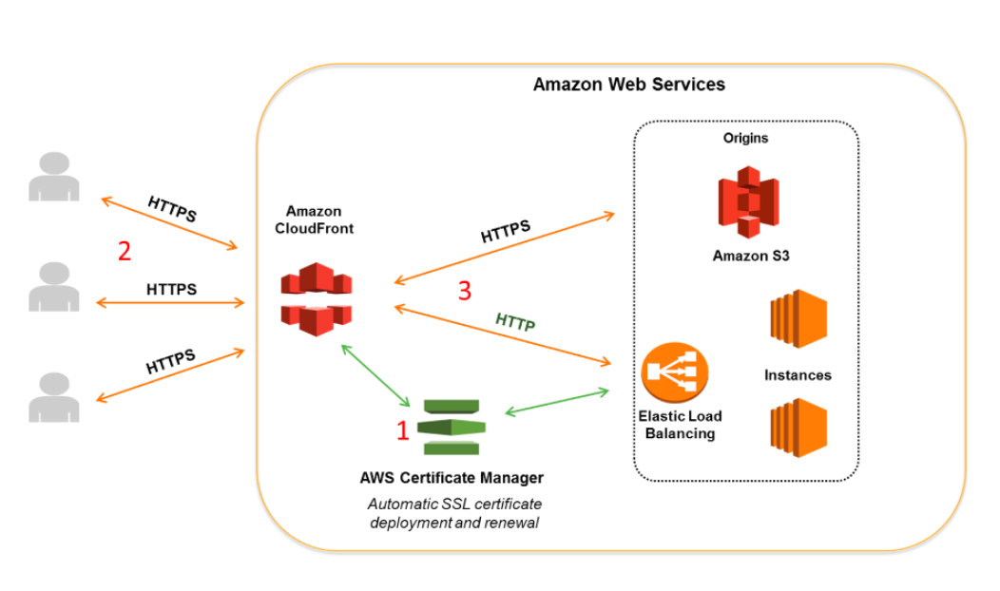

# Certificate

1. A web application is hosted in an Auto Scaling group of EC2 instances deployed across multiple Availability Zones behind an Application Load Balancer. You need to implement an SSL solution for your system to improve its security which is why you requested an SSL/TLS certificate from a third-party certificate authority (CA).

Where can you safely import the SSL/TLS certificate of your application? (Select TWO.)

[ ] IAM certificate store

[ ] A private S3 bucket w/ versioning enabled

[ ] AWS Certificate Manager

[ ] CloudFront

[ ] An S3 bucket configured w/ server-side encryption w/ customer-provided encryption keys (SSE-C)

**Explanation**: If you got your certificate from a third-party CA, import the certificate into ACM or upload it to the IAM certificate store. Hence, **AWS Certificate Manager** and **IAM certificate store** are the correct answers.

ACM lets you import third-party certificates from the ACM console, as well as programmatically. If ACM is not available in your region, use AWS CLI to upload your third-party certificate to the IAM certificate store.

> **A private S3 bucket with versioning enabled** and **an S3 bucket configured with server-side encryption with customer-provided encryption keys (SSE-C)** are both incorrect as S3 is not a suitable service to store the SSL certificate.

> **CloudFront** is incorrect. Although you can upload certificates to CloudFront, it doesn't mean that you can import SSL certificates on it. You would not be able to export the certificate that you have loaded in CloudFront nor assign them to your EC2 or ELB instances as it would be tied to a single CloudFront distribution.

 

2. An application is hosted in an Auto Scaling group of EC2 instances and a Microsoft SQL Server on Amazon RDS. There is a requirement that all in-flight data between your web servers and RDS should be secured.

Which of the following options is the MOST suitable solution that you should implement? (Select TWO.)

[ ] Enable the IAM DB authentication in RDS using the AWS Management Console.

[ ] Specify the TDS option in an RDS option group that is associated w/ the DB instance to enable transparent data encryption (TDE).

[ ] Force all connections to your DB instance to use SSL by setting the `rds.force_ssl` parameter to true. Once done, reboot your DB instance.

[ ] Configure the security groups of your EC2 instances and RDS to only allow traffic to and from port 443.

[ ] Download the Amazon RDS Root CA certificate. Import the certificate to your servers and configure your application to use SSL to encrypt the connection to RDS.

**Explanation**: You can use Secure Sockets Layer (SSL) to encrypt connections between your client applications and your Amazon RDS DB instances running Microsoft SQL Server. SSL support is available in all AWS regions for all supported SQL Server editions.

When you create an SQL Server DB instance, Amazon RDS creates an SSL certificate for it. The SSL certificate includes the DB instance endpoint as the Common Name (CN) for the SSL certificate to guard against spoofing attacks.

There are 2 ways to use SSL to connect to your SQL Server DB instance:

* Force SSL for all connections — this happens transparently to the client, and the client doesn't have to do any work to use SSL.

* Encrypt specific connections — this sets up an SSL connection from a specific client computer, and you must do work on the client to encrypt connections.

You can force all connections to your DB instance to use SSL, or you can encrypt connections from specific client computers only. To use SSL from a specific client, you must obtain certificates for the client computer, import certificates on the client computer, and then encrypt the connections from the client computer.

If you want to force SSL, use the `rds.force_ssl` parameter. By default, the `rds.force_ssl` parameter is set to `false`. Set the `rds.force_ssl` parameter to `true` to force connections to use SSL. The `rds.force_ssl` parameter is static, so after you change the value, you must reboot your DB instance for the change to take effect.

Hence, the correct answers for this scenario are the options that say:

* **Force all connections to your DB instance to use SSL by setting the `rds.force_ssl` parameter to true. Once done, reboot your DB instance.**

* **Download the Amazon RDS Root CA certificate. Import the certificate to your servers and configure your application to use SSL to encrypt the connection to RDS.**

> **Specifying the TDE option in an RDS option group that is associated with that DB instance to enable transparent data encryption (TDE)** is incorrect because transparent data encryption (TDE) is primarily used to encrypt stored data on your DB instances running Microsoft SQL Server, and not the data that are in transit.

> **Enabling the IAM DB authentication in RDS using the AWS Management Console** is incorrect because IAM database authentication is only supported in MySQL and PostgreSQL database engines. With IAM database authentication, you don't need to use a password when you connect to a DB instance but instead, you use an authentication token.

> **Configuring the security groups of your EC2 instances and RDS to only allow traffic to and from port 443** is incorrect because it is not enough to do this. You need to either force all connections to your DB instance to use SSL, or you can encrypt connections from specific client computers, just as mentioned above.

 
