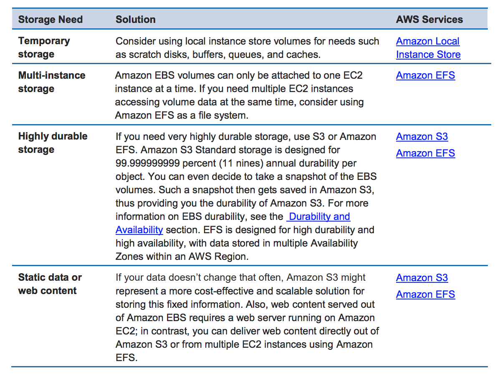

# Elastic Block Storage

1. A database is running on an Amazon EC2 instance. The database software has a backup feature that requires block storage. What storage option would be the lowest cost option for the backup data?

[ ] Amazon Glacier

[x] Amazon EBS Cold HDD Volume (sc1)

[ ] Amazon S3

[ ] Amazon EBS Throughput Optimized HDD Volume

**Explanation**: Amazon Glacier and S3 are not block storage, meaning you are not allowed to edit a single byte. Cold HDD (sc1) is cheaper than Throughput Optimized HDD (st1).

 

2. A company runs a legacy application w/ a single-tier architecture on an Amazon EC2 instance. Disk I/O is low, w/ occasional small spikes during business hours. The company requires the instance to be stopped from 8 PM to 8 AM daily.

Which storage option is MOST appropriate for this workload?

[ ] Amazon EC2 instance storage

[x] Amazon EBS General Purpose SSD (gp2) storage

[ ] Amazon S3

[ ] Amazon EBS Provisioned IOPS SSD (io2) storage

**Explanation**: Instance storage is ephemeral. S3 is for object storage. Provisioned IOPS SSD (io2) is for applications w/ very high IOPS. General Purpose SSD (gp2) provides the balance between price and performance for an application. GP2 can burst up to 3000 IOPS.

 

3. You are running an EC2 instance which uses EBS for storing its state. You take an EBS snapshot every day. When the system crashes it takes you 10 minutes to bring it up again from the snapshot. What is your RTO and RPO going to be?

[ ] RTO will be 1 day, RPO will be 10 minutes

[x] RTO will be 10 minutes, RPO will be 1 day

[ ] RTO and RPO will be 10 minutes

[ ] RTO and RPO will be 1 day

**Explanation**: RTO is the goal your organization sets for the maximum length of time it should take to restore normal operations following an outage or data loss. RPO is your goal for the maximum amount of data the organization can tolerate losing. This parameter is measured in time: from the moment a failure occurs to your last valid data backup. For example, if you experience a failure now and your last full data backup was 24 hours ago, the RPO is 24 hours. → RTO is time to recover, RPO is how much data was lost.

 

4. A company is building an internal application that processes loans, accruals, and interest rates for their clients. They require a storage service that is able to handle future increases in storage capacity of up to 16 TB and can provide the lowest-latency access to their data. The web application will be hosted in a single m5ad.24xlarge Reserved EC2 instance that will process and store data to the storage service.

Which of the following storage services would you recommend?

[ ] S3

[ ] Storage Gateway

[ ] EFS

[ ] EBS

**Explanation**: Amazon Web Services (AWS) offers cloud storage services to support a wide range of storage workloads such as Amazon S3, EFS and EBS. Amazon EFS is a file storage service for use with Amazon EC2. Amazon EFS provides a file system interface, file system access semantics (such as strong consistency and file locking), and concurrently-accessible storage for up to thousands of Amazon EC2 instances. Amazon S3 is an object storage service. Amazon S3 makes data available through an Internet API that can be accessed anywhere. Amazon EBS is a block-level storage service for use with Amazon EC2. Amazon EBS can deliver performance for workloads that require the **lowest-latency access to data** from a single EC2 instance. You can also increase EBS storage for up to 16TB or add new volumes for additional storage.

In this scenario, the company is looking for a storage service which can provide the lowest-latency access to their data which will be fetched by a single m5ad.24xlarge Reserved EC2 instance. This type of workloads can be supported better by using either EFS or EBS but in this case, the latter is the most suitable storage service. As mentioned above, EBS provides the lowest-latency access to the data for your EC2 instance since the volume is directly attached to the instance. In addition, the scenario does not require concurrently-accessible storage since they only have one instance.

Hence, the correct answer is **EBS**.

> **Storage Gateway** is incorrect since this is primarily used to extend your on-premises storage to your AWS Cloud.

> **S3** is incorrect because although this is also highly available and highly scalable, it still does not provide the lowest-latency access to the data, unlike EBS. Remember that S3 does not reside within your VPC by default, which means the data will traverse the public Internet that may result to higher latency. You can set up a VPC Endpoint for S3 yet still, its latency is greater than that of EBS.

> **EFS** is incorrect because the scenario does not require concurrently-accessible storage since the internal application is only hosted in one instance. Although EFS can provide low latency data access to the EC2 instance as compared with S3, the storage service that can provide the lowest latency access is still EBS.

 
