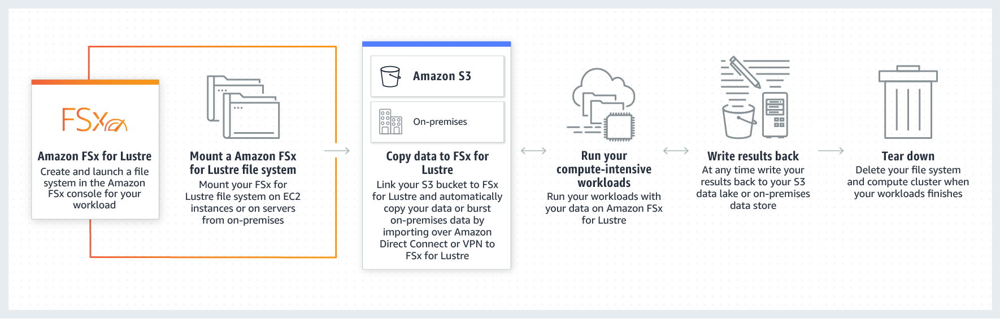

# Amazon FSx for Lustre

1. A company is planning to deploy a High Performance Computing (HPC) cluster in its VPC that requires a scalable, high-performance file system. The storage service must be optimized for efficient workload processing, and the data must be accessible via a fast and scalable file system interface. It should also work natively with Amazon S3 that enables you to easily process your S3 data with a high-performance POSIX interface.

Which of the following is the MOST suitable service that you should use for this scenario?

[ ] Amazon FSx for Lustre

[ ] Amazon Elastic Block Storage (EBS)

[ ] Amazon FSx for Windows File Server

[ ] Amazon Elastic File System (EFS)

**Explanation**: **Amazon FSx for Lustre** provides a high-performance file system optimized for fast processing of workloads such as machine learning, high performance computing (HPC), video processing, financial modeling, and electronic design automation (EDA). These workloads commonly require data to be presented via a fast and scalable file system interface, and typically have data sets stored on long-term data stores like Amazon S3.

Operating high-performance file systems typically require specialized expertise and administrative overhead, requiring you to provision storage servers and tune complex performance parameters. With Amazon FSx, you can launch and run a file system that provides sub-millisecond access to your data and allows you to read and write data at speeds of up to hundreds of gigabytes per second of throughput and millions of IOPS.

Amazon FSx for Lustre works natively with Amazon S3, making it easy for you to process cloud data sets with high-performance file systems. When linked to an S3 bucket, an FSx for Lustre file system transparently presents S3 objects as files and allows you to write results back to S3. You can also use FSx for Lustre as a standalone high-performance file system to burst your workloads from on-premises to the cloud. By copying on-premises data to an FSx for Lustre file system, you can make that data available for fast processing by compute instances running on AWS. With Amazon FSx, you pay for only the resources you use. There are no minimum commitments, upfront hardware or software costs, or additional fees.

For Windows-based applications, Amazon FSx provides fully managed Windows file servers with features and performance optimized for "lift-and-shift" business-critical application workloads including home directories (user shares), media workflows, and ERP applications. It is accessible from Windows and Linux instances via the SMB protocol. If you have Linux-based applications, Amazon EFS is a cloud-native fully managed file system that provides simple, scalable, elastic file storage accessible from Linux instances via the NFS protocol.

For compute-intensive and fast processing workloads, like high-performance computing (HPC), machine learning, EDA, and media processing, Amazon FSx for Lustre, provides a file system that’s optimized for performance, with input and output stored on Amazon S3.

Hence, the correct answer is: **Amazon FSx for Lustre.**

> **Amazon Elastic File System (EFS)** is incorrect because although the EFS service can be used for HPC applications, it doesn't natively work with Amazon S3. It doesn't have the capability to easily process your S3 data with a high-performance POSIX interface, unlike Amazon FSx for Lustre.

> **Amazon FSx for Windows File Server** is incorrect because although this service is a type of Amazon FSx, it does not work natively with Amazon S3. This service is a fully managed native Microsoft Windows file system that is primarily used for your Windows-based applications that require shared file storage to AWS.

> **Amazon Elastic Block Storage (EBS)** is incorrect because this service is not a scalable, high-performance file system.

 
