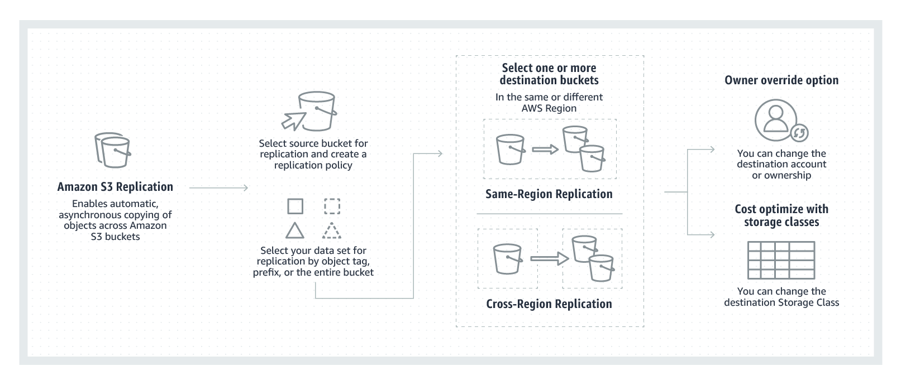

# S3 Cross-Region Replication

1. A Solutions Architect is trying to enable Cross-Region Replication to an S3 bucket but this option is disabled. Which of the following options is a valid reason for this?

[ ] In order to use the Cross-Region Replication feature in S3, you need to first enable versioning on the bucket.

[ ] This is a premium feature which is only for AWS Enterprise accounts.

[ ] The Cross-Region Replication feature is only available for Amazon S3 - Infrequent Access.

[ ] The Cross-Region Replication feature is only available for Amazon S3 - One Zone-IA

**Explanation**: To enable the cross-region replication feature in S3, the following items should be met:

* The source and destination buckets must have versioning enabled.

* The source and destination buckets must be in different AWS Regions.

Amazon S3 must have permissions to replicate objects from that source bucket to the destination bucket on your behalf.

> The options that say: **The Cross-Region Replication feature is only available for Amazon S3 - One Zone-IA** and **The Cross-Region Replication feature is only available for Amazon S3 - Infrequent Access** are incorrect as this feature is available to all types of S3 classes.

> The option that says: **This is a premium feature which is only for AWS Enterprise accounts** is incorrect as this CRR feature is available to all Support Plans.

 
