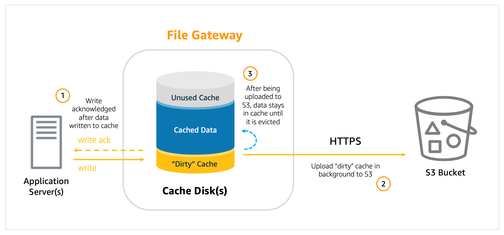

# Amazon S3 File Gateway

1. A disaster recovery team is planning to back up on-premises records to a local file server share through SMB protocol. To meet the company’s business continuity plan, the team must ensure that a copy of data from 48 hours ago is available for immediate access. Accessing older records with delay is tolerable.

Which should the DR team implement to meet the objective with the LEAST amount of configuration effort?

[ ] Create an SMB file share in Amazon FSx for Windows File Server that has enough storage to store all backups. Access the file share from on-premises.

[ ] Create an AWS Backup plan to copy data backups to a local SMB share every 48 hours.

[ ] Mount an Amazon EFS file system on the on-premises client and copy all backups to an NFS share.

[ ] Use an AWS Storage File gateway w/ enough storage to keep data from the last 48 hours. Send the backups to an SMB share mounted as a local disk.

**Explanation**: **Amazon S3 File Gateway** presents a file interface that enables you to store files as objects in Amazon S3 using the industry-standard NFS and SMB file protocols, and access those files via NFS and SMB from your data center or Amazon EC2, or access those files as objects directly in Amazon S3.

When you deploy File Gateway, you specify how much disk space you want to allocate for local cache. This local cache acts as a buffer for writes and provides low latency access to data that was recently written to or read from Amazon S3. When a client writes data to a file via File Gateway, that data is first written to the local cache disk on the gateway itself. Once the data has been safely persisted to the local cache, only then does the File Gateway acknowledge the write back to the client. From there, File Gateway transfers the data to the S3 bucket asynchronously in the background, optimizing data transfer using multipart parallel uploads, and encrypting data in transit using HTTPS.

In this scenario, you can deploy an AWS Storage File Gateway to the on-premises client. After activating the File Gateway, create an SMB share and mount it as a local disk at the on-premises end. Copy the backups to the SMB share. You must ensure that you size the File Gateway's local cache appropriately to the backup data that needs immediate access. After the backup is done, you will be able to access the older data but with a delay. There will be a small delay since data (not in cache) needs to be retrieved from Amazon S3.

Hence, the correct answer is: **Use an AWS Storage File gateway with enough storage to keep data from the last 48 hours. Send the backups to an SMB share mounted as a local disk.**

> The option that says: **Create an SMB file share in Amazon FSx for Windows File Server that has enough storage to store all backups. Access the file share from on-premises** is incorrect because this requires additional setup. You need to set up a Direct Connect or VPN connection from on-premises to AWS first in order for this to work.

> The option that says: **Mount an Amazon EFS file system on the on-premises client and copy all backups to an NFS share** is incorrect because the file share required in the scenario needs to be using the SMB protocol.

> The option that says: **Create an AWS Backup plan to copy data backups to a local SMB share every 48 hours** is incorrect. AWS Backup only works on AWS resources.

 
