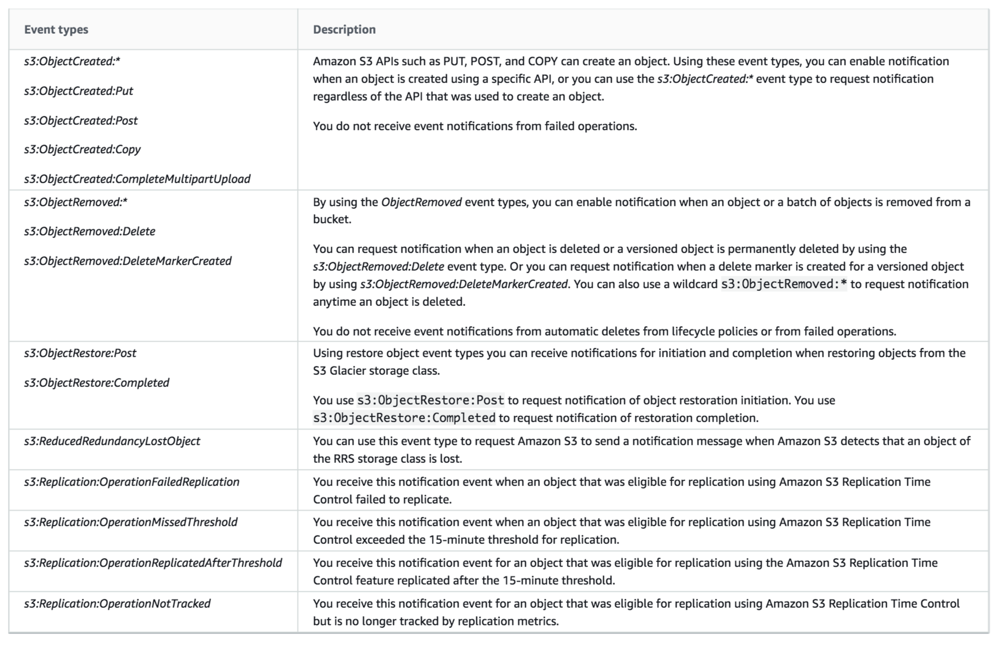

# S3 Event Notification Destinations

1. A Data Engineer is working for a litigation firm for their case history application. The engineer needs to keep track of all the cases that the firm has handled. The static assets like .jpg, .png, and .pdf files are stored in S3 for cost efficiency and high durability. As these files are critical to the business, the engineer wants to keep track of what's happening in the S3 bucket. The engineer found out that S3 has an event notification whenever a delete or write operation happens within the S3 bucket.

What are the possible Event Notification destinations available for S3 buckets? (Select TWO.)

[x] SQS

[ ] Kinesis

[ ] SWF

[ ] SES

[x] Lambda function

**Explanation**: The **Amazon S3 notification** feature enables you to receive notifications when certain events happen in your bucket. To enable notifications, you must first add a notification configuration identifying the events you want Amazon S3 to publish and the destinations where you want Amazon S3 to send the event notifications.

Amazon S3 supports the following destinations where it can publish events:

  * **Amazon Simple Notification Service (Amazon SNS) topic** ▶︎ A web service that coordinates and manages the delivery or sending of messages to subscribing endpoints or clients.

  * **Amazon Simple Queue Service (Amazon SQS) queue** ▶︎ Offers reliable and scalable hosted queues for storing messages as they travel between computers.

  * **AWS Lambda** ▶︎ AWS Lambda is a compute service where you can upload your code and the service can run the code on your behalf using the AWS infrastructure. You package up and upload your custom code to AWS Lambda when you create a Lambda function

> **Kinesis** is incorrect because this is used to collect, process, and analyze real-time streaming data so you can get timely insights and react quickly to new information, and not used for event notifications. You have to use SNS, SQS or Lambda.

> **SES** is incorrect because this is mainly used for sending emails designed to help digital marketers and application developers send marketing, notification, and transactional emails, and not for sending event notifications from S3. You have to use SNS, SQS or Lambda.

> **SWF** is incorrect because this is mainly used to build applications that use Amazon's cloud to coordinate work across distributed components and is not used as a way to trigger event notifications from S3. You have to use SNS, SQS or Lambda.

Here’s what you need to do in order to start using this new feature with your application:

  1. Create the queue, topic, or Lambda function (target)

  2. Grant S3 permission to publish to the target or invoke the Lambda function. For SNS or SQS, you do this by applying an appropriate policy to the topic or the queue. For Lambda, you must create and supply an IAM role, then associate it with the Lambda function.

  3. Arrange for your application to be invoked in response to activity on the target. As you will see in a moment, you have several options here.

  4. Set the bucket’s Notification Configuration to point to the target.

 

2. A company is storing its financial reports and regulatory documents in an Amazon S3 bucket. To comply with the IT audit, they tasked their Solutions Architect to track all new objects added to the bucket as well as the removed ones. It should also track whether a versioned object is permanently deleted. The Architect must configure Amazon S3 to publish notifications for these events to a queue for post-processing and to an Amazon SNS topic that will notify the Operations team.

Which of the following is the MOST suitable solution that the Architect should implement?

[ ] Create a new Amazon SNS topic and Amazon MQ. Add an S3 event notification configuration on the bucket to publish `s3:ObjectCreated:*` and `ObjectRemoved:DeleteMarkerCreated` event types to SQS and SNS.

[ ] Create a new Amazon SNS topic and Amazon SQS queue. Add an S3 event notification configuration on the bucket to publish `s3:ObjectCreated:*` and `ObjectRemoved:DeleteMarkerCreated` event type to SQS and SNS.

[ ] Create a new Amazon SNS topic and Amazon MQ. Add an S3 event notification configuration on the bucket to publish `s3:ObjectAdded:*` and `s3:ObjectRemoved` event types to SQS and SNS.

[x] Create a new Amazon SNS topic and Amazon SQS queue. Add an event notification configuration on the bucket to publish `s3:ObjectCreated:*` and `s3:ObjectRemoved:Delete` event types to SQS and SNS.

**Explanation**: The **Amazon S3** notification feature enables you to receive notifications when certain events happen in your bucket. To enable notifications, you must first add a notification configuration that identifies the events you want Amazon S3 to publish and the destinations where you want Amazon S3 to send the notifications. You store this configuration in the *notification* sub-resource that is associated with a bucket. Amazon S3 provides an API for you to manage this sub-resource.

**Amazon S3 event notifications** typically deliver events in seconds but can sometimes take a minute or longer. If two writes are made to a single non-versioned object at the same time, it is possible that only a single event notification will be sent. If you want to ensure that an event notification is sent for every successful write, you can enable versioning on your bucket. With versioning, every successful write will create a new version of your object and will also send an event notification.

Amazon S3 can publish notifications for the following events:

  1. New object created events

  2. Object removal events

  3. Restore object events

  4. Reduced Redundancy Storage (RRS) object lost events

  5. Replication events

Amazon S3 supports the following destinations where it can publish events:

  1. Amazon Simple Notification Service (Amazon SNS) topic

  2. Amazon Simple Queue Service (Amazon SQS) queue

  3. AWS Lambda

If your notification ends up writing to the bucket that triggers the notification, this could cause an execution loop. For example, if the bucket triggers a Lambda function each time an object is uploaded and the function uploads an object to the bucket, then the function indirectly triggers itself. To avoid this, use two buckets, or configure the trigger to only apply to a prefix used for incoming objects.

Hence, the correct answers is: **Create a new Amazon SNS topic and Amazon SQS queue. Add an S3 event notification configuration on the bucket to publish `s3:ObjectCreated:*` and `s3:ObjectRemoved:Delete` event types to SQS and SNS.**

> The option that says: **Create a new Amazon SNS topic and Amazon MQ. Add an S3 event notification configuration on the bucket to publish `s3:ObjectAdded:*` and `s3:ObjectRemoved:*` event types to SQS and SNS** is incorrect. There is no `s3:ObjectAdded:*` type in Amazon S3. You should add an S3 event notification configuration on the bucket to publish events of the `s3:ObjectCreated:*` type instead. Moreover, Amazon S3 does support Amazon MQ as a destination to publish events.

> The option that says: **Create a new Amazon SNS topic and Amazon SQS queue. Add an S3 event notification configuration on the bucket to publish `s3:ObjectCreated:*` and `ObjectRemoved:DeleteMarkerCreated` event types to SQS and SNS** is incorrect because the s3:ObjectRemoved:DeleteMarkerCreated type is only triggered when a delete marker is created for a versioned object and not when an object is deleted or a versioned object is permanently deleted.

> The option that says: **Create a new Amazon SNS topic and Amazon MQ. Add an S3 event notification configuration on the bucket to publish `s3:ObjectCreated:*` and `ObjectRemoved:DeleteMarkerCreated` event types to SQS and SNS** is incorrect because Amazon S3 does public event messages to Amazon MQ. You should use an Amazon SQS instead. In addition, the `s3:ObjectRemoved:DeleteMarkerCreated` type is only triggered when a delete marker is created for a versioned object. Remember that the scenario asked to publish events when an object is deleted or a versioned object is permanently deleted.

 
