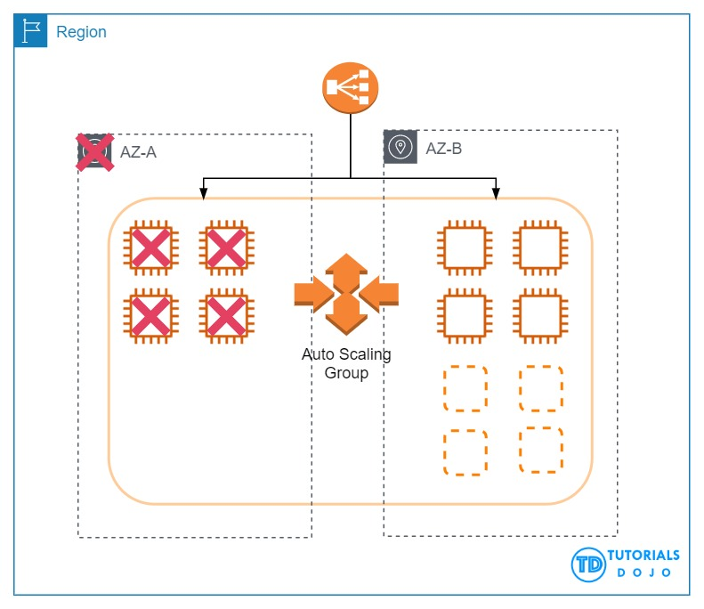

# Elastic Load Balancer

1. Select all true statements. Elastic Load Balancing (ELB) ... (Select two):

[x] Is a managed service and is highly available by default.

[x] Load balancers can be internet facing or internal facing.

[ ] Can be used to route between resources in different subnets, Availability Zones, and AWS Regions.

[ ] Is a managed service, and therefore load balancers don't need to be launched into an Amazon VPC.

[ ] Requires its own unique subnet, separate from other resources.

**Explanation**: ELB will scale to handle changes in traffic and detect and replace unavailable load balancing nodes by default and is therefore highly available.

ELB load balancers can be internet facing or internal facing.

While you can use ELB load balancers to route between resources in different subnets and Availability Zones, they cannot route traffic between resources in different Regions.

ELB is a managed service; however, its load balancers do need to be **launched** into your Amazon VPC. If your Amazon VPC becomes unavailable, so will any load balancers within it.

ELB load balancers do not require their own subnets. They can share subnets with other internet-facing resources, such as network address translation (NAT) solutions.

 

2. You are configuring a new Application Load Balancer w/ multiple target groups specified. Which of the following defines the rules for configuring health check settings w/ multiple target groups?

[x] Health check setting are defined on a per target group basis

[ ] Each target group uses the same health check settings

[ ] Target groups use both the default and custom health check settings in parallel

[ ] Health check settings can be defined per instance within a target group

**Explanation**: There can only be on Health check setting per target group.

 

3. A customer relationship management (CRM) application runs on Amazon EC2 instances in multiple Availability Zones behind an Application Load Balancer.

If one of these instances fail, what occurs?

[x] The load balancer will stop sending requests to the failed instance.

[ ] The load balancer will terminate the failed instance. `(AutoScaling Group)`

[ ] The load balancer will automatically replace the failed instance. `(AutoScaling Group)`

[ ] The load balancer will return 504 Gateway Timeout errors until the instance is replaced.

**Explanation**: An Application Load Balancer (ALB) sends requests to healthy instances only. An ALB performs periodic health checks on targets in a target group. An instance that fails health checks for a configurable number of consecutive times is considered unhealthy. The load balancer will no longer send requests to the instance until it passes another health check.

 

4. A major TV network has a web application running on eight Amazon T3 EC2 instances. The number of requests that the application processes are consistent and do not experience spikes. To ensure that eight instances are running at all times, the Solutions Architect should create an Auto Scaling group and distribute the load evenly between all instances.

Which of the following options can satisfy the given requirements?

[ ] Deploy two EC2 instances w/ Auto Scaling in four regions **behind** an Elastic Load Balancer.

[ ] Deploy eight EC2 instances w/ Auto Scaling in one Availability Zone **behind** an Amazon Elastic Load Balancer.

[ ] Deploy four EC2 instances w/ Auto Scaling in one Availability Zone and four in another availability zone in the same region **behind** an Amazon Elastic Load Balancer.

[ ] Deploy four EC2 instances w/ Auto Scaling in one region and four in another region **behind** an Amazon Elastic Load Balancer.

**Explanation**: The best option to take is to deploy four EC2 instances in one Availability Zone and four in another availability zone in the same region behind an Amazon Elastic Load Balancer. In this way, if one availability zone goes down, there is still another available zone that can accommodate traffic.

When the first AZ goes down, the second AZ will only have an initial 4 EC2 instances. This will eventually be scaled up to 8 instances since the solution is using Auto Scaling.

The 110% compute capacity for the 4 servers might cause some degradation of the service, but not a total outage since there are still some instances that handle the requests. Depending on your scale-up configuration in your Auto Scaling group, the additional 4 EC2 instances can be launched in a matter of minutes.

T3 instances also have a Burstable Performance capability to burst or go beyond the current compute capacity of the instance to higher performance as required by your workload. So your 4 servers will be able to manage 110% compute capacity for a short period of time. This is the power of cloud computing versus our on-premises network architecture. It provides elasticity and unparalleled scalability.

Take note that Auto Scaling will launch additional EC2 instances to the remaining Availability Zone/s in the event of an Availability Zone outage in the region. Hence, the correct answer is the option that says: **Deploy four EC2 instances with Auto Scaling in one Availability Zone and four in another availability zone in the same region behind an Amazon Elastic Load Balancer.**

> The option that says: **Deploy eight EC2 instances with Auto Scaling in one Availability Zone behind an Amazon Elastic Load Balancer** is incorrect because this architecture is not highly available. If that Availability Zone goes down then your web application will be unreachable.

> The options that say: **Deploy four EC2 instances with Auto Scaling in one region and four in another region behind an Amazon Elastic Load Balancer** and **Deploy two EC2 instances with Auto Scaling in four regions behind an Amazon Elastic Load Balancer** are incorrect because the ELB is designed to only run in one region and not across multiple regions.

 
