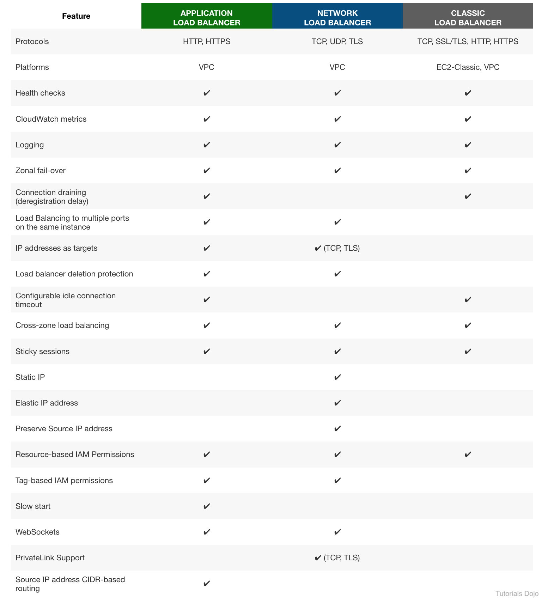

# Network Load Balancer

1. A startup plans to develop a multiplayer game that uses UDP as the protocol for communication between clients and game servers. The data of the users will be stored in a key-value store. As the Solutions Architect, you need to implement a solution that will distribute the traffic across a number of servers.

Which of the following could help you achieve this requirement?

[ ] Distribute the traffic using Network Load Balancer and store the data in Amazon DynamoDB.

[ ] Distribute the traffic using Application Load Balancer and store the data in Amazon DynamoDB.

**Explanation**: A **Network Load Balancer** functions at the fourth layer of the Open Systems Interconnection (OSI) model. It can handle millions of requests per second. After the load balancer receives a connection request, it selects a target from the target group for the default rule. For UDP traffic, the load balancer selects a target using a flow hash algorithm based on the protocol, source IP address, source port, destination IP address, and destination port. A UDP flow has the same source and destination, so it is consistently routed to a single target throughout its lifetime. Different UDP flows have different source IP addresses and ports, so they can be routed to different targets.

In this scenario, a startup plans to create a multiplayer game that uses UDP as the protocol for communications. Since UDP is a Layer 4 traffic, we can limit the option that uses Network Load Balancer. The data of the users will be stored in a key-value store. This means that we should select Amazon DynamoDB since it supports both document and key-value store models.

Hence, the correct answer is: **Distribute the traffic using Network Load Balancer and store the data in Amazon DynamoDB.**

> The option that says: **Distribute the traffic using Application Load Balancer and store the data in Amazon DynamoDB** is incorrect because UDP is not supported in Application Load Balancer. Remember that UDP is a Layer 4 traffic. Therefore, you should use a Network Load Balancer.

 

2. A business plans to deploy an application on EC2 instances within an Amazon VPC and is considering adopting a Network Load Balancer to distribute incoming traffic among the instances. A solutions architect needs to suggest a solution that will enable the security team to inspect traffic entering and exiting their VPC.

Which approach satisfies the requirements?

[ ] Create a firewall at the subnet level using the Amazon Detective service. Inspect the ingress and egress traffic using the VPC Reachability Analyzer.

[ ] Enable Traffic Mirroring on the Network Load Balancer and forward traffic to the instances. Create a traffic mirror filter to inspect the ingress and egress of data that traverses your Amazon VPC.

[ ] Use the Network Access Analyzer service on the application's VPC for inspecting ingress and egress traffic. Create a new Network Access Scope to filter and analyze all incoming and outgoing requests.

[x] Create a firewall using the AWS Network Firewall service at the VPC level then add custom rule groups for inspecting ingress and egress traffic. Update the necessary VPC route tables.

**Explanation**: AWS Network Firewall is a stateful, managed, network firewall, and intrusion detection and prevention service for your virtual private cloud (VPC). With Network Firewall, you can filter traffic at the perimeter of your VPC. This includes traffic going to and coming from an internet gateway, NAT gateway, or over VPN or AWS Direct Connect. Network Firewall uses Suricata — an open-source intrusion prevention system (IPS) for stateful inspection.

The diagram below shows an AWS Network firewall deployed in a single availability zone and traffic flow for a workload in a public subnet:

You can use Network Firewall to monitor and protect your Amazon VPC traffic in a number of ways, including the following:

* Pass traffic through only from known AWS service domains or IP address endpoints, such as Amazon S3.

* Use custom lists of known bad domains to limit the types of domain names that your applications can access.

* Perform deep packet inspection on traffic entering or leaving your VPC.

* Use stateful protocol detection to filter protocols like HTTPS, independent of the port used.

Therefore, the correct answer is: **Create a firewall using the AWS Network Firewall service at the VPC level then add custom rule groups for inspecting ingress and egress traffic. Update the necessary VPC route tables.**

> The option that says: **Use the Network Access Analyzer service on the application’s VPC for inspecting ingress and egress traffic. Create a new Network Access Scope to filter and analyze all incoming and outgoing requests** is incorrect. Network Access Analyzer is a feature of VPC that reports on unintended access to your AWS resources based on the security and compliance that you set. This service is not capable of performing deep packet inspection on traffic entering or leaving your VPC, unlike AWS Network Firewall.

> The option that says: **Create a firewall at the subnet level using the Amazon Detective service. Inspect the ingress and egress traffic using the VPC Reachability Analyzer** is incorrect because a firewall must be created at the VPC level and not at the subnet level. Moreover, Amazon Detective can't be used to create a firewall. This service just automatically collects log data from your AWS resources to analyze, investigate, and quickly identify the root cause of potential security issues or suspicious activities in your AWS account. For this scenario, you have to use the AWS Network Firewall instead.

> The option that says: **Enable Traffic Mirroring on the Network Load Balancer and forward traffic to the instances. Create a traffic mirror filter to inspect the ingress and egress of data that traverses your Amazon VPC** is incorrect as this alone accomplishes nothing. It would make more sense if you redirect the traffic to an EC2 instance where an Intrusion Detection System (IDS) is running. Remember that Traffic Mirroring is simply an Amazon VPC feature that you can use to copy network traffic from an elastic network interface. Traffic mirror filters can't inspect the actual packet of the incoming and outgoing traffic.

 
