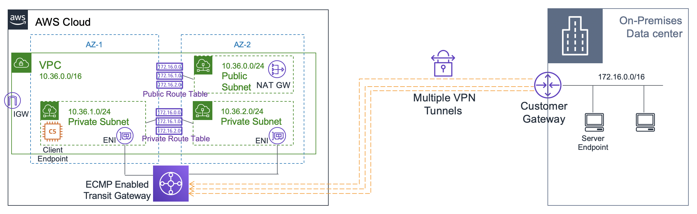

# Equal Cost Multi-path Routing (ECMR)

1. A company has multiple AWS Site-to-Site VPN connections placed between their VPCs and their remote network. During peak hours, many employees are experiencing slow connectivity issues, which limits their productivity. The company has asked a solutions architect to scale the throughput of the VPN connections.

Which solution should the architect carry out?

[ ] Add more virtual private gateways to a VPC and enable Equal Cost Multipath Routing (ECMR) to get higher VPN bandwidth.

[ ] Modify the VPN configuration by increasing the number of tunnels to scale the throughput.

[ ] Re-route some of the VPN connections to a secondary customer gateway device on the remote network's end.

[x] Associate the VPCs to an Equal Cost Multipath Routing (ECMR)-enabled transit gateway and attach additional VPN tunnels.

**Explanation**: With AWS Transit Gateway, you can simplify the connectivity between multiple VPCs and also connect to any VPC attached to AWS Transit Gateway with a single VPN connection.

AWS Transit Gateway also enables you to scale the IPsec VPN throughput with equal-cost multi-path (ECMP) routing support over multiple VPN tunnels. A single VPN tunnel still has a maximum throughput of 1.25 Gbps. If you establish multiple VPN tunnels to an ECMP-enabled transit gateway, it can scale beyond the default limit of 1.25 Gbps.

Hence, the correct answer is: **Associate the VPCs to an Equal Cost Multipath Routing (ECMR)-enabled transit gateway and attach additional VPN tunnels.**

> The option that says: **Add more virtual private gateways to a VPC and enable Equal Cost Multipath Routing (ECMR) to get higher VPN bandwidth** is incorrect because a VPC can only have a single virtual private gateway attached to it one at a time. Also, there is no option to enable ECMR in a virtual private gateway.

> The option that says: **Modify the VPN configuration by increasing the number of tunnels to scale the throughput** is incorrect. The maximum tunnel for a VPN connection is two. You cannot increase this beyond its limit.

> The option that says: **Re-route some of the VPN connections to a secondary customer gateway device on the remote network’s end** is incorrect. This would only increase connection redundancy and won't increase throughput. For example, connections can failover to the secondary customer gateway device in case the primary customer gateway device becomes unavailable.

 
