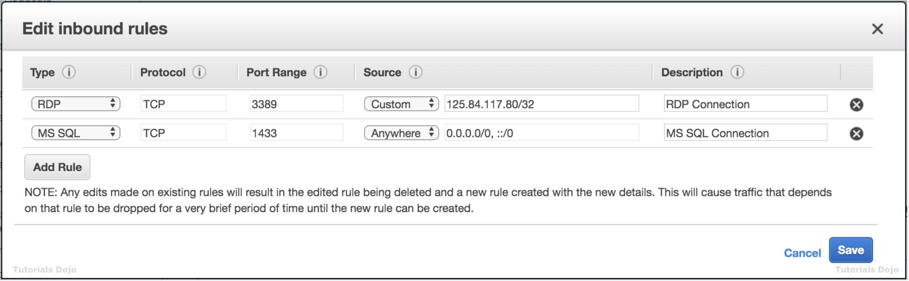

# Security Features

1. Stateful is allowing traffic in and the response out automatically. Stateless is allowing traffic in and the response blocked from leaving unless explicitly permitted by a rule. Select two.

[x] Security groups are stateful.

[ ] Security groups are stateless.

[ ] Network Access Control Lists (network ACLs) are stateful.

[x] Network Access Control Lists (network ACLs) are stateless.

**Explanation**: Security groups are stateful. Network ACLs are stateless. Remember that when setting up traffic rules for each.

 

2. A company hosted a web application on a Linux Amazon EC2 instance in the public subnet that uses a default network ACL. The instance uses a default security group and has an attached Elastic IP address. The network ACL has been configured to block all traffic to the instance. The Solutions Architect must allow incoming traffic on port 443 to access the application from any source.

Which combination of steps will accomplish this requirement? (Select TWO.)

[ ] In the Security Group, create a new rule to allow TCP connection on port 443 to destination `0.0.0.0/0`

[ ] In the Security Group, add a new rule to allow TCP connection on port 443 from source `0.0.0.0/0`

[ ] In the Network ACL, update the rule to allow outbound TCP connection on port `32768 - 65535` to destination `0.0.0.0/0`

[ ] In the Network ACL, update the rule to allow both inbound and outbound TCP connection on port 443 from source `0.0.0.0/0` and to destination `0.0.0.0/0`

[ ] In the Network ACL, update the rule to allow inbound TCP connection on port 443 from source `0.0.0.0/0` and outbound TCP connection on port `32768 - 65535` to destination `0.0.0.0/0`

**Explanation**: To enable the connection to a service running on an instance, the associated network ACL must allow both inbound traffic on the port that the service is listening on as well as allow outbound traffic from ephemeral ports. When a client connects to a server, a random port from the ephemeral port range (1024-65535) becomes the client's source port.

The designated ephemeral port then becomes the destination port for return traffic from the service, so outbound traffic from the ephemeral port must be allowed in the network ACL. By default, network ACLs allow all inbound and outbound traffic. If your network ACL is more restrictive, then you need to explicitly allow traffic from the ephemeral port range.

The client that initiates the request chooses the ephemeral port range. The range varies depending on the client's operating system.

* Many Linux kernels (including the Amazon Linux kernel) use ports 32768-61000.

* Requests originating from Elastic Load Balancing use ports 1024-65535.

* Windows operating systems through Windows Server 2003 use ports 1025-5000.

* Windows Server 2008 and later versions use ports 49152-65535.

* A NAT gateway uses ports 1024-65535.

* AWS Lambda functions use ports 1024-65535.

For example, if a request comes into a web server in your VPC from a Windows 10 client on the Internet, your network ACL must have an outbound rule to enable traffic destined for ports 49152 - 65535. If an instance in your VPC is the client initiating a request, your network ACL must have an inbound rule to enable traffic destined for the ephemeral ports specific to the type of instance (Amazon Linux, Windows Server 2008, and so on).

In this scenario, you only need to allow the incoming traffic on port 443. Since security groups are stateful, you can apply any changes to an incoming rule and it will be automatically applied to the outgoing rule.

To enable the connection to a service running on an instance, the associated network ACL must allow both inbound traffic on the port that the service is listening on as well as allow outbound traffic from ephemeral ports. When a client connects to a server, a random port from the ephemeral port range (32768 - 65535) becomes the client's source port.

Hence, the correct answers are:

* In the Security Group, add a new rule to allow TCP connection on port 443 from source `0.0.0.0/0`.

* In the Network ACL, update the rule to allow inbound TCP connection on port 443 from source `0.0.0.0/0` and outbound TCP connection on port `32768 - 65535` to destination `0.0.0.0/0`.

> The option that says: **In the Security Group, create a new rule to allow TCP connection on port 443 to destination `0.0.0.0/0`** is incorrect because this step just allows outbound connections from the EC2 instance out to the public Internet which is unnecessary. Remember that a default security group already includes an outbound rule that allows all outbound traffic.

> The option that says: **In the Network ACL, update the rule to allow both inbound and outbound TCP connection on port 443 from source `0.0.0.0/0` and to destination `0.0.0.0/0`** is incorrect because your network ACL must have an outbound rule to allow ephemeral ports (`32768 - 65535`). These are the specific ports that will be used as the client's source port for the traffic response.

> The option that says: **In the Network ACL, update the rule to allow outbound TCP connection on port `32768 - 65535` to destination `0.0.0.0/0`** is incorrect because this step is just partially right. You still need to add an inbound rule from port 443 and not just the outbound rule for the ephemeral ports (`32768 - 65535`).

 

3. A company deployed several EC2 instances in a private subnet. The Solutions Architect needs to ensure the security of all EC2 instances. Upon checking the existing Inbound Rules of the Network ACL, she saw this configuration:

| **Rule #** | **Type**        | **Protocol** | **Port Range** | **Source**        | **Allow / Deny** |
|------------|-----------------|--------------|----------------|-------------------|------------------|
| 100        | ALL Traffic     | ALL          | ALL            | 0.0.0.0/0         | ALLOW            |
| 101        | Custom TCP Rule | TCP(6)       | 4000           | 110.238.109.37/32 | DENY             |
| *          | ALL Traffic     | ALL          | ALL            | 0.0.0.0/0         | DENY             |

If a computer with an IP address of 110.238.109.37 sends a request to the VPC, what will happen?

[ ] Initially, it will be allowed and then after a while, the connection will be denied.

[ ] It will be denied.

[ ] Initially, it will be denied and then after a while, the connection, will be allowed.

[x] It will be allowed.

**Explanation**: Rules are evaluated starting with the lowest numbered rule. As soon as a rule matches traffic, it's applied immediately regardless of any higher-numbered rule that may contradict it.

We have 3 rules here:

  1. Rule 100 permits all traffic from any source.

  2. Rule 101 denies all traffic coming from 110.238.109.37

  3. The Default Rule (*) denies all traffic from any source.

The Rule 100 will first be evaluated. If there is a match, then it will allow the request. Otherwise, it will then go to Rule 101 to repeat the same process until it goes to the default rule. In this case, when there is a request from 110.238.109.37, it will go through Rule 100 first. As Rule 100 says it will permit all traffic from any source, it will allow this request and will not further evaluate Rule 101 (which denies 110.238.109.37) nor the default rule.

 

4. A newly hired Solutions Architect is checking all of the security groups and network access control list rules of the company's AWS resources. For security purposes, the MS SQL connection via port 1433 of the database tier should be secured. Below is the security group configuration of their Microsoft SQL Server database:

The application tier hosted in an Auto Scaling group of EC2 instances is the only identified resource that needs to connect to the database. The Architect should ensure that the architecture complies with the best practice of granting least privilege.

Which of the following changes should be made to the security group configuration?

[ ] For the MS SQL rule, change the `Source` to the static AnyCast IP address attached to the application tier.

[ ] For the MS SQL rule, change the `Source` to the EC2 instance IDs of the underlying instances of the Auto Scaling group.

[ ] For the MS SQL rule, change the `Source` to the security group ID attached to the application tier.

[ ] For the MS SQL rule, change the `Source` to the Network ACL ID attached to the application tier.

**Explanation**: A **security group** acts as a virtual firewall for your instance to control inbound and outbound traffic. When you launch an instance in a VPC, you can assign up to five security groups to the instance. Security groups act at the instance level, not the subnet level. Therefore, each instance in a subnet in your VPC can be assigned to a different set of security groups.

If you launch an instance using the Amazon EC2 API or a command line tool and you don't specify a security group, the instance is automatically assigned to the default security group for the VPC. If you launch an instance using the Amazon EC2 console, you have an option to create a new security group for the instance.

For each security group, you add *rules* that control the inbound traffic to instances, and a separate set of rules that control the outbound traffic. This section describes the basic things that you need to know about security groups for your VPC and their rules.

Amazon security groups and network ACLs don't filter traffic to or from link-local addresses (`169.254.0.0/16`) or AWS reserved IPv4 addresses (these are the first four IPv4 addresses of the subnet, including the Amazon DNS server address for the VPC). Similarly, flow logs do not capture IP traffic to or from these addresses.

In the scenario, the security group configuration allows any server (0.0.0.0/0) from anywhere to establish an MS SQL connection to the database via the 1433 port. The most suitable solution here is to change the `Source` field to the security group ID attached to the application tier.

Hence, the correct answer is the option that says: **For the MS SQL rule, change the `Source` to the security group ID attached to the application tier.**

> The option that says: **For the MS SQL rule, change the `Source` to the EC2 instance IDs of the underlying instances of the Auto Scaling group** is incorrect because using the EC2 instance IDs of the underlying instances of the Auto Scaling group as the source can cause intermittent issues. New instances will be added and old instances will be removed from the Auto Scaling group over time, which means that you have to manually update the security group setting once again. A better solution is to use the security group ID of the Auto Scaling group of EC2 instances.

> The option that says: **For the MS SQL rule, change the `Source` to the static AnyCast IP address attached to the application tier** is incorrect because a static AnyCast IP address is primarily used for AWS Global Accelerator and not for security group configurations.

> The option that says: **For the MS SQL rule, change the `Source` to the Network ACL ID attached to the application tier** is incorrect because you have to use the security group ID instead of the Network ACL ID of the application tier. Take note that the Network ACL covers the entire subnet which means that other applications that use the same subnet will also be affected.

 
