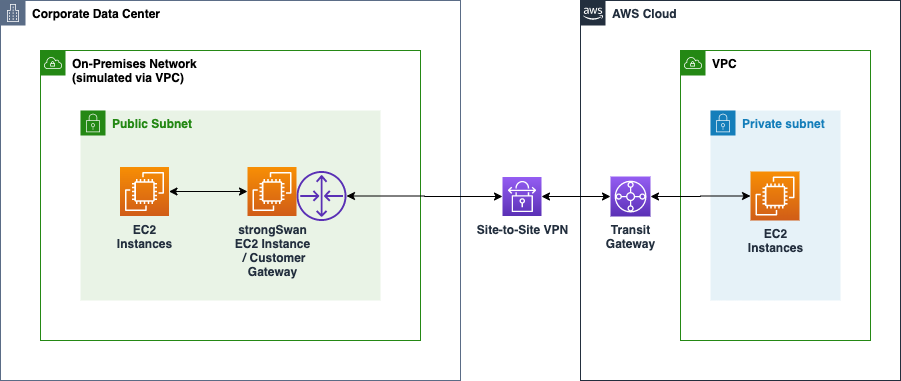

# Virtual Private Network

1. An insurance company utilizes SAP HANA for its day-to-day ERP operations. Since they can’t migrate this database due to customer preferences, they need to integrate it with the current AWS workload in the VPC in which they are required to establish a site-to-site VPN connection.

What needs to be configured outside of the VPC for them to have a successful site-to-site VPN connection?

[ ] An EIP to the Virtual Private Gateway

[ ] A dedicated NAT instance in a public subnet

[ ] The main route table in your VPC to route traffic through a NAT instance

[ ] An Internet-routable IP address (static) of the customer gateway's external interface for the on-premises network

**Explanation**: By default, instances that you launch into a virtual private cloud (VPC) can't communicate with your own network. You can enable access to your network from your VPC by attaching a virtual private gateway to the VPC, creating a custom route table, updating your security group rules, and creating an AWS managed VPN connection.

Although the term VPN connection is a general term, in the Amazon VPC documentation, a **VPN connection** refers to the connection between your VPC and your own network. AWS supports Internet Protocol security (IPsec) VPN connections.

A **customer gateway** is a physical device or software application on your side of the VPN connection.

To create a VPN connection, you must create a customer gateway resource in AWS, which provides information to AWS about your customer gateway device. Next, you have to set up an Internet-routable IP address (static) of the customer gateway's external interface.

The following diagram illustrates single VPN connections. The VPC has an attached virtual private gateway, and your remote network includes a customer gateway, which you must configure to enable the VPN connection. You set up the routing so that any traffic from the VPC bound for your network is routed to the virtual private gateway.

> The options that say: **A dedicated NAT instance in a public subnet** and **the main route table in your VPC to route traffic through a NAT instance** are incorrect since you don't need a NAT instance for you to be able to create a VPN connection.

> **An EIP to the Virtual Private Gateway** is incorrect since you do not attach an EIP to a VPG.

 

2. A company has an existing VPC which is quite unutilized for the past few months. The Business Manager instructed the Solutions Architect to integrate the company’s on-premises data center and its VPC. The architect explained the list of tasks that he’ll be doing and discussed the Virtual Private Network (VPN) connection. The Business Manager is not tech-savvy but he is interested to know what a VPN is and its benefits.

What is one of the major advantages of having a VPN in AWS?

[ ] It provides a networking connection between two VPCs which enables you to route traffic between them using private IPv4 addresses or IPv6 addresses.

[ ] It provides a cost-effective, hybrid connection from your VPC to your on-premises data centers which bypass the public Internet.

[ ] It allows you to connect your AWS cloud resources to your on-premises data center using secure and private sessions w/ IP Security (IPsec) or Transport Layer Security tunnels.

[ ] It enables you to establish a private and dedicated network connection between your network and your VPC

**Explanation**: **Amazon VPC** offers you the flexibility to fully manage both sides of your Amazon VPC connectivity by creating a VPN connection between your remote network and a software VPN appliance running in your Amazon VPC network. This option is recommended if you must manage both ends of the VPN connection either for compliance purposes or for leveraging gateway devices that are not currently supported by Amazon VPC’s VPN solution.

You can connect your Amazon VPC to remote networks and users using the following VPN connectivity options:

  * **AWS Site-to-Site VPN** ▶︎ creates an IPsec VPN connection between your VPC and your remote network. On the AWS side of the Site-to-Site VPN connection, a virtual private gateway or transit gateway provides two VPN endpoints (tunnels) for automatic failover.

  * **AWS Client VPN** ▶︎ a managed client-based VPN service that provides secure TLS VPN connections between your AWS resources and on-premises networks.

  * **AWS VPN CloudHub** ▶︎ capable of wiring multiple AWS Site-to-Site VPN connections together on a virtual private gateway. This is useful if you want to enable communication between different remote networks that uses a Site-to-Site VPN connection.

  * **Third-party software VPN appliance** ▶︎ You can create a VPN connection to your remote network by using an Amazon EC2 instance in your VPC that's running a third party software VPN appliance.

With **a VPN connection**, you can connect to an Amazon VPC in the cloud the same way you connect to your branches while establishing secure and private sessions with IP Security (IPSec) or Transport Layer Security (TLS) tunnels.

Hence, the correct answer is the option that says: **It allows you to connect your AWS cloud resources to your on-premises data center using secure and private sessions with IP Security (IPSec) or Transport Layer Security (TLS) tunnels** since one of the main advantages of having a VPN connection is that you will be able to connect your Amazon VPC to other remote networks securely.

> The option that says: **It provides a cost-effective, hybrid connection from your VPC to your on-premises data centers which bypasses the public Internet** is incorrect. Although it is true that a VPN provides a cost-effective, hybrid connection from your VPC to your on-premises data centers, it certainly does not bypass the public Internet. A VPN connection actually goes through the public Internet, unlike the AWS Direct Connect connection, which has a direct and dedicated connection to your on-premises network.

> The option that says: **It provides a networking connection between two VPCs which enables you to route traffic between them using private IPv4 addresses or IPv6 addresses** is incorrect because this actually describes VPC Peering and not a VPN connection.

> The option that says: **It enables you to establish a private and dedicated network connection between your network and your VPC** is incorrect because this is the advantage of an AWS Direct Connect connection and not a VPN.

 
