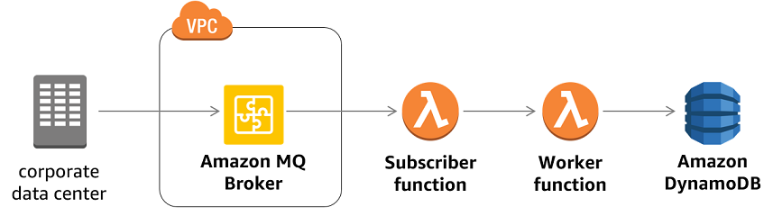

# Amazon MQ

Amazon MQ is a managed message broker service for Apache ActiveMQ that makes it easy to set up and operate message brokers in the cloud. Connecting your current applications to Amazon MQ is easy because it uses industry-standard APIs and protocols for messaging, including JMS, NMS, AMQP, STOMP, MQTT, and WebSocket. Using standards means that in most cases, there’s no need to rewrite any messaging code when you migrate to AWS.

Amazon MQ, Amazon SQS, and Amazon SNS are messaging services that are suitable for anyone from startups to enterprises. If you're using messaging with existing applications and want to move your messaging service to the cloud quickly and easily, it is recommended that you consider Amazon MQ. It supports industry-standard APIs and protocols so you can switch from any standards-based message broker to Amazon MQ without rewriting the messaging code in your applications.

If you are building brand new applications in the cloud, then it is highly recommended that you consider Amazon SQS and Amazon SNS. Amazon SQS and SNS are lightweight, fully managed message queue and topic services that scale almost infinitely and provide simple, easy-to-use APIs. You can use Amazon SQS and SNS to decouple and scale microservices, distributed systems, and serverless applications, and improve reliability.
