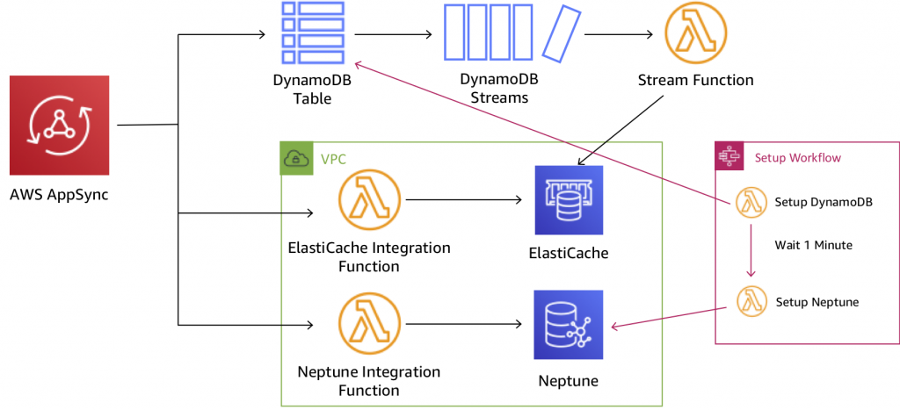

# AppSync

**DynamoDB** is durable, scalable, and highly available data store which can be used for real-time tabulation. You can also use **AppSync** with DynamoDB to make it easy for you to build collaborative apps that keep shared data updated in real time. You just specify the data for your app with simple code statements and AWS AppSync manages everything needed to keep the app data updated in real time. This will allow your app to access data in Amazon DynamoDB, trigger AWS Lambda functions, or run Amazon Elasticsearch queries and combine data from these services to provide the exact data you need for your app.
