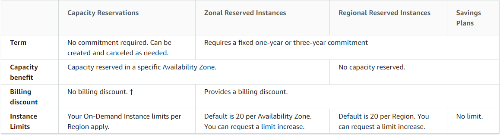

# On-Demand Capacity Reservations

On-Demand Capacity Reservations enable you to reserve compute capacity for your Amazon EC2 instances in a specific Availability Zone for any duration. This gives you the ability to create and manage Capacity Reservations independently from the billing discounts offered by Savings Plans or Regional Reserved Instances.

By creating Capacity Reservations, you ensure that you always have access to EC2 capacity when you need it, for as long as you need it. You can create Capacity Reservations at any time, without entering into a one-year or three-year term commitment, and the capacity is available immediately. Billing starts as soon as the capacity is provisioned and the Capacity Reservation enters the active state. When you no longer need it, cancel the Capacity Reservation to stop incurring charges.

When you create a Capacity Reservation, you specify:

* The Availability Zone in which to reserve the capacity

* The number of instances for which to reserve capacity

* The instance attributes, including the instance type, tenancy, and platform/OS

Capacity Reservations can only be used by instances that match their attributes. By default, they are automatically used by running instances that match the attributes. If you don't have any running instances that match the attributes of the Capacity Reservation, it remains unused until you launch an instance with matching attributes.

In addition, you can use Savings Plans and Regional Reserved Instances with your Capacity Reservations to benefit from billing discounts. AWS automatically applies your discount when the attributes of a Capacity Reservation match the attributes of a Savings Plan or Regional Reserved Instance.
