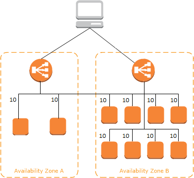
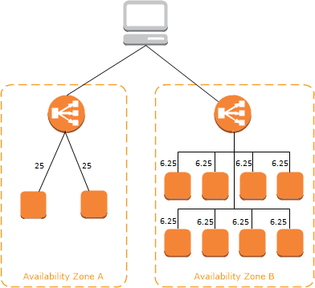

# Cross-zone Load Balancing

The nodes for your load balancer distribute requests from clients to registered targets. When cross-zone load balancing is enabled, each load balancer node distributes traffic across the registered targets in all enabled Availability Zones. When cross-zone load balancing is disabled, each load balancer node distributes traffic only across the registered targets in its Availability Zone.

The following diagrams demonstrate the effect of cross-zone load balancing. There are two enabled Availability Zones, with two targets in Availability Zone A and eight targets in Availability Zone B. Clients send requests, and Amazon Route 53 responds to each request with the IP address of one of the load balancer nodes. This distributes traffic such that each load balancer node receives 50% of the traffic from the clients. Each load balancer node distributes its share of the traffic across the registered targets in its scope.

If cross-zone load balancing is enabled, each of the 10 targets receives 10% of the traffic. This is because each load balancer node can route 50% of the client traffic to all 10 targets.

If cross-zone load balancing is disabled:

Each of the two targets in Availability Zone A receives 25% of the traffic.

Each of the eight targets in Availability Zone B receives 6.25% of the traffic.

This is because each load balancer node can route 50% of the client traffic only to targets in its Availability Zone.

With Application Load Balancers, cross-zone load balancing is always enabled.

With Network Load Balancers and Gateway Load Balancers, cross-zone load balancing is disabled by default. After you create the load balancer, you can enable or disable cross-zone load balancing at any time.

When you create a Classic Load Balancer, the default for cross-zone load balancing depends on how you create the load balancer. With the API or CLI, cross-zone load balancing is disabled by default. With the AWS Management Console, the option to enable cross-zone load balancing is selected by default. After you create a Classic Load Balancer, you can enable or disable cross-zone load balancing at any time
