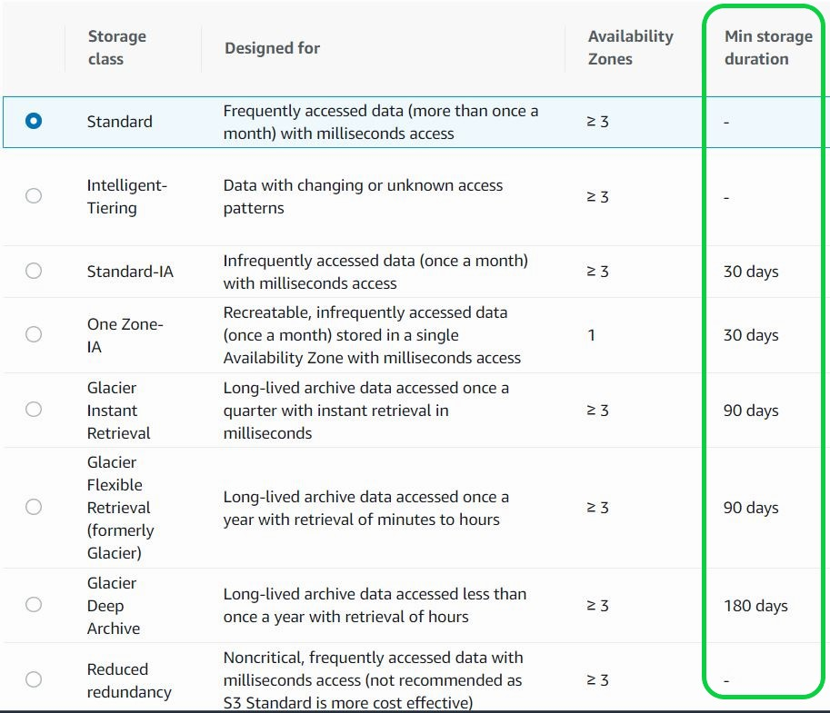

# Object Lifecycle Management

When using multipart uploads, Amazon S3 retains all the parts on the server until you complete or discontinue the upload. To avoid unnecessary storage costs related to incomplete uploads, make sure to complete or discontinue an upload. Use lifecycle rules to clean up incomplete multipart uploads automatically.

An Amazon S3 Lifecycle configuration is an XML file that consists of a set of rules w/ predefined actions that you want Amazon S3 to perform on objects during their lifetime. As a best practice, we recommend you configure a lifecycle rule using the `AbortIncompleteMultipartUpload` action to minimize your storage costs.

It is recommended that you enable the ability to clean incomplete multipart uploads in the lifecycle settings even if you are not sure whether you are going to perform multipart uploads. Some applications default to multipart uploads when uploading files over a particular application-dependent size and failed or incomplete uploads will result in increased storage costs.

> **Use lifecycle rules to manage your objects**
>
> You can manage an object's li

> **Lifecycle Policies**
>
> * Automates moving your objects between the different storage tiers.
>
> * Can be used in conjunction w/ versioning.
>
> * Can be applied to current versions and previous versions.

Lifecycle configuration enables you to specify the lifecycle management of objects in a bucket. The configuration is a set of one or more rules, where each rule defines an action for Amazon S3 to apply to a group of objects. These actions can be classified as follows:

* **Transition actions** ▶︎ In which you define when objects transition to another storage class. For example, you may choose to transition objects to the STANDARD_IA (IA, for infrequent access) storage class 30 days after creation or archive objects to the GLACIER storage class one year after creation.

* **Expiration actions** ▶︎ In which you specify when the objects expire. Then Amazon S3 deletes the expired objects on your behalf.

Only Amazon S3 Standard has the feature of no minimum storage duration. It is also the most cost-effective storage service because you will only be charged for the last 12 hours, unlike in other storage classes where you will still be charged based on its respective storage duration (e.g. 30 days, 90 days, 180 days). S3 Intelligent-Tiering also has no minimum storage duration and this is designed for data with changing or unknown access patters.

S3 Standard-IA is designed for long-lived but infrequently accessed data that is retained for months or years. Data that is deleted from S3 Standard-IA within 30 days will still be charged for a full 30 days.

S3 Glacier Deep Archive is designed for long-lived but rarely accessed data that is retained for 7-10 years or more. Objects that are archived to S3 Glacier Deep Archive have a minimum of 180 days of storage, and objects deleted before 180 days incur a pro-rated charge equal to the storage charge for the remaining days.
