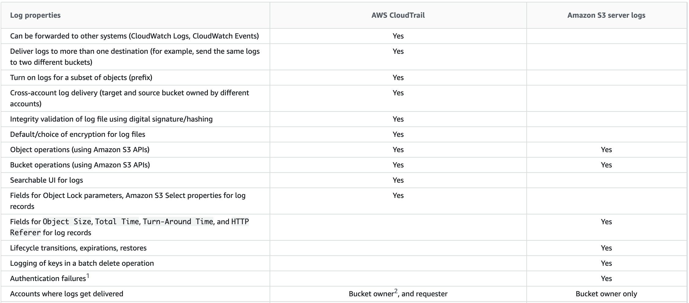

# S3 Server Logs

You can record the actions that are taken by users, roles, or AWS services on Amazon S3 resources and maintain log records for auditing and compliance purposes. To do this, you can use server access logging, AWS CloudTrail logging, or a combination of both. AWS recommends that you use AWS CloudTrail for logging bucket and object-level actions for your Amazon S3 resources.

