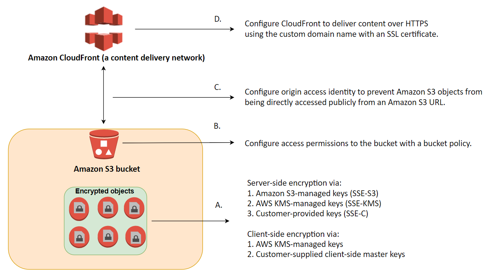

# Encrypting Data

## Data in-transit and data at-rest

Data protection refers to protecting data while in-transit (data traveling to adn from Amazon S3) and while at rest (while stored on disks in Amazon S3 data centers). You can protect data in transit using Secure Socket Layer/Transport Layer Security (SSL/TLS) or client-side encryption. By providing the appropriate level of protection for your data in transit, you protect the confidentiality and integrity of your workload's data from any bad actor who may intercept the data while in transit. B/c the AWS API is a REST service that supports SSL/TLS connections, all official AWS SDKs and CLI tools connect to the AWS API using SSL/TLS by default.

Data protection refers to protecting data while in-transit (as it travels to and from Amazon S3) and at rest (while it is stored on disks in Amazon S3 data centers). You can protect data in transit by using SSL or by using client-side encryption. You have the following options for protecting data at rest in Amazon S3.

For data at rest (data already stored on disk), Amazon S3 provides you w/ two options: Server-side encryption, and client-side encryption.

## Server-side encryption

You request Amazon S3 to encrypt your object before saving it on disks in its data centers and decrypt it when you download the objects.

When you use server-side encryption, Amazon S3 encrypts an object before saving it to disk and decrypts when you download it. As long as you authenticate nad have access permissions, there is no difference in how you access encrypted or un-encrypted objects. For example, if you share your objects using a presigned URL, that URL works the same way for both encrypted and un-encrypted objects. Additionally, when you list objects in your bucket, the list API returns a list of all objects, regardless of their encryption.

## Three server-side encryption options

You have three mutually exclusive options, depending on how you choose to manage the encryption keys.

> ### SSE-S3
>
> Server-Side Encryption w/ Amazon S3-Managed Keys (SSE-S3)
>
> When you use Server-Side Encryption w/ Amazon S3-Managed Keys (SSE-S3), each object encrypts w/ a unique key. As an additional safeguard, it encrypts the key itself w/ a master key that it regularly rotates. Amazon S3 server-side encryption uses one of the strongest block ciphers available, 256-bit Advanced Encryption Standard (AES-256), to encrypt your data.

e.g. "Enable SSE on an S3 bucket to make use of AES-256 encryption"

> ### SSE-KMS
>
> Server-Side Encryption w/ Customer Master Keys (CMKs) Stored in AWS Key Management Service (SSE-KMS)
>
> Server-Side Encryption w/ Customer Master Keys (CMKs) Stored in AWS Key Management Service (SSE-KMS) is similar to SSE-S3, but w/ some additional benefits and charges for using this service. There are separate permissions for the use of a CMK that provides added protection against unauthorized access of your objects in Amazon S3. SSE-KMS also provides you w/ an audit trail showing when and who used the CMK. Additionally, you can choose to create and manage customer managed CMKs, or use AWS managed CMKs that are unique to you, your service, and your Region.

> ### SSE-C
>
> Server-Side Encryption w/ Customer-Provided Keys (SSE-C)
>
> W/ Server-Side Encryption w/ Customer-Provided Keys (SSE-C), you manage the encryption keys and Amazon S3 manages the encryption, as it writes to disks, and decryption, when you access your objects. W/ this option, the customer is responsible for managing and rotating the keys, and w/o access to these keys the Amazon S3 data can not be decrypted.

e.g. "Encrypt the data using your own encryption keys then copy the data to Amazon S3 over HTTPS endpoints. This refers to using a Server-Side Encryption with Customer-Provided Keys (SSE-C)."

> [!NOTE]
> You can't apply different types of server-side encryption to the same object simultaneously.

## Client-side Encryption

You can encrypt data client-side and upload the encrypted data to Amazon S3. In this case, you manage the encryption process, the encryption keys, and related tools.

Client-side encryption is the act of encrypting sensitive data before sending it to Amazon S3. When using client-side encryption, the encryption performs locally and your data never leaves the environment unencrypted. You maintain possession of your master encryption keys, and they are never sent to AWS, therefore, it is important that you safely store them (i.e., as a file or using a separate key management system) and load them when uploading or downloading objects. This ensures that no one outside of your environment has access to your master keys and w/o access to the master keys; your data cannot be decrypted. If your master encryption keys are lost, you will not be able to decrypt your own data, therefore it is essential that if you use client-side encryption that you store your keys safely.

To enable client-side encryption, you have the following options:

* Use a customer master key (CMK) stored in AWS Key Management Service (AWS KMS). W/ this option, you use an AWS KMS CMK for client-side encryption when uploading or downloading data in Amazon S3.

* Use a master key that you store within your application. W/ this option, you provide a client-side master key to the Amazon S3 encryption client. The client uses the master key only to encrypt the data encryption key that it generates randomly.

> [!NOTE]
> Your client-side master keys and your un-encrypted data are not sent to AWS. It's important that you safely manage your encryption keys. If you lose them, you can't decrypt your data.

## Learning Summary

In Amazon S3, data protection refers to protecting data while in-transit (as it travels to and from Amazon S3) and at rest (while it is stored on disks in Amazon S3 data centers). You can protect data in transit by using SSL or by using client-side encryption. You have the following options to protect data at rest in Amazon S3.

* **Use Server-Side Encryption** ▶︎ You request Amazon S3 to encrypt your object before saving it on disks in its data centers and decrypt it when you download the objects.

* **Use Client-Side Encryption** ▶︎ You can encrypt data client-side and upload the encrypted data to Amazon S3. In this case, you manage the encryption process, the encryption keys, and related tools.
