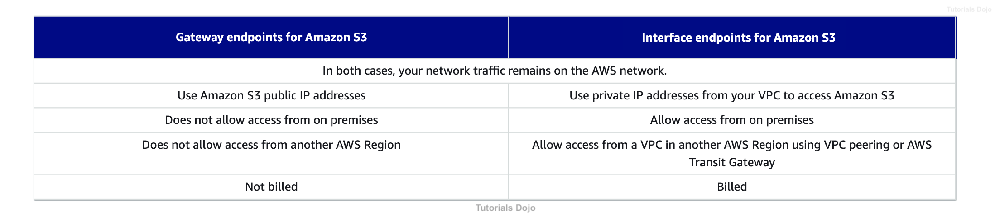

# VPC Endpoint

There are two types of VPC endpoints: *interface endpoints* and *gateway endpoints*. You have to create the type of VPC endpoint required by the supported service.

An **interface endpoint** is an elastic network interface with a private IP address that serves as an entry point for traffic destined to a supported service. A **gateway endpoint** is a gateway that is a target for a specified route in your route table, used for traffic destined to a supported AWS service.

Hence, the correct answer is: **Change the web architecture to access the financial data through a Gateway VPC Endpoint.**

> The option that says: **Changing the web architecture to access the financial data in your S3 bucket through a VPN connection** is incorrect because a VPN connection still goes through the public Internet. You have to use a VPC Endpoint in this scenario and not VPN, to privately connect your VPC to supported AWS services such as S3.

> The option that says: **Changing the web architecture to access the financial data hosted in your S3 bucket by creating a custom VPC endpoint service** is incorrect because a "VPC endpoint service" is quite different from a "VPC endpoint". With the VPC endpoint service, you are the service provider where you can create your own application in your VPC and configure it as an AWS PrivateLink-powered service (referred to as an endpoint service). Other AWS principals can create a connection from their VPC to your endpoint service using an interface VPC endpoint.

> The option that says: **Changing the web architecture to access the financial data in S3 through an interface VPC endpoint, which is powered by AWS PrivateLink** is incorrect. Although you can use an Interface VPC Endpoint to satisfy the requirement, this type entails an associated cost, unlike a Gateway VPC Endpoint. Remember that you won't get billed if you use a Gateway VPC endpoint for your Amazon S3 bucket, unlike an Interface VPC endpoint that is billed for hourly usage and data processing charges. Take note that the scenario explicitly asks for the most cost-effective solution.

 
