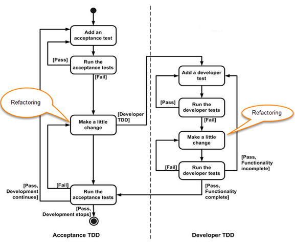

# Test-Driven Development

## What is acceptance TDD and Developer TDD

 

There are two levels of TDD:

1. **Acceptance TDD (ATDD)**: With ATDD you write a single acceptance test. This test fulfills the requirement of the specification or satisfies the behavior of the system. After that write just enough production/functionality code to fulfill that acceptance test. Acceptance test focuses on the overall behavior of the system.

2. **Developer TDD**: With Developer TDD you write single developer test i.e. unit test and then just enough production code to fulfill that test. The unit test focuses on every small functionality of the system. Developer TDD is simply called as TDD.The main goal of ATDD and TDD is to specify detailed, executable requirements for your solution on a just in time (JIT) basis. JIT means taking only those requirements in consideration that are needed in the system. So increase efficiency.

 

## Scaling TDD via Agile Driven Development (AMDD)

 

TDD is very good at detailed specification and validation. It falls short at addressing larger scoped problems such as overall design, use of the system, or UI. **AMDD** addresses the Agile scaling issues that TDD does not.

Thus AMDD used for bigger issues.

The lifecycle of AMDD:

In Model-driven Development (MDD), extensive models are created before the source code is written. Which in turn have an agile approach?

In above figure, each box represents a development activity.

Envisioning is one of the TDD process of predicting/imagining tests which will be performed during the first week of the project. The main goal of envisioning is to identify the scope of the system and architecture of the system. High-level requirements and architecture modeling is done for successful envisioning.

It is the process where not a detailed specification of software/system is done but exploring the requirements of software/system which defines the overall strategy of the project.

 

### Iteration 0: Envisioning

 

There are two main sub-activates:

1. *Initial requirements envisioning*. It may take several days to identify high-level requirements and scope of the system. The main focus is to explore usage model, Initial domain model, and user interface model (UI).

2. *Initial Architectural envisioning*. It also takes several days to identify architecture of the system. It allows setting technical directions for the project. The main focus is to explore technology diagrams, User Interface (UI) flow, domain models, and Change cases.

 

### Iteration modeling

 

Here team must plan the work that will be done for each iteration.

* Agile process is used for each iteration, i.e. during each iteration, new work item will be added with priority

* First higher prioritized work will be taken into consideration. Work items added may be re-prioritized or removed from items stack any time

* The team discusses how they are going to implement each requirement. Modeling is used for this purpose

* Modeling analysis and design is done for each requirement which is going to implement for that iteration.

 

### Model storming

 

This is also known as *Just-in-time* Modeling.

* Here modeling session involves a team of 2/3 members who discuss issues on paper or whiteboard.

* One team member will ask another to model with them. This modeling session will take approximately 5 to 10 minutes. Where team members gather together to share whiteboard/paper.

* They explore issues until they don’t find the main cause of the problem. Just in time, if one team member identifies the issue which he/she wants to resolve then he/she will take quick help of other team members.

* Other group members then explore the issue and then everyone continues on as before. It is also called as stand-up modeling or customer QA sessions.

 

### Test-Driven Development (TDD)

 

* It promotes confirmatory testing of your application code and detailed specification.

* Both acceptance test (detailed requirements) and developer tests (unit test) are inputs for TDD.

* TDD makes the code simpler and clear. It allows the developer to maintain less documentation.

 

### Reviews

 

* This is optional. It includes code inspections and model reviews.

* This can be done for each iteration or for the whole project.

* This is a good option to give feedback for the project.
