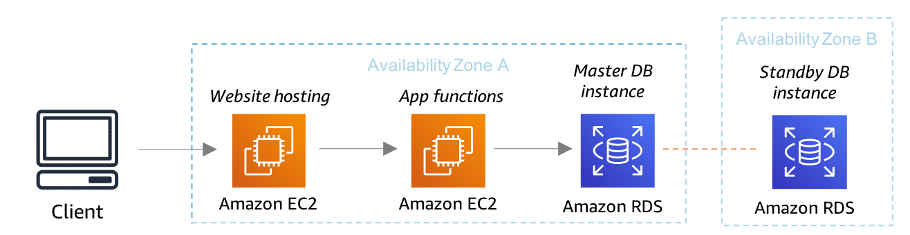
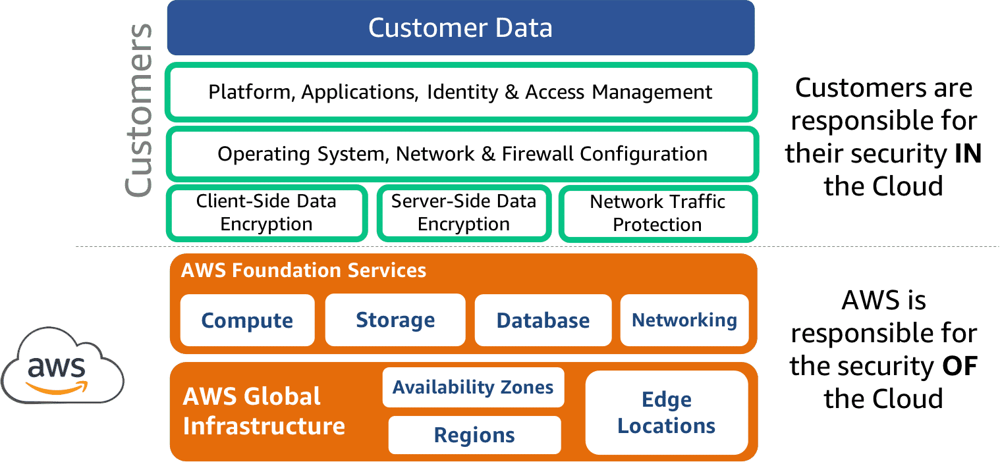
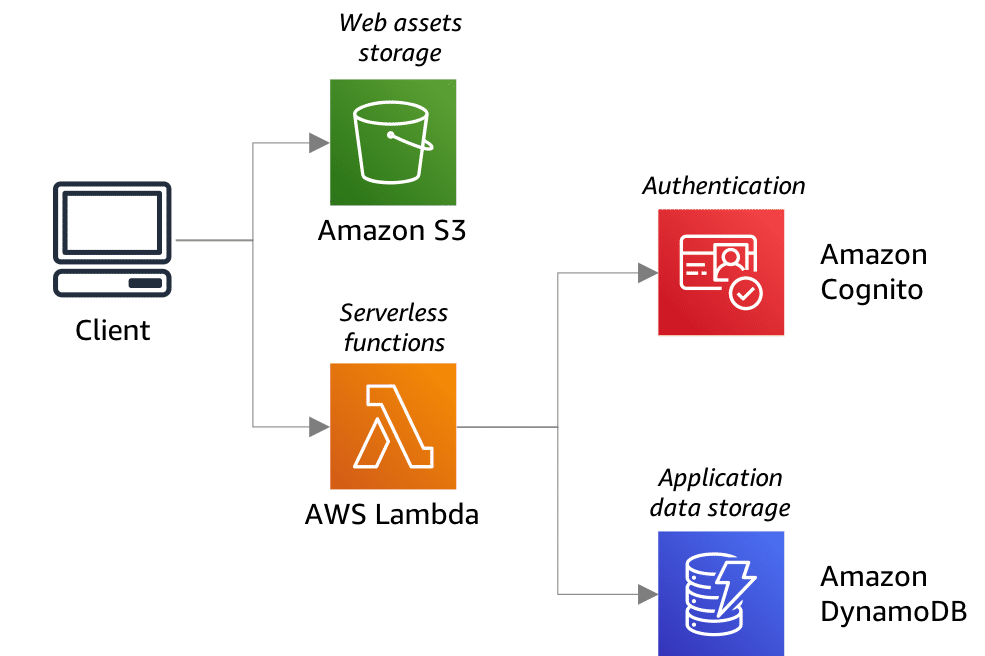

# Architecture Overview

A server-based architecture is a computing model in which the server hosts, delivers, and manages most of the resources and services the applications and users consume. You manage the servers. You must pay for maintenance to patch and update them. You're responsible for ensuring their proper function. As your business grows, scaling requires you to purchase additional servers and software. Finally, implementing high availability and fault tolerance? Well, that can be a bit costly.

A serverless architecture, also known as serverless computing, is a software design pattern where applications are hosted by a third-party service, eliminating the need for the developer to manage server software and hardware.

Serverless architectures require zero server maintenance, provide automatic scaling, and have built-in high availability and fault tolerance. Serverless can be a great fit for certain applications, but it’s not the best for every application. There are cases when it makes more sense, both from a cost and system architecture perspective, to use dedicated servers that are either self-managed or offered as a service.

In another example, developing new applications made of short-running tasks that have a single purpose is a perfect fit for serverless architecture. This architecture can save you a significant amount of time and money over the same architecture designed for a server-based architecture. It's important to remember that if you need to do a lot of in-depth analysis or perform long-running computations, a server-based architecture is generally a better fit.

## Benefits of a server-based architecture

> ### Developer Perspective
>
> * **Predictive tasks**: For tasks that use constant or predictive compute, it may be more cost-effective to use server-based billing.
>
> * **Testing and debugging**: Debugging is less complicated because there is visibility into backend processes and the application is not broken up into separate, smaller functions. It's difficult to replicate the serverless environment to see how code will actually perform once deployed.
>
> * **Fewer units of integration**: Serverless architectures have lots of smaller components than with server-based architectures. This requires extra time to go into organizing the functions so they work in line with your data.

> ### Business Perspective
>
> * **Overall control**: The company owns and manages the infrastructure, which provides full control over all aspects of the application.
>
> * **Compliance and security**: Having full control over the infrastructure allows for full visibility, which may be required for compliance and security standards.
>
> * **Legacy applications**: Existing applications may not have the flexibility of decoupling individual parts and may be better suited to migrate to a server-based architecture.

## Benefits of a serverless architecture

> ### Developer Perspective
>
> * **Server management**: Because there is no backend infrastructure to be responsible for, liability is reduced and there is no system administration.
>
> * **Scalability**: With a serverless architecture, you don’t have to think twice about provisioning infrastructure because of its ability to automatically scale with traffic volumes.
>
> * **Application flexibility**: You can migrate individual application features or partial workloads to run on serverless as on-demand events. This frees up resources in production to be used for more critical tasks.

> ### Business Perspective
>
> * **Time to market**: Smaller deployable units result in faster delivery of features to market, increasing the ability to adapt to change.
>
> * **Cost**: The cost of hiring backend infrastructure engineers goes down, along with operational costs.
>
> * **Customer obsession**: Abstraction from servers allows companies to dedicate more time and resources to developing and improving customer experience.
>
> * **Startup friendly**: The serverless architecture pay-as-you-go model allows you to build an environment nearly for free and ease into the market without dealing with huge bills for minimum traffic.

## Server-Based Architecture

### AWS server-based architecture example

The following diagram shows a typical web application using a server-based database solution. This architecture includes website content and application functions hosted on Amazon EC2 instances. Amazon RDS provides data store in multiple Availability Zones for fault tolerance.

> ### Amazon EC2
>
> Amazon EC2 is a web service that allows you to run applications and spin up virtual machines in the AWS Cloud. AWS offers cloud web hosting solutions that provide businesses, non-profits, and governmental organizations w/ low-cost ways to deliver their websites and web applications.

> ### Amazon RDS
>
> Amazon RDS uses Amazon EC2 to create its database instances and configure them w/ one of the supported database engines. Amazon RDS takes care of all the instance maintenance tasks that you would have to manually perform on-premises.

> ### Amazon RDS Multi-AZ
>
> Amazon RDS Multi-AZ deployments provide enhanced availability and durability for database instances. When you provision a Multi-AZ database instance, Amazon RDS automatically creates a master database instance and synchronously replicates the data to a standby instance in a different Availability Zone.

### Scaling in a server-based architecture

When it comes to server-based architectures, scaling usually comes with a cost and may introduce complexity to a solution. For a web application that’s under too much load, for example, that means finding out what resource your application is running out of on the server.

AWS offers instance monitoring out of the box for its server-based databases. This makes it easier to determine what needs scaling. To handle a higher load in your database, for example, you can vertically scale up your Amazon RDS master database instance by selecting a bigger instance size. There are currently more than 18 instance sizes to choose from when resizing your Amazon RDS MySQL, PostgreSQL, MariaDB, Oracle, or Microsoft SQL Server instance. Your application can remain online, and Amazon RDS manages the scaling.

### AWS server-based databases

> ### Amazon RDS
>
> Amazon RDS is a managed relational database service. AWS takes care of most of the management and maintenance tasks required by a server-based approach. Amazon RDS provides you with six familiar database engines to choose from, including Amazon Aurora, PostgreSQL, MySQL, MariaDB, Oracle, and SQL Server.
>
> **Amazon RDS benefits**
>
> * AWS automates the entire process of database configuration, management, and maintenance.
>
> * Configure read replicas when using certain database engines, or set up synchronous replication for enhanced performance, availability, and durability.
>
> * Amazon RDS offers automatic backups and encryption at rest and in transit.
>
> * You can scale your database's compute and storage resources with only a few mouse clicks or an API call, often with no downtime.

> ### Amazon EC2
>
> With Amazon EC2 as the underlying structure for your database deployment, you are responsible for the administration and maintenance of your database, including database engine installs, patching, and OS updates. For data storage, Amazon Elastic Block Storage (Amazon EBS) volumes are used by Amazon EC2 instances. An instance may have more than one volume associated.
>
> **Amazon EC2 benefits**
>
> * Amazon EC2 gives you full control over your database deployment.
>
> * Easily supervise your maintenance windows, use of ports, and number of instances per database.
>
> * Configure your Amazon EC2 database with the same settings and parameters as your on-premises solution.
>
> * Encrypt Amazon EBS volumes to protect your data both at rest and in transit as the data travels between the volume and the instance.
 
> ### AWS Shared Responsibility Model
>
> Security and compliance are shared responsibilities between AWS and the customer. As an AWS customer, you can securely provision virtual servers, storage, databases, and desktops in the AWS Cloud. In this process, you are responsible for securing your data, operating systems, networks, platforms, and other resources that you create in the AWS Cloud. You are responsible for protecting the confidentiality, integrity, and availability of your data in the cloud and for meeting any specific business and compliance requirements for your workloads in the cloud.

> Note that the shared responsibilities vary depending on the type of AWS service. When it comes to using **Amazon EC2** to host your database, AWS takes care of the server infrastructure, including networking and storage. You are responsible for managing the database, including the following:
>
> * Scaling and capacity planning
>
> * Implementing high availability and fault tolerance
>
> * Database backups
>
> * Database software patches
>
> * Database software installs
>
> * Operating system patches
>
> When it comes to using **Amazon RDS**, AWS performs database maintenance on your behalf. Even though Amazon RDS does not automatically scale a database instance, it does make it easier with little to no downtime. This allows you to dedicate more of your time to application optimization.

## Serverless Architecture

All AWS serverless database services feature a distributed, fault-tolerant, highly available storage system that automatically scales as demand grows: **Amazon DynamoDB** and **Amazon Aurora Serverless**.

### AWS serverless architecture example

The following diagram shows a typical web application, similar to the application architecture from the previous lesson, only this time using serverless. This architecture includes website content stored in Amazon Simple Storage Service (Amazon S3), application code executed using AWS Lambda functions, user authentication provided by Amazon Cognito, and Amazon DynamoDB to store application data.

> ### Client
>
> The UI of the application is rendered at the client side, which allows you to use a simple, static web server.

> ### Web server
>
> Amazon S3 serves all of the static HTML, CSS, and JavaScript files for the application.

> ### Lambda functions
>
> Lambda functions are the key enablers in a serverless architecture. The application services for logging in and accessing data can be built as Lambda functions. These functions read and write from your database.

> ### User authentication
>
> Amazon Cognito is an identity service, which can be integrated w/ AWS Lambda. W/ Amazon Cognito, you can easily add user sign-up and sign-in to your mobile and web apps. The service can also authenticate users through social identity providers or your own identity system.

> ### Database
>
> Amazon DynamoDB automatically scales tables up and down to adjust for capacity and maintain performance. In this diagram, DynamoDB is a non-relational data store option.

### Scaling in a serverless architecture

Implementing a serverless architecture allows your backend AWS services to efficiently and automatically scale and help keep your costs low. Scaling is an event-driven process. For example, when it comes to Amazon DynamoDB, you can use Amazon CloudWatch to monitor and track a table’s read and write capacity metrics. Even if you’re not around, DynamoDB automatic scaling monitors your tables and indexes to automatically adjust throughput in response to changes in application traffic as demand increases and decreases.

### AWS serverless databases

> ### Amazon DynamoDB
>
> As a fully managed non-relational database, Amazon DynamoDB automatically scales tables on-demand to adjust for capacity and maintains performance with zero server administration. DynamoDB supports both document and key-value store models.
>
> **Amazon DynamoDB benefits**
>
> * DynamoDB supports ACID (Atomicity, Consistency, Isolation, and Durability) transactions to enable you to build business-critical applications at scale.
>
> * There is no hardware provisioning, software patching, or upgrades. DynamoDB scales up or down automatically and is perfect for new, unpredictable, infrequently used, or variable workloads.
>
> * DynamoDB encrypts all data by default and fully integrates with AWS Identity and Access Management (AWS IAM) for robust security.
>
> * Build global applications with fast access to local data by easily replicating tables across multiple AWS Regions.
>
> * You can use Amazon DynamoDB Accelerator (DAX), which is an in-memory store for DynamoDB, without the need to modify application logic.

> ### Amazon Aurora Serverless
>
> For relational databases, Amazon Aurora Serverless is an on-demand, automatically scaling configuration for Amazon Aurora (MySQL and PostgreSQL). Aurora automatically starts up, shuts down, and scales capacity up or down based on your application's needs.
>
> **Amazon Aurora Serverless benefits**
>
> * Aurora Serverless is built on distributed, fault-tolerant, self-healing Aurora storage with six-way replication to protect against data loss.
>
> * Pay only for the database resources you consume, on a per-second basis. Your database automatically shuts down when not in use, so you don't pay for the database instance unless it's actually running.
>
> * Automatically scale compute and memory capacity as needed, with no disruption to client connections.
>
> * It's managed by Amazon RDS so there is no hardware provisioning, software patching, setup, configuration, or backup management.
>
> **Use cases for Amazon Aurora Serverless**
>
> * **Variable workloads** ▶︎ Lightly used applications, with peaks of 30 minutes to several hours a few times each day or several times per year, such as a human resources, budgeting, or operational reporting application
>
> * **Unpredictable workloads** ▶︎ Workloads where there is database usage throughout the day and also peaks of activity that are hard to predict such as a traffic site that might see a surge of activity when it starts raining
>
> * **New applications** ▶︎ New applications that use a relational data model but the instance size needed is not certain
>
> * **Development and test databases** ▶︎ Relational databases used by software development and quality assurance teams during work hours but are not needed on nights or weekends
>
> * **Multitenant applications** ▶︎ For web-based applications where each customer has their own database, Aurora Serverless manages individual database capacity for each customer.
