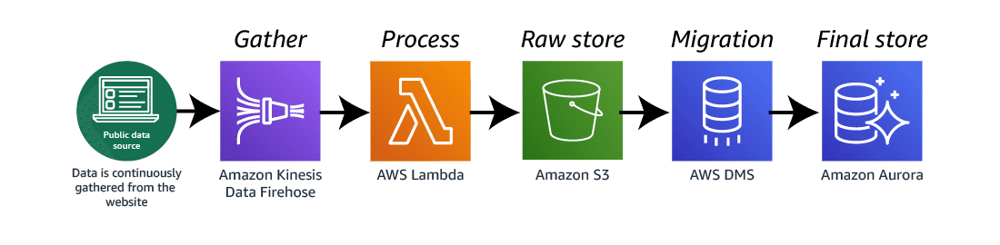

# Public source data ingestion architecture

Many applications rely on data from public sources to meet the needs of their users. This architecture is one way to accomplish this task.

> ### Public data source
>
> *Public data is everywhere. Using it to enhance the abilities of your applications and analysis can be the difference between having a functional app and having one that is a huge success.*
>
> **In this architecture**, data is being gathered from a website containing a public weather data source.

> ### Amazon Kinesis Data Firehose
>
> *Kinesis Data Firehose is a service that can capture, transform, and load streaming data into an Amazon S3 bucket. The result is called a data stream.*
>
> **In this architecture**, Kinesis Data Firehose gathers data from the weather website and sends it on to a Lambda function.

> ### AWS Lambda
>
> *Lambda lets you run code, called functions, w/o provisioning or managing servers.*
>
> **In this architecture**, the Lambda function takes the data from the data stream and transforms it into a consistent format before storing it in an Amazon S3 bucket.

> ### Amazon S3
>
> *Amazon S3 is a data repository.*
>
> **In this architecture**, Amazon S3 holds the data gathered by the Lambda function.

> ### AWS DMS
>
> *AWS DMS migrates data from one source into an AWS database service.*
>
> **In this architecture**, AWS DMS takes the data from the Amazon S3 bucket, transforms it, and loads it into an Aurora table within the designated database.

> ### Amazon Aurora
>
> **In this architecture**, Aurora can now take the data from the table created by AWS DMS and use it to enrich the other data generated and used by applications accessing the database.
