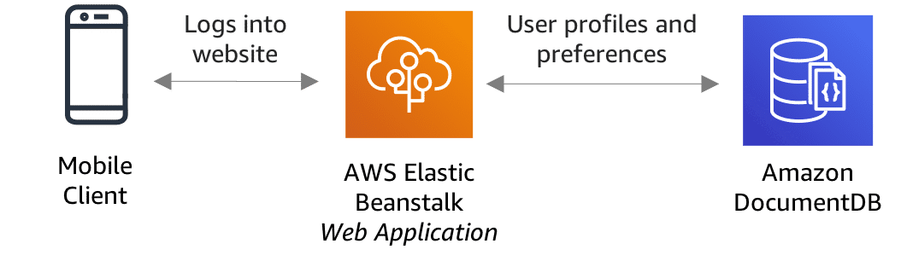

# Use Case - Profile management: Amazon DocumentDB

User profile management enables online transactions, user preferences, and user authentication. With the growth in number of users, increasingly complex user profile data, and growing user experience expectations, the demand for scalability, data flexibility, and performance has grown too. With Amazon DocumentDB’s document data model, you can manage profiles and preferences for millions of users and scale to process millions of user requests per second with millisecond latency.

Developers can persist data with Amazon DocumentDB by using the same document model format that they use in their application code. Content management, personalization, and mobile applications are typical use cases.

