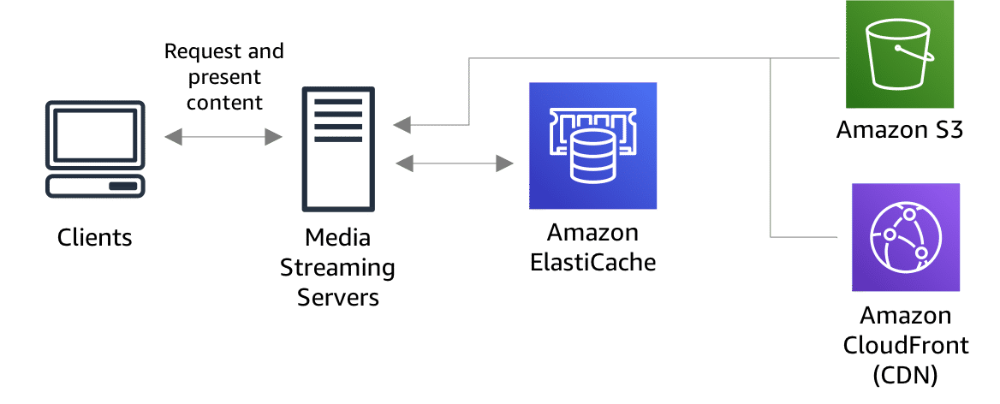

# Elasticache

> 1. ElastiCache is a **managed in-memory data store**
>
> 2. **Supports two popular caching engines**:
>
>   * **Redis**
>
>   * **Memcached**
>
> 3. Great for **offloading reads** by caching our response to improve our application speed and reduce application's cost and **storing session state**. So it allows for stateless compute instances, used for fault-tolerant architectures.

Elasticache can be used to improve performance by improving the read scalability of the application or improve the fault-tolerant architecture.

> ElastiCache is a web service that makes it easy to deploy, operate, and scale an in-memory cache in the cloud. The service improves the performance of web applications by allowing you to retrieve information from fast, managed, in-memory caches, instead of relying entirely on slower disk-based databases.

* Helps take off some of the performance impact b/c you're not constantly querying w/ your main production database for the same queries. So you're going to cache your most-queried information in Elasticache.

> **ElastiCache** supports two open-source in-memory caching engines:
>
> * **Memcached**
>
> * **Redis**

|                                                  | **Memcached** | **Redis** |
|--------------------------------------------------|---------------|-----------|
| Sub-millisecond latency                          | Yes           | Yes       |
| Developer ease of use                            | Yes           | Yes       |
| Data partitioning                                | Yes           | Yes       |
| Support for a broad set of programming languages | Yes           | Yes       |
| Advanced data structures                         | -             | Yes       |
| Multithreaded architecture                       | Yes           | -         |
| Snapshots                                        | -             | Yes       |
| Replication                                      | -             | Yes       |
| Transactions                                     | -             | Yes       |
| Pub/Sub                                          | -             | Yes       |
| Lua scripting                                    | -             | Yes       |
| Geospatial support                               | -             | Yes       |

## Use case - Media streaming: Amazon ElastiCache

Amazon ElastiCache offers a fast, in-memory data store to power live streaming use cases. ElastiCache can store metadata for user profiles and viewing history, authentication information/tokens for millions of users, and manifest files to enable content delivery networks to stream videos to millions of mobile and desktop users at a time.

In this use case, Amazon Simple Storage Service (Amazon S3) and Amazon CloudFront are managing and serving media content. ElastiCache manages the content index and token authentication for in-memory, sub-milliseconds responses at scale.

## Learning summary

> * Use Elasticache to increase database and web application performance.

* e.g. Your database is overloaded. What two steps could you take to make this database perform better? One is to add a **Read Replica** and then point your reads to your Read Replicas. And then the other is to use **ElastiCache**.

> * Redis is Multi-AZ
>
> * You can do backups and restores of Redis
>
> * If you need to scale horizontally, use Memcached
