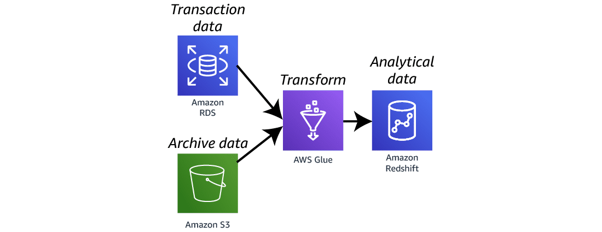
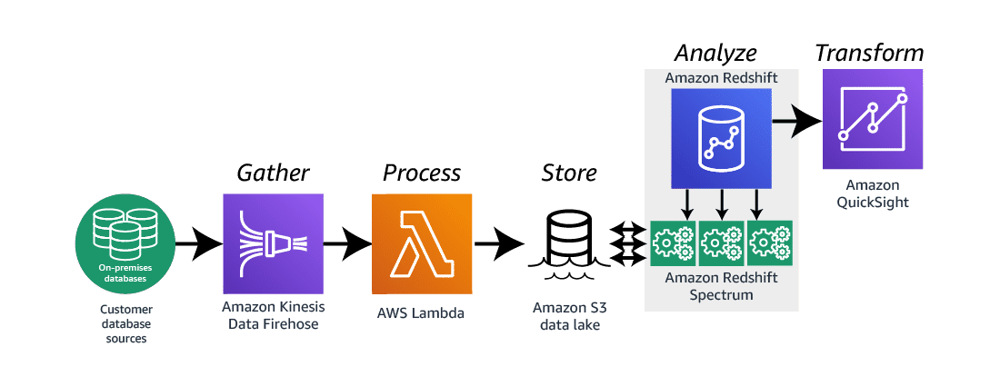

# Service Technical Overview

Amazon Redshift is a fast, scalable data warehouse that makes it simple and cost-effective to analyze all your data across your data warehouse and data lake. Amazon Redshift delivers ten times faster performance than other data warehouses by using machine learning, massively parallel query execution, and columnar storage on high-performance disk.

The core infrastructure component of an Amazon Redshift data warehouse is a cluster. A cluster is composed of a leader node and one or more compute nodes. The leader node is responsible for distributing jobs to the compute nodes.

Each compute node has its own dedicated CPU, memory, and attached disk storage. Compute nodes partition the job into slices. Each slice is allocated a portion of the node's memory and disk space. It is in these slices where the node processes its assigned portion of the job.

After the slices have completed their assigned tasks, the results are aggregated and returned to the leader node. The leader node then aggregates the results from all nodes and returns them to the client.

So, how do you connect to an Amazon Redshift cluster? By using an endpoint. An endpoint is a URL that contains a host address and a port. Use the SQL endpoint to connect your application to Amazon Redshift. You can use any application that uses an industry standard JDBC or ODBC driver for PostgreSQL.

Security is one of the most important aspects of managing a data warehouse. The first consideration is controlling access to the Amazon Redshift cluster. Amazon Redshift uses AWS Identity and Access Management, or IAM, to create and manage credentials. You can use the same users and roles you have in IAM with Amazon Redshift. It requires both authentication and permission to access tables and data. IAM policies assign permissions that determine who can manage Amazon Redshift resources.

Amazon Redshift is configured to run inside an Amazon Virtual Private Cloud (Amazon VPC). This isolates the Amazon Redshift cluster within your own virtual network.

The second consideration is securing communications to and from the data warehouse, known as data in transit. This is done by using HTTPS connections. These connections are encrypted using Secure Sockets Layer, or SSL.

The final consideration is protecting data in the database. Amazon Relational Database Service (Amazon RDS) uses the industry standard AES-256 bit encryption algorithm to encrypt the data while at rest. AWS Key Management Service (AWS KMS) handles key management.

Amazon Redshift integrates with other AWS services, enabling you to move, transform, and load data quickly, reliably, and securely.

In this architecture, you see one way to build a rich data platform by combining data from multiple data sources. **AWS Glue** can combine transactional data from an Amazon RDS database with archived records from an Amazon Simple Storage Service (Amazon S3) bucket. Once this data has been combined and transformed, it can then be loaded into an Amazon Redshift data warehouse.

In another architecture, you can build out an event-driven data analysis platform by using Amazon Kinesis Data Firehose to gather data from on-premises data servers. Kinesis Data Firehose can trigger an AWS Lambda function that loads the data into an Amazon S3 data lake. The Amazon Redshift cluster can now query not only the data within the data warehouse but also the data in the data lake using Amazon Redshift Spectrum. You can then visualize this data with Amazon QuickSight.

## Rich data platform architecture

Amazon Redshift is a perfect repository for analytical data. The question becomes how to get quality data into the database with speed, efficiency, and accuracy. This is one architecture for building out a rich data platform pulling data from multiple data sources.

> ### Amazon Relational Database Service (Amazon RDS)
>
> *Amazon RDS is a web service that makes it easy to set up, operate, and scale a relational database in the cloud.*
>
> **In this architecture**, Amazon RDS houses a large volume of transactional data that is vital to the analytical processes of the business.

> ### Amazon Simple Storage Service (Amazon S3)
>
> *Amazon S3 is a data repository.*
>
> **In this architecture**, the Amazon S3 bucket contains archived data from hundreds of data repositories.

> ### AWS Glue
>
> *AWS Glue is a fully managed extract, transform, and load (ETL) service that makes it easy for customers to prepare and load their data by analytics.*
>
> **In this architecture**, AWS Glue is pulling data from both Amazon RDS and Amazon S3, transforming the data into analytical results, then loading those results into the Amazon Redshift data warehouse.

> ### Amazon Redshift
>
> **In this architecture**, Amazon Redshift is the final repository for the analytical data. Services such as Amazon QuickSight can access the repository for visualization and analysis of the data.

## Event-driven data analysis architecture

With the speed of data generation increasing all the time, the speed of data analysis and reporting must increase at the same pace. This architecture is one way to create an event-driven data analysis solution.

> ### Amazon Kinesis Data Firehose
>
> *Kinesis Data Firehose is a service that captures, transforms, and loads data into storage services such as Amazon S3.*
>
> **In this architecture**, Kinesis Data Firehose gathers data from on-premises data servers. This process triggers a Lambda function.

> ### AWS Lambda
>
> *Lambda lets you run code w/o provisioning or managing servers.*
>
> **In this architecture**, the Lambda function takes the data from the Kinesis Data Firehose stream and loads it into an Amazon S3 data lake.

> ### Amazon S3 data lake
>
> *An Amazon S3 data lake is a storage location for many types of data.*
>
> **In this architecture**, it stores all the data gathered by Kinesis Data Firehose.

> ### Amazon Redshift
>
> **In this architecture**, the Amazon Redshift cluster has already been loaded w/ analytical data.

> ### Amazon Redshift Spectrum
>
> *Amazon Redshift Spectrum efficiently queries and retrieves structured and semi-structured data from files in Amazon S3 w/o having to load the data into Amazon Redshift tables.
>
> **In this architecture**, Amazon Redshift Spectrum is used to query both the data within the Amazon Redshift tables as well as the data gathered from the Lambda function.

> ### Amazon QuickSight
>
> *Amazon QuickSight is a fast, cloud-powered business intelligence service that makes it easy to deliver insights to everyone in your organization.
>
> **In this architecture**, Amazon QuickSight uses the Amazon Redshift cluster as a data source. The reports and dashboard written in Amazon QuickSight can refresh and load all new records in real time.

> ### Amazon Redshift
>
> **In this architecture**, Amazon Redshift is the final repository for the analytical data. Services such as Amazon QuickSight can access the repository for visualization and analysis of the data.
