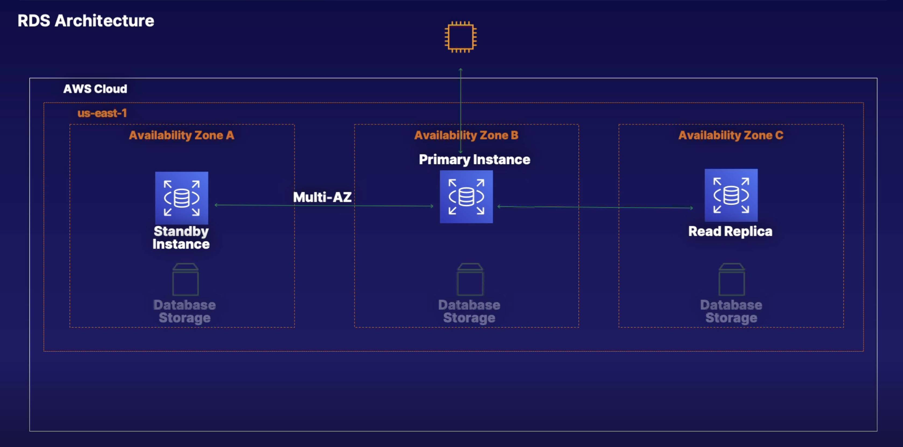

# Relational Databases

> **Cost-efficient and resizable capacity**

> **Relational Database Service (RDS)**
>
> 1. **DBaaS** = Database as a Service
>
> 2. **RDS provides managed database instances**
>
>   * Structured schema ▶︎ So each table has a schema that defines a fixed layout for each row and every row needs to have all of the attributes and correct data types. So relational databases and RDS have a structure for their data, and that structure is known as a schema. The schema is defined in advance.
>
>   * Data is organized into tables
>
>   * Structured Query Language (SQL)
>
> 3. **RDS supports these database engines**:
>
>   * MySQL
>
>   * MariaDB
>
>   * PostgreSQL
>
>   * Oracle
>
>   * Microsoft SQL Server
>
>   * Amazon Aurora
>
> 4. **RDS has two features**:
>
>   * Multi-AZ ▶︎ where we can deploy an RDS database in a single availability zone or multi-availability zones for more resilience and high availability. If there is failover or our database goes down, AWS will automatically update the DNS address from pointing to our primary instance to point to the secondary database instance in the other availability zone. So w/ the Multi-AZ feature, failover is automatic.
>
>   * Read replicas ▶︎ add performance to an RDS database.
>
> 5. **RDS has two types of storage**:
>
>   * General Purpose SSD (gp2)
>
>   * Provisioned IOPs SSD (io1)

We can provision an RDS database w/o the administration of the management overhead and RDS provides Databases as a Service for the following engines above.

So every time this primary RDS instance is written to, then that write is replicated to our Read Replica. If our primary instance goes down, there's no automatic failover like there is for Multi-AZ. We have to actually go in and manually update the new DNS name of that Read Replica, but Read Replicas are great when we have many requests hitting our database and our primary database is getting too many reads. So we can scale up an application, a website, a blog site, etc., by adding a Read Replica, so the Read Replica can handle most of the reads for that application/blog/website.

You can scale out (horizontally) and have up to 5 Read Replicas in RDS. There are also 2 types of storage for RDS instances (mentioned above). RDS instances are charged based on the instance size that you choose, the provision storage not used, the IOPs used, if you're using io1, your data transferred out, and also any backup snapshot beyond what is free for each database instance w/ the AWS free tier. As far as Security Groups go, you can assign Security Groups to your RDS instance to control access. You can also encrypt your databases when you're creating the RDS instance. You can add encryption by taking a snapshot, encrypting that snapshot, and then creating a new database instance from the encrypted snapshot and you can copy the encrypted snapshot between regions, but KMS CMKs do not transfer.

KMS CMKs do not transfer. They are each region-specific, so you will need to create a new one for each region. Once encrypted, that encryption cannot be removed and your Read Replicas should match your RDS instance encryption.

## Learning summary

> * RDS runs on virtual machines.
>
> * You cannot log in to these operating systems however.
>
> * Patching of the RDS Operating System and DB is Amazon's responsibility
>
> * RDS is NOT serverless
>
> * Aurora Serverless is serverless
