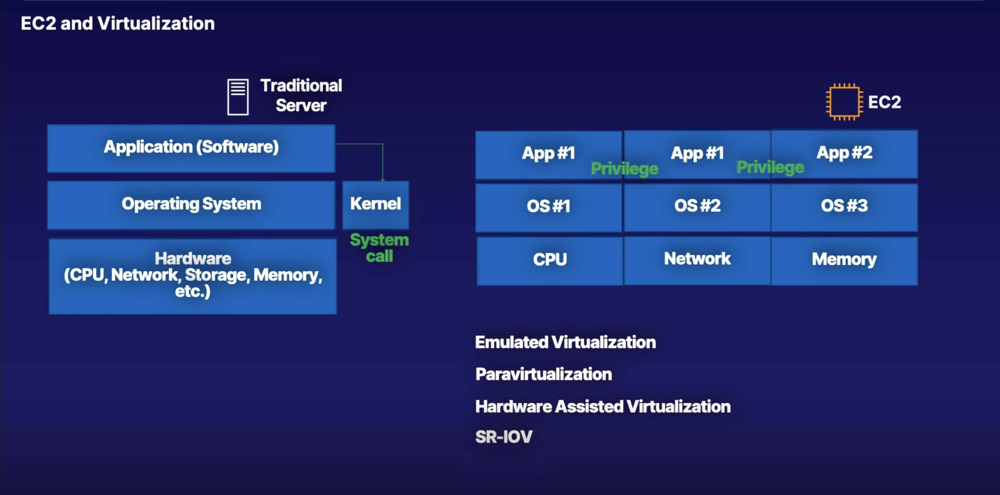
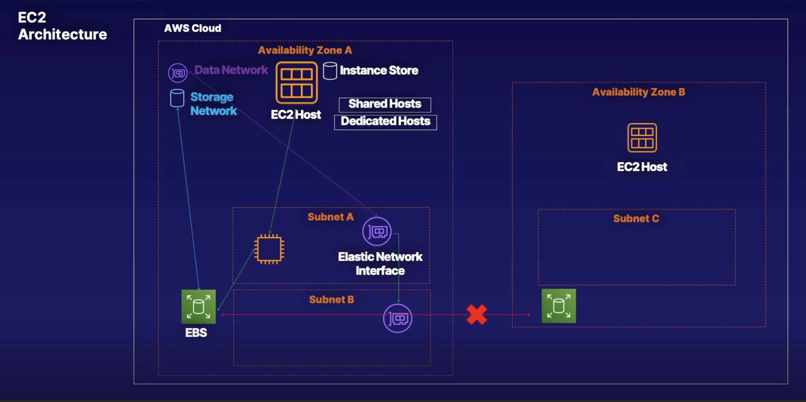

# Elastic Computer Cloud (EC2)

> Amazon Elastic Compute Cloud (Amazon EC2) is a web service that provides resizable compute capacity in the cloud. Amazon EC2 reduces the time required to obtain and boot new server instances to minutes, allowing you to quickly scale capacity, both up and down, as your computing requirements change.
>
> W/ **EC2**, you are able to provision virtual machines in the cloud, ready in minutes

## EC2 Overview

**EC2** is a VaaS (virtualization as a service) and IaaS (infrastructure as a service) product. Virtualization is the running of one or more operating systems on a piece of physical hardware known as a server. Each operating system is separate along w/ their applications and also allows multiple different privileged applications to run on that same hardware using software to make their calls.

EC2 instances are virtual machines, so the operating system also has resources such as memory storage, CPU, etc. Like we just discussed, EC2 instances run on an EC2 host, which is the physical hardware, the physical servers that AWS manages for us.

EC2 is the default AWS compute service and EC2 hosts are either shared host or dedicated host. **Shared Hosts** are the default for EC2 host and are shared among different AWS customers. The customers do not get any ownership of the host hardware, so we pay for our individual instances and resources, but it is important to remember that when we use a shared host, our EC2 instance is isolated from other AWS customers and their instances. W/ **Dedicated Hosts**, you are paying for the entire EC2 host, not just the instances that you run on that host. W/ a **dedicated host**, you do not share this host w/ any other AWS customers. You pay for the entire host no matter how many EC2 instances you run.

EC2 instances are an Availability Zone resilient service b/c the EC2 hosts sits within an Availability Zone, so if that Availability Zone fails, then the host and the instances running on that host will most likely fail as well. EC2 hosts that sit inside an Availability Zone also have a local storage called instance store. The key to understand w/ the instance store is that it is temporary storage and if your EC2 instance moves off of the hosts to another EC2 host, then your storage in the instance store is lost.

For networking, you will often hear that security groups are attached to EC2 instances, but this is not necessarily true. When an EC2 instance is lodged into a specific subnet inside your VPC, a primary **Elastic Network Interface** (ENI) is provisioned into that subnet and then mapped to the physical hardware of the EC2 hosts for that Availability Zone. You can add multiple different **ENIs** to your EC2 instance.

Let's go back to storage and discuss how an EC2 instance can connect to an Elastic Block Store (EBS). **EBS** lets you access volumes of persistent storage. Remember **Instance Store** w/ temporary storage, but **EBS** gives us persistent storage. So inside your VPC you have a data network set up for your **ENIs**, but you also have a storage network to connect to your **EBS** volumes. Again, **EBS** is an Availability Zone resilience service so you can have different **EBS** volumes running in different subnets for different EC2 instances, but you cannot connect EC2 instances to EBS volumes in a different Availability Zone.

## The AWS pricing white paper

> While the number and types of services offered by AWS have increased dramatically, our philosophy on pricing has not changed. You pay as you go, pay for what you use, pay less as you use more, and pay even less when you reserve capacity. Projecting costs for a use case, such as web application hosting, can be challenging, because a solution typically uses multiple features across multiple AWS products, which in turn means there are more factors and purchase options to consider.

## EC2 pricing models

> 1. **On Demand**: Allows you to pay a fixed rate by the hour (or by the second) with no commitment.

* So you can spin it up, have it run for a couple of hours, and then terminate the instance.

> 2. **Reserved**: Provides you w/ a capacity reservation, and offers a significant discount on the hourly charge for an instance
>
>    * Contract Terms are 1 year or 3 year terms

* The more you pay upfront, the more you are going to save.

> 3. **Spot**: Enables you to bid whatever price you want for instance capacity, providing for even greater savings if your applications have flexible start and end times

* Basically, when Amazon has excess capacity, when not everyone is using EC2 at once, prices of EC2 instances will decline to try and get people to use that capacity. However, when other people are provisioning on-demand or other EC2 instances, and EC2 instances run out of capacity, that capacity will be needed back. So the price moves around w/ spot instances.

* You set the price that you want to bid at. If it hits that price, you have your instances. If it goes above, you lose your instances.

> 4. **Dedicated Hosts**: Physical EC2 server dedicated for your use. Dedicated Hosts can help you reduce costs by allowing you to use your existing server-bound software licenses

* Useful where you've got existing server bound software licenses, or perhaps a regulation saying that you cannot use multi-tenant virtualization

## On Demand

On Demand pricing is useful for:

* Users that want the low cost and flexibility of Amazon EC2 without any up-front payment or long-term commitment

* Applications w/ short term, spiky, or unpredictable workloads that cannot be interrupted

* Applications being developed or tested on Amazon EC2 for the first time

Throughout the rest of the course, we will be provisioning EC2 instances and terminating them.

## Reserved pricing

Reserved pricing is useful for:

* Applications w/ steady state or predictable usage

* Applications that require reserved capacity

* Users able to make upfront payments to reduce their total computing costs even further

### Reserved Pricing types

1. **Standard Reserved instances**: These offer up to 75% off on demand instances. The more you pay up front and the longer the contract, the greater the discount.

2. **Convertible Reserved instances**: These offer up to 54% off on demand capability to change the attributes of the Reserved Instances (RI) as long as the exchange results in the creation of Reserved Instances of equal or greater value.

> [!NOTE]
> The way EC2 works is you have a virtual machine, but you have different types of virtual machines. So you'll have ones that are very high RAM, w/ RAM utilization, or you'll have ones that have very good CPUs that you can pick and choose, and they're called "instance types."
>
> Now w/ standard Reserved Instances (RI), you can't convert one reserved instance to another. So if you get a T2, and you want to go over to an R4, you can't do that w/ **Standard RI**.
>
> W/ **Convertible RI**, you can change between your different instance types.

3. **Scheduled Reserved instances**: These are available to launch within the time windows you reserve. This option allows you to match your capacity reservation to a predictable recurring schedule that only requires a fraction of a day, a week, or a month.

## Spot pricing

Recall, spot pricing is Amazon selling off their excess capacity at a lower rate

> If the Spot instance is terminated by Amazon EC2, you will not be charged for a partial hour of usage. However, if you terminate the instance yourself, you will be charged for any hour in which the instance ran.

Spot pricing is useful for:

* Applications that have flexible start and end times

* Applications that are only feasible at very low compute prices

* Users w/ urgent computing needs for large amounts of additional capacity

## Dedicated hosts pricing

Dedicated Hosts pricing is useful for:

* Useful for regulatory requirements that may not support multi-tenant virtualization

* Great for licensing which does not support multi-tenancy or cloud deployments

* Can be purchased On-Demand (hourly)

* Can be purchased as a Reservation for up to 70% off the On-Demand price

## EC2 instance types

| **Family** | **Specialty**                                     | **Use case**                                                                                                            |
|------------|---------------------------------------------------|-------------------------------------------------------------------------------------------------------------------------|
| **F1**     | Field Programmable Gate Array                     | Genomics research, financial analytics, real-time video processing, big data, etc                                       |
| **I3**     | High Speed Storage                                | NoSQL DBs, Data Warehousing, etc                                                                                        |
| **G3**     | Graphics Intensive                                | Video Encoding / 3D Application Streaming                                                                               |
| **H1**     | High Disk Throughput                              | MapReduce-based workloads, distributed file systems such as HDFS and MapR-FS                                            |
| **T3**     | Lowest Cost, General Purpose                      | Web Servers / Small DBs                                                                                                 |
| **D2**     | Dense Storage                                     | Fileservers / Data Warehousing / Hadoop                                                                                 |
| **R5**     | Memory Optimized                                  | Memory Intensive Apps/DBs                                                                                               |
| **M5**     | General Purpose                                   | Application Servers                                                                                                     |
| **C5**     | Compute Optimized                                 | CPU Intensive Apps/DBs                                                                                                  |
| **P3**     | Graphics/General Purpose GPU                      | Machine Learning, Bitcoin mining, etc                                                                                   |
| **X1**     | Memory Optimized                                  | SAP HANA / Apache Spark etc                                                                                             |
| **Z1D**    | High compute capacity and a high memory footprint | Ideal for electronic design automation (EDA) and certain relational database workloads w/ high per-core licensing costs |
| **A1**     | Arm-based workloads                               | Scale-out workloads such as web servers                                                                                 |
| **U-6tb1** | Bare Metal                                        | Bare metal capabilities that eliminate virtualization overhead                                                          |

## EC2 Instance Types mnemonic

* **F** → for FPGA

* **I** → for IOPS

* **G** → Graphics

* **H** → High Disk Throughput

* **T** → cheap general purpose (think T2 Micro)

* **D** → for Density

* **R** → for RAM

* **M** → Main choice for general purpose apps

* **C** → for Compute

* **P** → Graphics (think Pics)

* **X** → Extreme Memory

* **Z** → Extreme Memory AND CPU

* **A** → Arm-based workloads

* **U** → Bare Metal

## Learning summary

Amazon Elastic Compute Cloud (Amazon EC2) is a web service that provides resizable compute capacity in the cloud. Amazon EC2 reduces the time required to obtain and boot new server instances to minutes, allowing you to quickly scale capacity, both up and down, as your computing requirements change.

If the Spot instance is terminated by Amazon EC2, you will not be charged for a partial hour of usage. However, if you terminate the instance yourself, you will be charged for any hour in which the instance ran.

> **EC2 Behaviors**
>
> What happens to your **EC2 instance** running on a specific host if it is restarted?
>
> ▶︎ The **EC2 instance** will remain w/ the same EC2 host.
>
> ▶︎ Usually, **EC2 Host** contained lots of different EC2 instances of the same type, but different sizes.
>
> What if **AWS** stops the EC2 instance for maintenance, etc.?
>
> ▶︎ The **instance** will be reassigned to another EC2 host in the same Availability Zone.
>
> Can you migrate your EC2 instance to **another Availability Zone**?
>
> ▶︎ EC2 instances live and remain inside one Availability Zone, but you can migrate your EC2 instance by copying your EC2 instance and then creating a new EC2 instance inside a new Availability Zone. The tool used for this is known as **Snapshots** and **AMIs**.
