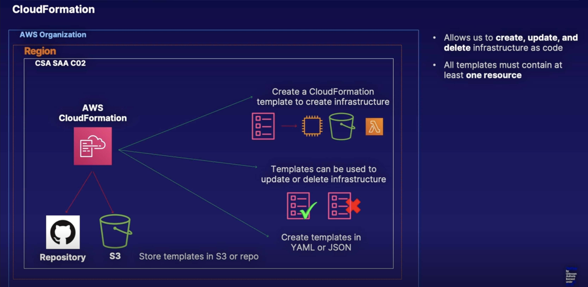

# CloudFormation

> * Tool that allows us to **create**, **update**, and **delete** infrastructure as code
>
> * Is a way of completely scripting your cloud environment
>
> * Quick Start is a bunch of CloudFormation templates already built by AWS Solutions Architects allowing you to create complex environments very quickly.

## CloudFormation Template

> * All templates must contain at least **one resource** e.g. **EC2**, **S3**, **IAM**, **Lambda**

The **Parameters** section of the CloudFormation template allows us to add fields where we would have to add more information. For example, that could be what size of EC2 instance that we want to create, the number of availability zones to use, etc.

The **Mappings** section tells the CloudFormation template which region to create the resources. We also have **conditions**, which allow us to set decisions in our template, so we can create the condition, and then if that parameter is equal to the condition, then we can create the resource. **Conditions** are used w/ the resources that are used inside of the **CloudFormation** template.

The **Outputs** section give us some information back, such as a `Subnet ID`, `Instance ID`, etc.

CloudFormation takes the template w/ the resources, the parameters, the mappings, the outputs, etc. and creates a stack containing all of the logical resources that are outlined in the CloudFormation template, and then CloudFormation takes those logical resources from that stack and creates physical resources in an AWS account. So if our template called for an EC2 instance and an RDS instance, then the stack w/ the logical resources would create the physical instances inside our AWS account.

You can also use CloudFormation to update templates. CloudFormation would update our physical environment to match the logical environment for that updated stack, and then when you delete a stack, the logical resources are deleted, and then the physical environment is also deleted.

> * CloudFormation allows us to design and automate our infrastructure as code, so we can script our whole cloud environment.
