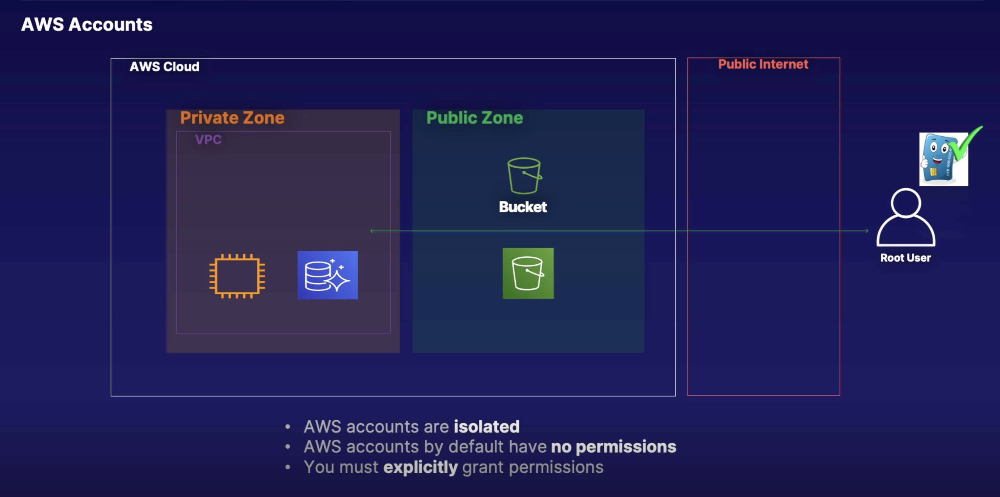

# Identity Access Management (IAM)

* IAM is a global service that secures any data in the AWS IAM database across all regions of AWS. Think of IAM as a database service.

* IAM allows you to manage users and their level of access to the AWS Console.

* IAM allows you to set up users, groups, permissions, and roles, allowing you to grant access to different parts of the AWS platform.

> **Identity and Access Management (IAM)**
>
> 1. IAM allows us to **create identities**:
>
>   * IAM users
>
>   * IAM groups
>
>   * IAM roles
>
> 2. **IAM Users**
>
>   * People and applications (that require access to our AWS accounts)
>
>   * Long-term credentials
>
> 3. **IAM Groups**
>
>   * Groups of related users, i.e. development team, SysAdmins team, storage engineers, finance
>
> 4. **IAM Roles**
>
>   * AWS services and grant external access to our AWS Account. For example, we would need to grant an EC2 instance inside our AWS account access to CloudWatch, S3, etc.
>
> 5. **IAM Policies**
>
>   * Allow or deny access to our AWS services

* IAM identities start w/ no permissions inside our AWS account. We have to explicitly grant the permissions that are needed.

* An IAM policy has to be attached to an IAM user, IAM group, or an IAM role. So you can use AWS managed policies, or create a new policy. That policy will simply allow or deny access and to take action, they have to be attached to a user, group, or role.

* On a high level overview, IAM acts as an identity provider or IDP, and manages identities inside of our AWS accounts. It also authenticates these identities to be allowed to log into our AWS account, and authorizes those identities to access resources or deny access to resources based on the policies attached.

Identity Access Management (IAM) offers the following features:

* Centralized control of your AWS account

* Shared Access your AWS account

* Granular permissions 

    * permissions to services and to create users, groups, and roles

* Identity Federation (including Active Directory, Facebook, LinkedIn, etc)

* Multi-factor authentication

* Provide temporary access for users/devices and services where necessary

* Allows you to set up your own passed rotation policy

* Integrates w/ many different AWS services

* Supports PCI DSS Compliance (compliant framework for working w/ credit cards)

## Key terminology for IAM

> **Identity Access Management consists of the following:**
>
> 1. **Users**: End Users such as people, employees of an organization, etc.
>
> 2. **Groups**: A collection of users. Each user in the group will inherit the permissions of the group.
>
>    * For instance, if a policy were applied to a group, users within that group are going to inherit that policy automatically.
>
> 3. **Policies**: Policies are made up of documents. These documents are in a format called JSON and they give **permissions** as to what a User/Group/Role is able to do.
>
> 4. **Roles**: You create roles and then assign them to AWS Resources. A role is a way of allowing one part of AWS to do something w/ another part. So you might give a virtual machine inside AWS the ability to write files to S3, which is a type of storage within AWS.
>
>    * We created a role when we turned on cross region replication. If you actually go into IAM and have a look at your roles, you'll see a role there for cross region replication.

## Creating the AWS Organization

> **As a solutions architect, we have been tasked to build out a new AWS environment for our organization w/ detailed requirements:**
>
> 1. Create **two AWS accounts** to add into an AWS Organization.
>
> 2. **Three** AWS accounts will be needed.

> **Learning objectives:**
>
> * Create an AWS account
>
> * Users, groups, and roles
>
> * Budget

## AWS Account

## Learning summary

> * **IAM is universal**. It does not apply to regions at this time, so when you create a user, you're creating a user globally. Same when you create a role or when you create a group.
>
> * The **"root account"** is simply the account created when you first setup your AWS account. It has complete Admin access.
>
> * New Users have **No permissions** when first created → follows the principle of Least Privilege. That user is not going to have any rights or privileges until you grant them privileges. To give our new users permission, we created an administrator access policy and we assigned that to the Dev group. Likewise, when we look at S3, when we create out bucket, it's locked down, it's not public.
>
> * New users are assigned **Access Key ID** & **Secret Access Keys** when first created. They use this to programmatically access the AWS ecosystem - console and/or programmatic access.
>
>    * **These are not the same as a password**. You cannot use the Access Key ID and Secret Access Key to login to the console. You can use this to access AWS via the APIs and Command Line, however.
>
>    * **You only get to view these once**. If you lose them, you have to regenerate them. So, save them in a secure location.
>
> * Always setup Multi-factor Authentication on your root account.
>
> * You can create and customize your own password rotation policies.

> 1. IAM allows **5,000 users** per AWS account
>
> 2. An IAM user can be a member of **10 groups**
>
> 3. IAM provides **identity federation**. AWS allows for authentication using Active Directory, Google, Amazon, and Facebook
>
> 4. IAM helps **secure** our AWS account
>
> 5. IAM identities start w/ **no permissions**. Need to explicitly grant permissions
>
> 6. Resource policies = A policy on a resource
