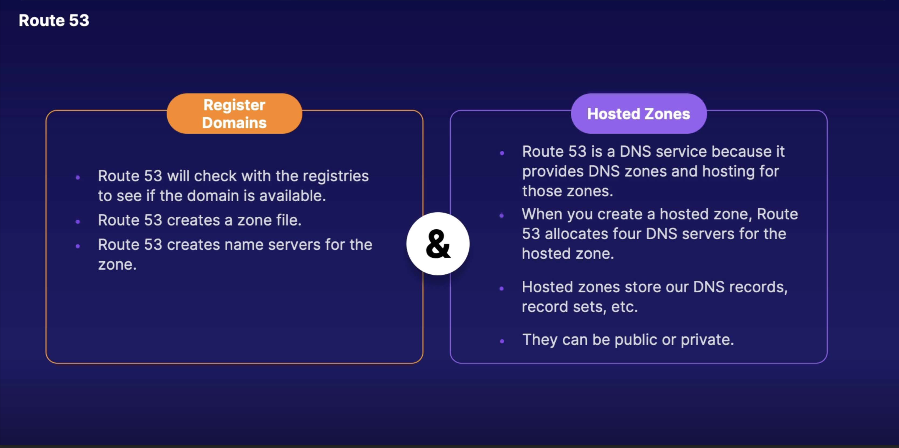

# DNS

**Route 53**, Amazon's DNS (Domain Name System) service

> If you've used the internet, you've used DNS. DNS is used to convert human friendly domain names (such as http://acloud.guru) into an Internet Protocol (IP) address (such as http://82.124.53.1).
>
> IP addresses are used by computers to identify each other on the network. IP addresses commonly come in 2 different forms: **IPv4** and **IPv6**

* IP addresses are used by computers to identify each other on a network

* DNS is a method looking at a domain name and getting an IP address

> ✓ **Route 53**
>
>   * AWS managed Domain Name System (DNS)
>
> ✓ **Register Domains**
>
>   * Register *ScubaSyndrome.com*
>
> ✓ **Hosted Zones**
>
>   * On managed name servers
>
> ✓ **Global Service**
>
>   * Single database that is replicated between regions, which makes Route53 a globally resilient service, meaning that it can tolerate the failure of one or more regions and continue to operate. It is a huge hierarchical database.

**DNS** is a service that discovers and finds other systems on the internet and translates addresses.

## IPv4 vs IPv6

> IPv4 Addresses are running out...
>
> The IPv4 space is a 32 bit field and has over 4 billion different addresses (4,294,967,296 to be precise).
>
> IPv6 was created to solve this depletion issue and has an address space of 128bits which in theory is 340,282,366,920,938,463,463,374,607,431,768,211,456 addresses or 340 undecillion addresses.

## Top Level Domains

> If we look at common domain names such as google.com, bbc.co.uk, acloud.guru etc., you will notice a string of characters separated by dots (periods). The last word in a domain name represents the "top level domain". The second word in a domain name is known as a second level domain name (this is optional though and depends on the domain name).
>
> * .com
>
> * .edu
>
> * .gov
>
> * .co.uk
>
> * .gov.uk
>
> * .com.au

> These top level domain names are controlled by the Internet Assigned Numbers Authority (IANA) in a root zone database which is essentially a database of all available top level domains. You can view this database by visiting http://www.iana.org/domains/root/db

## DNS Terms

> 1. **Resolver**: Query for given DNS name. The initial entry point into the DNS.
>
> 2. **DNS root**: The DNS root then follows up w/ the top-level domain, ".com" for instance. The ending `.` at the end of domain name *amazon.com.* is its own database that is part of the DNS database.
>
> 3. `.` is its own database, part of the DNS database, and made up of 13 name servers (also known as the root servers), 13 clusters of servers called the root servers.
>
> 4. These 13 name servers/root servers manage the DNS root zone and contain the top-level domains.
>
> 5. **Top-level domain**: .com, .org, .edu, .uk, etc.
>
> 6. **www.amazon.com.**
>
>   * `*` - Root
>
>   * `.com` - Top-level domain
>
>   * `amazon` - Subdomain
>
>   * `www` - Host
>
> 7. **Zone or zone file**: Root servers contain the root zone (*.com*, *amazon.com*, etc.). These zones are how DNS distributes our information, so each zone only knows the part that is relevant to them.
>
> 8. **Record types**:
>
>   * **A record**: Translates the name of the domain to an IP address
>
>   * **CNAME record**: Resolves one domain to another. Let's say that we have *www.mobile.amazon.com* and also *www.amazon.com*. Both will resolve to the same IP address, so we simply map the domain name to the other.
>
>   * **Alias record**: Resolves to AWS resources. Used to map resources to record sets inside your hosted zones to ELB, CloudFront, S3 static websites, etc. So you could map one DNS name like *www.amazon.com* to another target DNS name like an Elastic Load Balancer.
>
> 9. **Name server**: A DNS server that hosts one or more zones. Name servers are authoritative and they ensure that we have the security all along the way of DNS and starting off our root servers, which are authoritative for the root zone.
>
> 10. **Fully qualified domain name (FQDN)**: The host and the domain name e.g. `www.amazon.com`
>
> 11. **DNS** is a way to look up a domain name and get an IP address
>
> 12. **Internet Assigned Numbers Authority (IANA)**: Stores all top-level domains. The Domain Registrar is actually an authority that can assign domain names directly, and then one or more top-level domain names are registered w/ Inter NIC, which enforces the uniqueness of domain names across all domain names on the internet.
>
> 13. **Start of Authority (SOA)**: Stores name of server, admin of zone, current version of the data file, and default TTL. The TTL is the length of a DNS record that is cached on either a resolving server or on our own PC. Understand that Name Server Records are used by our top-level domain to direct traffic to the content DNS servers, which contain the authoritative DNS records.

You cannot map a **CNAME** to a naked domain. So the domain has to have a `www` in front. For instance, you cannot map a **CNAME** to `amazon.com`, but will have to map it to `www.amazon.com`.

## SND Behaviors

> 1. For load balancers, you resolve to them using the DNS name; **load balancers do not have pre-defined IPv4 addresses**
>
> 2. Understand the difference between **CNAME** and **alias records**:
>
>   * **CNAME** points to any other URL
>
>   * **Alias** points to an AWS resource only
>
> 3. If you have a question asking you to choose between an alias record and a CNAME record, **choose alias record**

> * **SOA**: SOA (Start of Authority) stores the name of the server that supplies the data for this zone, the admin of the zone, current version of data file, and default TTL on the records
>
> * **NS**: An NS (name server) is a DNS server that hosts one or more zones
>
> * **A records**: Translate a domain name to an IP address
>
> * **CNAME records**: Point to another URL
>
> * **MX records**: Used for mail
>
> * **PTR records**: The opposite of an A record; translate the DNS name for a given IP address

## Domain Registrars

> Because of all the names in a given domain name have to be unique there needs to be a way to organize this all so that domain names aren't duplicated. This is where domain registrars come in. A registrar is an authority that can assign domain names directly under one or more top-level domains. These domains are registered w/ InterNIC, a service of ICANN, which enforces uniqueness of domain names across the Internet. Each domain name becomes registered in a central database known as the "WhoIS" database.
>
> Popular domain registrars include: Amazon, GoDaddy.com, 123-reg.co.uk etc.

## Start of Authority Record (SOA)

> The SOA record stores information about:
>
> * The name of the server that supplied the data for the zone.
>
> * The administrator of the zone.
>
> * The current version od the data file.
>
> * The default number of seconds for the time-to-live file on resource records.

## NS Records

> NS stands for Name Server Records
>
> * They are used by Top Level Domain servers to direct traffic to the Content DNS server which contains the authoritative DNS records.

Let's take a look at an example to make sense of all this:

* Our user types "hellocloudgurus2019.com" into their browser

* Their browser doesn't know the IP address for that domain, so the browser goes to the top-level domain server, **.com**, essentially querying the top-level domain browser for the authoritative DNS records.

* The Top-level domain server, using the domain, provides the corresponding Name Server Record - in our case, `ns.awsdns.com`, or, again, the Name Server Record

* We then go and query the **NS records**, and the **NS records** are going to give us the **Start of Authority (SOA)**

* The Start of Authority (SOA) will contain all our DNS records

* And our DNS records consist of different things...

## A Records

> An "A" record is the fundamental type of DNS record. The "A" in A record stands for "Address". The A record is used by a computer to translate the name of the domain to an IP address. For example, `http://www.acloud.guru` might point to `http://123.10.10.80`

## TTL

> The length that a DNS record is cached on either the Resolving Server or the users own local PC is equal to the value of the "Time To Live" (TTL) in seconds. The lower the time to live, the faster changes to DNS records take to propagate throughout the internet.

* W/ most providers, the default *Time To Live* is 48 hours, and that can be quite frustrating b/c if you do make a DNS change, that DNS change can take 48 hours to propagate throughout the entire internet.

* If someone has just visited your website, they're going to cache that DNS address, so it might be an IPv4 address, and it will be cached for the *Time To Live*, and if that's 48 hours, it means if you go in and change that IP address, that could take 48 hours to take effect.

## CName

> A Canonical Name (CName) can be used to resolve one domain name to another. For example, you may have a mobile website w/ the domain name `http://m.acloud.guru` that s used for when users browse to your domain name on their mobile devices. You may also want the name `http://mobile.acloud.guru` to resolve to this same address.

* And instead of having two separate IP addresses, you just map one to the other.

* Essentially provides another reference that we can go up and look, and then that will give us our IPv4 address.

## Alias Records

> Alias records are used to map resource record sets in your hosted zone to Elastic Load Balancers, CloudFront distributions, or S3 buckets that are configured as websites.
>
> Alias records work like a CNAME record in that you can map one DNS name (`www.example.com`) to another 'target' DNS name (`elb1234.elb.amazonaws.com`).
>
> **Key difference**: A CNAME can't be used for naked domain names (zone apex record). You can't have a CNAME for `http://acloud.guru`, it must be either an A record or an Alias.

A naked domain name, or *zone apex record* is the entire domain w/o the "www" in front of it, or without a "mobile."

So a *CNAME* can't be used for naked domain names. You can't have a CNAME for `acloud.guru`. It has to either be an A record or an Alias.

## Learning summary

> * Elastic Load Balancers (ELBs) do not have pre-defined IPv4 addresses; you resolve to them using a DNS name.
>
> * Understand the difference between an Alias Record and a CNAME.
>
> * Given the choice, always choose an *Alias Record* over a *CNAME*.

So just remember when we're doing our *zone apex record*, or our naked domain name, and we're tying to point that towards an EC2 instance, for example, we're going to be using an Alias record. We're not going to be using a CNAME.

> **Common DNS Types**
>
> * SOA Records
>
> * NS Records
>
> * A Records
>
> * CNAMES
>
> * MX Records
>
> * PTR Records

A PTR record is the reverse of an A record. So it's a way of looking up a name against an IP address

> **The following routing policies are available w/ Route53**:
>
> * Simple Routing
>
> * Weighted Routing
>
> * Latency-based Routing
>
> * Failover Routing
>
> * Geolocation Routing
>
> * Geoproximity Routing (Traffic Flow Only)
>
> * Multivalue Answer Routing

> **Health Checks**
>
> * You can set health checks on individual record sets.
>
> * If a record set fails a health check it will be removed from Route53 until it passes the health check.
>
> * You can set SNS notifications to alert you if a health check is failed.

> **Simple Routing Policy**
>
> If you choose the simple routing policy, you can only have one record w/ multiple IP addresses. If you specify multiple values in a record, Route 53 returns all values to the user in a random order.

> **Geoproximity Routing (Traffic Flow Only)**
>
> Geoproximity routing lets Amazon Route 53 traffic to your resources based on the geographic location of your users and your resources. You can also optionally choose to route more traffic or less to a given resource by specifying a value, known as a bias. A bias expands or shrinks the size of the geographic region from which traffic is routed to a resource.
>
> **To use geoproximity routing, you must use Route 53 traffic flow.**

> **Multivalue Answer Policy
>
> Essentially the same as w/ Simple based routing, except you get **Health Checks**.

## Learning summary

* Route 53 creates a zone file for the domain being registered along w/ allocating name servers for that zone as well.

* Route 53 then reaches back out to the top-level domain, ".com" for instance and the SOA records for that domain is known as a hosted zone and then reaches back to our top-level domain and puts the name server records into the zone file for that ".com" top-level domain.

* Route 53 is essentially DNS as a Service.

* Hosted zones can be public so that the data is accessible on the public internet, and the name servers for the public hosted zone live in the AWS public zone. A Hosted Zone can also be private and linked to one or more VPCs and only accessible inside those VPCs. Hosted Zones are out DNS records and record set. Again, that would be your alias, your CNAME, etc.
