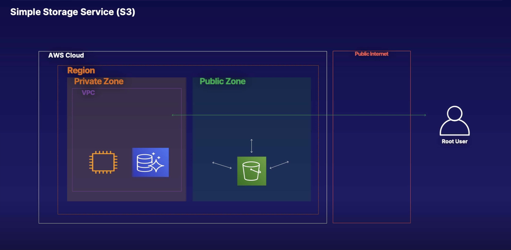
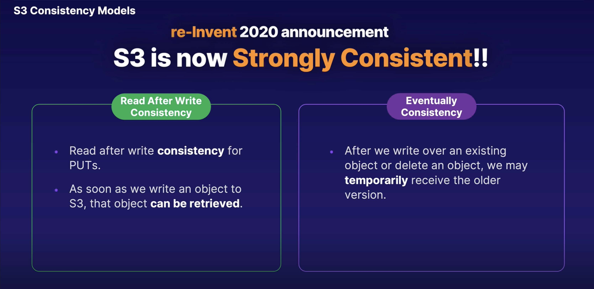

# Simple Storage Service (S3)

## What is S3?

> S3 stands for **Simple Storage Service**. It provides developers and IT teams with secure, durable, highly scalable object storage. Amazon S3 is easy to use, w/ a simple web services interface to store and retrieve any amount of data from anywhere on the web.
>
> * **S3** is a safe place to store your files. And that's all it means by objects (flat files - Word documents, pictures, movies)
>
> * It is object-based storage
>
> * The data is spread across multiple devices and multiple facilities

> **The basics of S3** are as follows:
>
> * S3 is **Object-based** - i.e. allows you to upload files
>
> * Files can be anywhere from 0 Bytes to 5 TB
>
> * There is unlimited storage
>
> * Files are stored in Buckets (think "folder" in the cloud)
>
> * **S3 is a universal namespace**. That is, names must be unique globally. So when I create a bucket, I can't just use test bucket
because someone's already taken that. I can't use "A Cloud Guru" because I took that a long, long time ago, in another AWS account.
So when you create a bucket, the name has to be unique. And the reason for that is it's actually creating a web address. So if we were going to create a bucket in Northern Virginia, which is the default AWS region, and we call it "A Cloud Guru", it's going to create a web address, `acloudguru.s3.amazonaws.com`.
>
>    * Alternatively, if we were to create the bucket, not in Northern Virginia, but let's say in Ireland, it would generate the web address `https://s3-eu-west-1.amazonaws.com/acloudguru`
>
>    * S3 is a universal namespace, so all you have to remember is that bucket names must be unique. Reason being is you're actually creating a web address.
>
> * When you upload a file to S3, you will receive a **HTTP 200 code** if the upload was successful, and that's going to come back to your browser.

**S3** is a global resilient service, a global storage platform that is run in every AWS region. **S3** is a public service and runs from the AWS public zone. Data that is stored in **S3** is replicated across different **Availability Zones** in that region. **S3** can tolerate a failure of one Availability Zone and can also replicate data between regions.

Within **S3**, you can create buckets and add objects to your buckets. So we can create **S3** buckets to hold objects and **S3** acts like a container. These objects can have versioning and Access Controls added to them, enabling the creation of Access Control Lists (ACLs) or bucket policies to restrict access to objects.

To store and hold our objects, create these **S3** buckets in specific regions, but the laws and rules of that region will apply to the **S3** bucket. When you create an **S3** bucket, you must add a globally unique name for your bucket.

## S3 objects

> **S3** is object-based. **Think of Objects just as files**. Objects consist of the following:
>
> * `Key` → the name of the object
>
> * `Value` → the data and is made up of a sequence of bytes
>
> * `VersionID` → important for versioning
>
> * `Metadata` → data about data you are storing
>
> * Sub-resources;
>
>    * Access Control Lists
>
>    * Torrent

There is no storage structure, so an S3 bucket will not have a structure like a file system that has filed, folders, etc. Everything in the **S3** bucket is stored at that same level.

## S3 Consistency Models

**S3** now delivers strong read after write consistency. All **S3** `GET`, `PUT`, and `LIST` operations, as well as operations that change object tags or Access Control Lists or Metadata are now all **Strongly Consistent**. So what you "write" is also what you will "read." And the result of a `LIST` will be an accurate reflection of what is actually in the bucket. This will apply to all existing and new S3 objects.

* `READ` after `WRITE` consistency for `PUTS` of new objects

    * If you upload a file to **S3**, you are able to read it immediately. So you are able to read it straight after writing to it, performing a `PUT` of that object into S3

* Eventual Consistency for overwrite `PUTS` and `DELETES` (can take some time to propagate)

    * Now if you were to go in and basically update that object or delete that object, so overwrite that object, then it's only going to be **Eventual Consistency**. So let's say we've got version one of the file, and then we upload version two, and you immediately try and read that object. What's going to happen is, you might get version one, or you might get version two. But if you wait like a second, you're always going to get version two. So there's **Eventual Consistency** for overwrite `PUTS` and `DELETES`. So even when you're overwriting a file, or you're deleting a file, eventually it's going to be consistent.

    * So you have *read after write consistency* for `PUTS` of new objects and you have **eventual consistency** for overwrite `PUTS` and `DELETES`.

## In other words...

* If you write a new file and read it immediately afterwards, you will be able to view that data.

* If you update **AN EXISTING file** or delete a file and read it immediately, you may get the older version or you may not. Basically the changes can take a little bit of time to propagate.

## S3 guarantees

**S3** has the following guarantees from Amazon:

* Built for 99.99% availability for the S3 platform

* Amazon Guarantee 99.9% availability

* Amazon guarantees 99.999999999% durability for S3 information (remember 11 x 9s)

    * Very unlikely to be lost

## S3 features

**S3** has the following features:

* Tiered storage available

* Lifecycle Management

    * You are able to go through and move your objects around to different storage tiers. So you could say, "Hey, when this file is 30 days old, move it to this tier, when it's 90 days old, archive it off to Glacier."

* Versioning

    * If you have multiple versions of objects in your S3 buckets, you're able to encrypt your objects, you're allowed to encrypt them at rest. And there's different encryption mechanisms,

* Encryption

* MFA Delete

    * You're able to use multi-factor authentication for deleting objects. So when you turn this on, if someone goes into delete an object, they're going to need two factor authentication in which to do this. They're going to need to use something like Google Authenticator.

* Secure your data using **Access Control Lists** and **Bucket Policies**

## S3 storage classes (ordered from priciest to least-costly)

1. **S3 Standard**

    * 99.99% availability

    * 99.999999999% durability

    * Stored redundantly across multiple devices in multiple facilities

    * Designed to sustain the loss of 2 facilities concurrently

    * Highly available and highly durable

2. **S3 - IA**

    * (Infrequently Accessed): For data that is accessed less frequently, but requires rapid access when needed.
    
    * Lower fee than S3, but you are charged a retrieval fee.
    
        * Essentially for data that is accessed less frequently, but requires rapid access when you need it. So you get a lower storage fee than S3, but you are charged a retrieval fee. So if you've got data that you need to be able to instantly access, but you don't use that data regularly, maybe you only need to check it at the end of every month, then you'd want S3 Infrequently Accessed.

3. **S3 - Intelligent Tiering**

    * Designed to optimize costs by automatically moving data to the most cost-effective access tier, w/o performance impact or operational overhead.

4. **S3 One Zone - IA**

    * For where you want a lower-cost option for infrequently accessed data, but do not require the multiple Availability Zone data resilience. Literally just stored in one availability zone. And it's infrequently accessed, but you still need to be able to access that data instantly.

    * However, if your data is crucial, refrain from using this option since if this zone is lost, you've lost your data. It's for data that you can easily reproduce.

5. **S3 Glacier**

    * S3 Glacier is a secure, durable, and low-cost storage class for data archiving. You can reliably store any amount of data at costs that are competitive w/ or cheaper than on-premises solutions.
    
    * Retrieval times configurable from minutes to hours

    * Essentially for data archiving. So, if you want to archive off your data, maybe you don't need it, maybe you have to hold on to it for seven years because of some federal regulation, you would be using Glacier.

    * You can store any amount of data and it's really super, super cheap.

6. **S3 Glacier Deep Archive**

    * S3 Glacier Deep Archive is Amazon S3's lowest-cost storage class where a retrieval time of 12 hours is acceptable

    * So if you want to get the data back using Deep Archive, you put in a request and it will come back 12 hours later.

## S3 charges

You are charged for S3 in the following ways:

* Storage

    * The more you store in S3, the more you're going to be billed.

* Requests

    * If you're making a lot of requests to those objects, it's going to be more expensive.

* Storage management pricing

    * Based on Tier

* Data Transfer Pricing

* Transfer Acceleration

* Cross Region Replication Pricing

## Cross Region Replication

Let's say you've got a bucket and it's in US East one. And you want to automatically replicate your objects to another bucket that's in, let's say, in Sydney, and you want to do that for high availability as well as, you know, disaster recovery. So what will happen is as soon as you upload an object to your bucket in US East one, and you've got cross region replication turned on, those objects will automatically be replicated over to your bucket in Sydney.

## S3 Transfer Acceleration

Amazon S3 Transfer Acceleration enables fast, easy, and secure transfers of files over long distances between your end users and an S3 bucket. Transfer Acceleration takes advantage of Amazon CloudFront's globally distributed edge locations. As the data arrives at an edge location, data is routed to Amazon S3 over an optimized network path.

S3 Transfer Acceleration takes advantage of Amazon's CloudFront's globally distributed edge locations. And then the data arrives at an edge location. It's routed to Amazon S3 over an optimized network path. And essentially what they're doing is they're using the Amazon backbone network.

## Restricting bucket access

* Bucket Policies → Applies across the whole bucket

* Object Policies → Applies to individual files

* IAM Policies to Users & Groups → APplies to Users & Groups

## Learning summary

* Remember that S3 is **Object-based**: i.e. allows you to upload files.

* Files can be from 0 Bytes to 5 TB.

* There is unlimited storage.

* File are stored in Buckets (a bucket is basically just a folder in the cloud)

* **S3 is a universal namespace**. That is, names must be unique globally. And when you create your bucket, it's going to create a DNS name or a web address name.

* `https://acloudguru.s3.amazonaws.com/`

* `https://acloudguru.eu-west-1.amazonaws.com/`

* Because it is object-based storage, **not suitable to install an operating system or database on** (for that you'll want block-based storage)

* Successful uploads will generate a **HTTP 200** status code

* You can turn on **MFA Delete**

* **The Key Fundamentals of S3 Are:

    * `Key` → the name of the object

    * `Value` → the data and is made up of a sequence of bytes

    * `VersionID` → important for versioning

    * `Metadata` → data about data you are storing through tags

    * Subresources:

        * Access Control Lists

        * Torrent

* Read after Write consistency for `PUTS` of new Objects

    * If you put an object into S3, you're going to be able to read it immediately.

* Eventual Consistency for overwrite `PUTS` and `DELETES` (can take some time to propagate)

    * For initial write/uploads it needs to propagate to all of the locations where it will be stored before it is available. W/ the update writes it can be available before it is completely propagated so you may still get an old copy but will eventually be consistent in all locations.

    * If you overwrite an object or delete an object in S3, and you read it instantly after that, you could get the old version or you could get the new version. You will eventually get the right version, but sometimes it takes time to propagate.

## S3 questions

17. Your company has launched a new app. To access the app files, the development team needs access to a bucket that is located within your team's AWS account. The development team is using a different account and requires programmatic and console level access to your team's S3 bucket. How would you share this bucket w/ the development team's account?

Setting up a cross account IAM Role

Setting up a cross account IAM role is currently the only method that will allow IAM users to access cross account S3 buckets both programmatically and via the AWS console.
