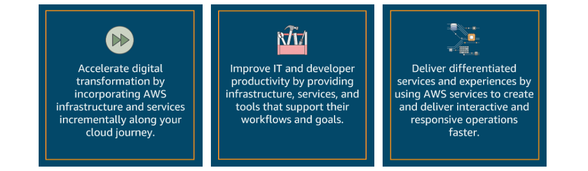

# Cloud Computing and Hybrid Cloud Benefits

> Deliver low-latency data access to on-premises applications while using the agility, economics, and security capabilities of AWS in the cloud.

AWS offers a broad set of cloud computing services, ranging from IT infrastructure services to business web services. Examples include compute, storage, database, analytics, networking, mobile, developer tools, management tools, Internet of Things (IoT), security, and enterprise applications. These cloud computing resources have been used in workloads ranging from running existing enterprise applications to deploying and managing new applications.

Not all workloads are the same. Some workloads cannot easily migrate to the cloud. Perhaps they need to work with large local datasets, share data with on-premises applications with single-digit-millisecond latency, or meet data residency requirements. In these use cases, constantly passing data to and from the cloud is too slow, too resource intensive, or not permitted. Hybrid cloud can be a useful alternative option for such workloads.

## When to consider hybrid cloud

The following four use cases summarize several key situations for when to consider hybrid cloud:

* You have an existing application that must run on premises, that uses databases or files, or that must perform backups, and you want to use cloud resources and scalability. 

* You need fast, local access to data, but you also want to take advantage of cloud compute and analytics engines.

* You have years’ worth of security and compliance requirements, supported by processes and procedures in disparate systems on premises. And you want to use cloud management and monitoring capabilities, ideally from a single pane of glass. 

* You have many physical locations to manage with data and applications, and you want reliable connectivity and simplified maintenance. 

AWS hybrid cloud permits AWS cloud infrastructure and services to be deployed where they are needed. It provides legacy systems and architectures with data capture, storage, and processing.

## Benefits of hybrid cloud

## Hybrid cloud storage

*Hybrid cloud storage* means that you can use your data on premises and store it durably in AWS Cloud storage services. You can access different data storage types such as files, volumes, and tapes that are stored in the AWS Cloud.

Hybrid cloud storage in AWS means more than just expanding your data center to the cloud. It means that you can benefit from unlimited storage, existing compliance certifications, multilayered security, and the endless possibilities provided by the AWS services.

## Hybrid cloud w/ AWS

AWS provides a broad set of services to build hybrid architectures that meet your specific requirements and use cases. This includes compute, networking, storage, security, identity, data integration, management, monitoring, and operations services.

W/ **Storage Gateway**, you can create hybrid cloud solutions and have on-premises data centers and applications use storage and services in the cloud. This way, you can take advantage of the durable low-cost storage, security, monitoring, and analytics services that AWS provides.
