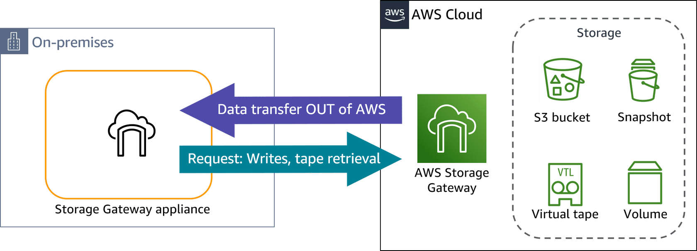

# Pricing Model

You pay only for what you use with Storage Gateway. You are charged based on the amount of data transferred out of AWS, the type and amount of storage you use, and the requests you make. In addition, if you have deployed Storage Gateway using a hardware appliance, you also have the cost of the appliance.

There are three elements to how you are billed for Storage Gateway: 

* **Storage**: Fees are based on the type of storage you use with your gateway (for example, Amazon S3) and how it is configured.

* **Requests**: Fees are based on data operations performed through the gateway including data ingest into AWS.

* **Data transfer**: Fees are based on data transferred out of the Storage Gateway service and into your Storage Gateway appliance.

These elements vary based on the Region, storage type, and gateway host specifics.

With AWS Snowball Edge, you pay for your use of the device and for data transfer out of AWS. On-demand and committed upfront pricing options are available.
