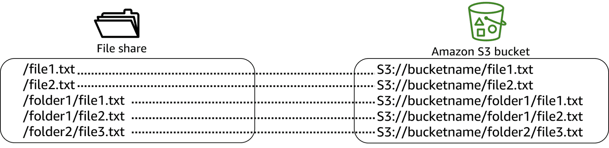
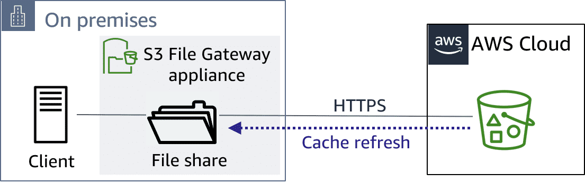

# Store and Access File-Based Data w/ Amazon S3 File Gateway

## S3 File Gateway

S3 File Gateway is a file-based storage solution offered by Storage Gateway. It provides a seamless way to connect to the AWS Cloud to store and retrieve application data files and back up images as durable objects in Amazon S3 cloud storage.

## Primary use cases

> ### Backing up data to the cloud
>
> Transform your on-premises user and group file shares to a hybrid cloud architecture for simplified management and cost reduction. You can use **S3 File Gateway** to do the following:
>
> * Back up on-premises file data as objects in Amazon S3 (including Microsoft SQL Server and Oracle databases and logs).
>
> * Optimize storage cost using lifecycle policies to change an object's storage tier, or delete old objects or object versions.
>
> * Use data generated by on-premises applications to support hybrid workflows and processing of data by AWS services such as ML or big data analytics.
>
> **Features**:
>
> * NFS and SMB protocol support with the ability to mount shares directly on database and application servers
>
> * Files stored durably in Amazon S3, with the ability to lifecycle to any Amazon S3 storage class
>
> * Local cache for accessing recent backups
>
> * Windows access control list (ACL) support to control access to backup files
>
> * Bandwidth-optimization with only changes transferred
>
> **Benefits**:
>
> * Reduce on-premises storage for backups.
>
> * Integrate with SAP, SQL Server, Oracle, Hadoop Distributed File System (HDFS), and other applications.
>
> * Restore backups on premises or in the cloud on Amazon EC2 or Amazon Relational Database Service (Amazon RDS).
>
> * Protect data with Amazon S3 Versioning, S3 Object Lock, and S3 Replication.

> ### Archiving long-term, retention-based data
>
> There is an ever-growing amount of data, and S3 File Gateway provides an efficient way of archiving this long-term retention-based data to AWS. This means that you can move away from aging, costly, and complex on-premises storage infrastructure to take advantage of greater cost savings and operational efficiency.
>
> **Features**:
>
> * NFS and SMB protocols, with support for mount shares directly on client systems
>
> * Files stored durably in Amazon S3, with the ability to lifecycle to any Amazon S3 storage class
>
> * Local cache for low-latency access to recently accessed files
>
> * Windows ACL support to control access to archive files
>
> * Bandwidth-optimized, where only changes are transferred
>
> **Benefits**:
>
> * Optimize cost across Amazon S3 storage classes.
>
> * Reduce on-premises capacity with easy to scale up and down cloud storage.
>
> * Protect data with Amazon S3 versioning, S3 Object Lock, and S3 Replication.

> ### Building data lakes
>
> Using S3 File Gateway, you can ingest and centralize data into the highly available, scalable Amazon S3 storage service to build data lakes and centralize data processing capabilities. By doing so, you can then obtain greater value out of your aggregated data.
>
> **Features**:
>
> * Generate data in the cloud or ingest from on premises.
>
> * Reduce latency to data with fully managed gateway cache.
>
> * Use up to 64 TB of cache per gateway, and set up automatic cache refresh at 5-minute intervals.
>
> * Use the option to access files using the Amazon S3 application programming interface (API).
>
> **Benefits**:
>
> * Access cloud storage from any on-premises location.
>
> * Process data in the cloud and refresh gateway cache for up-to-date results.
>
> * Store data cost-effectively and centrally in the cloud.

## How S3 File Gateway works

Storage Gateway, specifically S3 File Gateway, is integrated with Amazon S3, which stores the data in the cloud and provides unlimited storage.

Cloud storage is made accessible to database and application servers as locally mountable file shares, using industry-standard file protocols:

* Linux clients: NFS (versions 3 and 4.1)

* Windows clients: SMB (versions 2 and 3)

> The cloud storage solution includes an on-premises gateway appliance. In this case, it is S3 File Gateway, which interacts w/ the Storage Gateway fully managed service. It provides access to objects in Amazon S3 as files using NFS or SMB protocols.

The **Storage Gateway** consists of the in-cloud service and an on-premises **Storage Gateway** appliance that is stateless and runs on premises. The gateway provides a local point of presence through a cache that stores data for low-latency access. 

The **S3 File Gateway appliance** is configured with a file share. Each file share is paired with a single S3 bucket and uses the appliance's local cache. A specific S3 File Gateway appliance can have multiple NFS and SMB file shares.

> Files written to a file share become objects in Amazon S3, w/ the path as the key.

Files written to the file share become objects in the S3 bucket, with a one-to-one mapping between files and objects. Metadata, such as ownership and timestamps, are stored with the object. File paths become part of the object's key, and thus maintain consistent name space. Objects in Amazon S3 appear as files to the on-premises clients.

## Files as native S3 objects

When files are transferred to Amazon S3, they can be managed as native S3 objects. You can access your data directly in Amazon S3. You can implement storage management capabilities, such as versioning, lifecycle management, and cross-Region replication. **S3 File Gateway** also publishes audit logs for SMB file share user operations to **CloudWatch**.

## Cache refresh

To keep file shares current as the content of the S3 buckets change, for each file share, you can refresh the inventory of objects that your gateway is aware of. A cache refresh will find objects in the S3 bucket that were added, removed, or replaced since the gateway last listed the bucket's contents and cached the results. It will then refresh the metadata and cached inventory in the gateway appliance.

> Cache refresh the file shares for on-demand access to data.

You can configure **Storage Gateway** for automated cache refresh based on a timer value between 5 minutes and 30 days. If the timer is set to 30 minutes, the contents of that file share reflect the contents in Amazon S3 no longer than 30 minutes ago. The **Storage Gateway** can also be refreshed using the `RefreshCache` API operation. This provides additional flexibility and control over when and what directories of the file share are to be refreshed.

## Supporting workloads through automation

Let's examine some of the automation features for S3 File Gateway. 

Your gateway manages the cache with file data and an inventory of the metadata and objects in the S3 bucket. It does this for all file shares that it manages. The refresh cache refreshes the inventory and metadata. This is very helpful for when you have a workload in the cloud that is writing to your S3 bucket and you need to expose the objects in your S3 bucket as files. You can refresh the file share, which will pick up new metadata and a new inventory of the objects. This refresh can be configured to run automatically, through the Storage Gateway console, or programmatically.

Similarly, if you have a file-based workload that is writing data into the gateway, you might want to know when that data is available to an object-based workload in **Amazon S3**. **Storage Gateway** can send a notification through **Amazon CloudWatch Events** when all files written to your file share up to that point in time have been uploaded. CloudWatch can then be used to activate cloud workflows after the files are uploaded. It can, for example, publish to an **Amazon Simple Notification Service (Amazon SNS)** topic or even invoke an **AWS Lambda** function.
