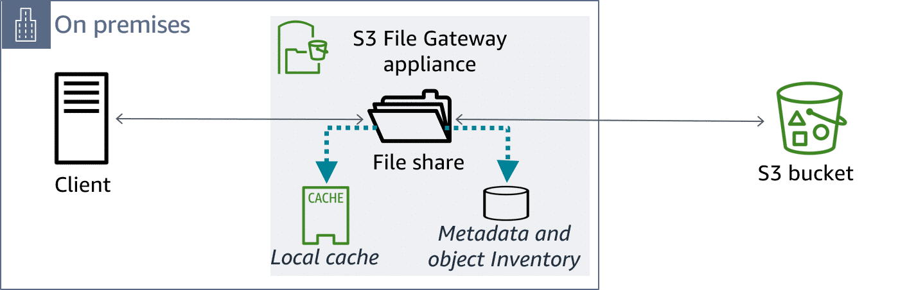
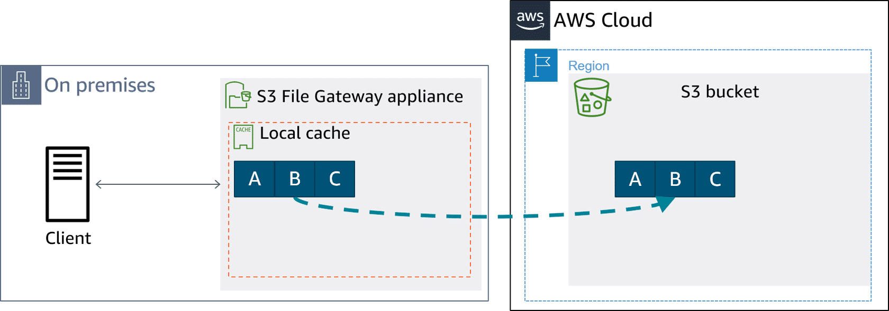

# Reads, Writes, and Updates

Using **S3 File Gateway**, your clients can create, read, update, and delete files and directories. 

> The S3 File Gateway appliance includes a local cache and a metadata and object inventory.

On premises, the file share uses a local cache that provides low-latency access to recently accessed data and reduces outgoing data charges. The **S3 File Gateway** also stores a local inventory of the objects in the S3 bucket and the metadata. The inventory is used to provide low-latency access for file system operations; for example, listing an inventory.

All data transferred between the gateway and Amazon Web Services (AWS) storage is encrypted using Secure Sockets Layer (SSL). Data transfers are done through HTTPS. Objects are encrypted with Amazon S3 server-side encryption keys (SSE-S3) or optionally with AWS Key Management Service (AWS KMS) managed keys using SSE-KMS.

Let's consider how S3 File Gateway reads, writes, and updates data.

## S3 File Gateway: Reads

When the client reads data from the gateway appliance, it uses the Network File System (NFS) or Server Message Block (SMB) protocols.

For read requests from the client, first check to see if the data is in the cache. If the data is not in the cache, it's fetched from the S3 bucket using byte-range *gets* to better use available *bandwidth*.

The AWS Storage Gateway service retrieves the data from Amazon S3 and sends it to the gateway appliance. The gateway appliance receives the data, stores it in the local cache, and provides it to the client.

The gateway performs several optimizations. For example, if you read the file in parts, the whole file is not necessarily pulled into the cache. The gateway tries to predict patterns and do some pre-fetching and read-aheads. If you are reading a video file, for example, and you are reading it serially front to back, the gateway will recognize the pattern and try to pre-fetch ahead of your operations. This is useful for avoiding buffering and avoids the latency of demand caching. 

## S3 File Gateway: Writes

When the client writes data to the gateway appliance, using either the NFS or SMB protocols, the gateway stores the data locally. The data is compressed asynchronously, and changed data is uploaded securely. Changes to the files asynchronously update the objects in the S3 bucket using optimized data transfers (such as multipart parallel uploads).

> Multipart uploads and parallelism are used for uploads from the gateway cache to AWS. An object represented as ABC can be uploaded as a single upload or a multipart upload.

Write requests from the client are written to the cache first and are then asynchronously uploaded to the S3 bucket. The service optimizes data transfer between the gateway and AWS using multipart parallel uploads. With multipart uploads, you can upload large objects as a set of parts, which generally yields to better network utilization through parallel transfers. With multipart uploads, you can also pause and resume and upload objects when the size is not known initially.

## S3 File Gateway: Write updates

> If **D** is appended to the file, only **D** is uploaded to Amazon S3. Then, the data that is already in the cloud is used to create a new version of that object, ABCD.

To reduce data transfer overhead, the gateway uses multipart uploads and *copy put*, so only changed data in your files is uploaded to Amazon S3. Then, data that is already in the cloud is used to create a new version of the object.

## Learning summary

You learned that the local cache of frequently used data improves performance with low-latency access to data and reduces data transfer traffic. You also learned that, because objects are immutable, some file actions will cause new object versions to be created. Next, you will learn why you might want to adjust Amazon S3 settings to better support your workflows.
