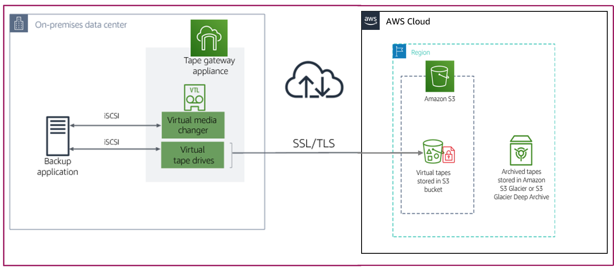
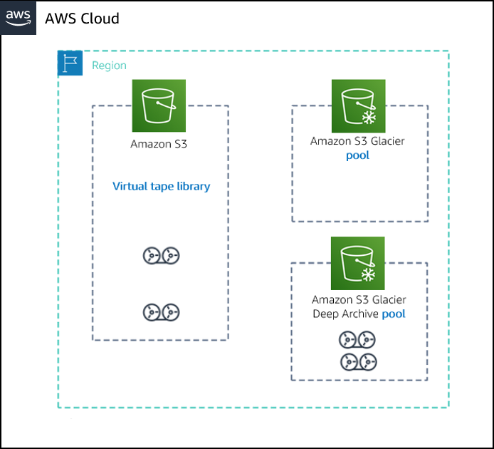

# Planning and Designing a Tape Gateway Deployment

> Storage Gateway provides a strategic, four-step approach to gateway creation, helping customers quickly deploy and implement the hybrid storage service.

## Deploying the solution

The Tape Gateway hybrid storage solution can be deployed as an on-premises appliance (using a VM), a physical hardware appliance, or as an Amazon EC2 instance in AWS.

The gateway appliance provides an Internet Small Computer System Interface (iSCSI) virtual tape library (VTL) mount target to your applications, caches the data locally, and manages the secure transfer of the data to Amazon Web Services (AWS).

To deploy the solution, create the Tape Gateway and then add tapes.

## Creating the Tape Gateway

To create the hybrid storage solution and use it, you will first deploy the gateway appliance. After it is created, then you securely connect it to the Storage Gateway service in your AWS account.

### Deploying the gateway appliance

Based on your on-premises infrastructure needs, the gateway appliance can be deployed either on premises or in the cloud on AWS.

> ### On Premises
>
> Choose from virtual or physical appliance options to deploy your on-premises gateway appliance:
>
> * Download a **virtual machine (VM) appliance** from the console and deploy it on one of the following:
>
>   * VMware ESXi Hypervisor
>
>     * Integrates with VMware vSphere High Availability (HA)
>
>   * Microsoft Hyper-V
>
>   * Linux Kernel-based Virtual Machine (KVM)
>
> * Order an **AWS Snowball Edge** storage-optimized device with Tape Gateway. Use this option, to migrate data stored in your tape archive, when network bandwidth is limited in your environment. You copy your tape data to the device and then send it back to AWS. With Tape Gateway on Snowball, your data is migrated to AWS offline.
>
> * Purchase a **hardware appliance**. A hardware appliance is a physical, standalone appliance with validated server configuration for on-premises deployments. It comes preloaded with Storage Gateway software and provides all the required central processing unit (CPU), memory, network, and solid state drive (SSD) cache resources for creating and configuring Tape Gateway.

> ### On AWS
>
> You can choose to deploy your tape gateway appliance in the cloud instead of on premises.
>
> * Deploy as an Amaz**on Machine Image (AMI) in Amazon EC2**. Storage Gateway provides an AMI that contains the gateway VM image.
>
> * Deploying a gateway on Amazon EC2 can be useful for learning how to set up and operate a Storage Gateway solution.
>
> Use cases:
>
> * Proof of concept
>
> * Disaster recovery
>
> * Data mirroring

### Gateway appliance sizing

As you plan your Tape Gateway deployment, evaluate the following sizing considerations:

1. Determine the number of total tapes and capacity you need to support initially:

* Each gateway can contain up to 1,500 tapes in the VTL (available tapes) or up to a maximum of 1 pebibyte (PiB) of total tape data at a time. VTS tape storage (archived tapes) is virtually unlimited.

* Each tape can store between 10 gibibytes (GiB) and 5 tebibytes (TiB) in size.

2. Estimate your backup application and workload needs. The minimum requirement is to allocate at least one local disk for each of the following:

* Cache storage – a minimum of 150 GiB

* Upload buffer storage – a minimum of 150 GiB

Best practice for increased performance is to allocate multiple local disks for cache storage with at least 150 GiB each.

3. Deploy additional gateway appliances to increase overall throughput (if required).

>[!IMPORTANT]
>
> Underlying physical storage resources are represented as a data store in VMware. When you deploy the gateway VM, you choose a data store on which to store the VM files. When you provision a local disk (for example, to use as cache storage or an upload buffer), you have the option to store the virtual disk in the same data store as the VM or a different data store. If you have more than one data store, we strongly recommend that you choose one data store for the cache storage and another for the upload buffer.

### Connectivity between gateway appliance and service

When Storage Gateway is deployed, it must communicate back to the Storage Gateway service for both management and data movement.

The connectivity between the gateway and the service is realized through service endpoints:

* **Public endpoint** – Storage Gateway connects to a public endpoint over the internet.

* **Virtual private cloud (VPC) endpoint** – Storage Gateway connects to Storage Gateway VPC endpoints over a private connection to AWS [AWS Direct Connect or AWS Virtual Private Network (AWS VPN)].

* **Federal Information Processing Standards (FIPS) 140-2 compliant endpoints** – Storage Gateway connects to a public endpoint over the internet. This endpoint complies with FIPS standards, to further protect sensitive information for regulated workloads in AWS GovCloud (US) Regions.

### Backup Applications

You use a backup application to read, write, and manage tapes. With Tape Gateway, you can use your existing backup application and don't have to change any of your existing backup processes.

The VTL interface is compatible with backup applications that use the industry-standard iSCSI-based tape library interface. 

## Adding tapes to the gateway appliance

After you create and activate the gateway appliance, on premises or in AWS, you can then create *virtual tapes*.

* Mount the virtual tape drives and media changer to your on-premises application servers as iSCSI devices. Create virtual tapes as needed and use your existing backup software application to write data to the virtual tapes. The media changer loads and unloads the virtual tapes into the virtual tape drives for read and write operations.

* Use the AWS Management Console to provision tapes backed by Amazon S3. You can also provision tapes programmatically using the Storage Gateway application programming interface (API) or the AWS Software Development Kit (SDK) libraries.

* Automatically create new virtual tapes to maintain the minimum number of available tapes that you configure. The tape gateway spawns a new tape automatically when it has fewer tapes than the minimum number of available tapes specified.

## Additional considerations

### Region

Assure your Storage Gateway and the gateway appliance are supported in your desired Regions.

Select an AWS Region before you deploy your gateway. Your gateway will then be activated in that Region. Available tapes in Amazon S3 and archived tapes in S3 Glacier Flexible Retrieval and S3 Glacier Deep Archive tape pools will also be available in this Region.

### Network Considerations

Tape Gateway requires access to specific ports for its operation.

> ### Access ports
>
> <table><thead><tr><th style="width:15.821%;">From </th><th style="width:16.101%;">To </th><th style="width:21.7017%;">Protocol </th><th style="width:15.4644%;">Port </th><th>Usage </th></tr></thead><tbody><tr><td style="text-align:left;width:15.821%;vertical-align:top;">Storage Gateway VM </td><td style="text-align:left;width:16.101%;vertical-align:top;">AWS </td><td style="text-align:left;vertical-align:top;width:21.7017%;">Transmission Control Protocol (TCP) </td><td style="text-align:left;vertical-align:top;width:15.4644%;">443 (HTTPS) </td><td style="text-align:left;vertical-align:top;">Used to communicate from a Storage Gateway outbound VM to an AWS service endpoint. </td></tr><tr><td style="width:15.821%;vertical-align:top;">Web Browser </td><td style="width:16.101%;vertical-align:top;">Storage Gateway VM </td><td style="vertical-align:top;width:21.7017%;">TCP </td><td style="vertical-align:top;width:15.4644%;">80 (HTTP) </td><td style="vertical-align:top;">
Used by local systems to obtain the Storage Gateway activation key. Port 80 is used only during activation of a Storage Gateway appliance.

 

A Storage Gateway VM doesn't require port 80 to be publicly accessible.
</td></tr><tr><td style="width:15.821%;vertical-align:top;">Storage Gateway VM </td><td style="width:16.101%;vertical-align:top;">Domain Name Service (DNS) server </td><td style="width:21.7017%;vertical-align:top;">User Datagram Protocol (UDP) </td><td style="width:15.4644%;vertical-align:top;">53 (DNS) </td><td style="vertical-align:top;">For communication between a Storage Gateway VM and the DNS server. </td></tr><tr><td style="width:15.821%;vertical-align:top;">Storage Gateway VM </td><td style="width:16.101%;vertical-align:top;">AWS </td><td style="width:21.7017%;vertical-align:top;">TCP </td><td style="width:15.4644%;vertical-align:top;">22 (Support channel) </td><td style="vertical-align:top;">Allows AWS Support to access your gateway to help you with troubleshooting gateway issues.  You don't need this port open for the normal operation of your gateway, but it is required for troubleshooting. </td></tr><tr><td style="width:15.821%;vertical-align:top;">Storage Gateway VM </td><td style="width:16.101%;vertical-align:top;">Network Time Protocol (NTP) server </td><td style="width:21.7017%;vertical-align:top;">UDP </td><td style="width:15.4644%;vertical-align:top;">123 (NTP) </td><td style="vertical-align:top;">
Local systems use this protocol to synchronize VM time to the host time.
</td></tr><tr><td style="width:15.821%;vertical-align:top;">iSCSI initiators </td><td style="width:16.101%;vertical-align:top;">Storage Gateway VM </td><td style="width:21.7017%;vertical-align:top;">TCP </td><td style="width:15.4644%;vertical-align:top;">3260 (iSCSI) </td><td style="vertical-align:top;">Used by local systems to connect to iSCSI targets exposed by a gateway.</td></tr></tbody></table>

### Storage classes

Tape Gateway archives based on your required data access and retrieval time needs.

Storage Gateway uses tape pools to provide the storage class options for archiving your tapes. You set the tape pool when creating a new tape. The assignment to the tape pool determines the destination storage class archive for your tapes.

> ### S3 Glacier Flexible Retrieval
>
> S3 Glacier Flexible Retrieval – You use S3 Glacier Flexible Retrieval for more active archives where you can retrieve the tapes typically within 3 – 5 hours.
>
> Tapes archived in S3 Glacier Flexible Retrieval can be moved to S3 Glacier Deep Archive at a later time for additional storage cost savings.

> ### S3 Glacier Deep Archive
>
> You use S3 Glacier Deep Archive for long-term data retention and digital preservation where data is accessed once or twice a year. You can retrieve tapes archived in S3 Glacier Deep Archive typically within 12 hours.

Apply a *retention lock* to your archived tape by creating a custom tape pool. Custom tape pools also use the two archive storage classes mentioned previously.
